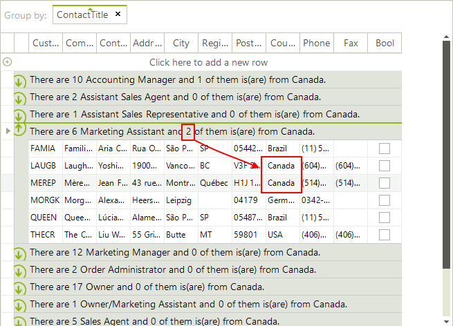

# Formatting Group Header Row


## 

__GroupSummaryEvaluate__ allows to modify the header text of the group rows. The event is fired when the group header row text is needed. So if you want to modify the group’s text, first you have to subscribe to the __GroupSummaryEvaluate__ event and then perform the actual grouping, because when the __GroupContentCellElement__ (the group header row) is being displayed, the event is fired and if you are  not subscribed for it, it will apply its default settings.

The example below demonstrates how you can change the group header text of each group if grouping is based on some specific column:

#### Change group header text

{{source=..\SamplesCS\GridView\Grouping\FormattingGroupHeaderRow.cs region=groupHeaderText}} 
{{source=..\SamplesVB\GridView\Grouping\FormattingGroupHeaderRow.vb region=groupHeaderText}} 

````C#
void radGridView1_GroupSummaryEvaluate(object sender, Telerik.WinControls.UI.GroupSummaryEvaluationEventArgs e)
{
    if (e.SummaryItem.Name == "Country")
    {
        e.FormatString = String.Format("Group by country: {0}", e.Value);
    }
}

````
````VB.NET
Private Sub RadGridView1_GroupSummaryEvaluate(ByVal sender As Object, ByVal e As Telerik.WinControls.UI.GroupSummaryEvaluationEventArgs) Handles RadGridView1.GroupSummaryEvaluate
    If e.SummaryItem.Name = "Country" Then
        e.FormatString = [String].Format("Group by country: {0}", e.Value)
    End If
End Sub

````

{{endregion}} 


The following example demonstrates formatting of group header which uses data from the group rows:

#### Formatting group header by using data grom data rows

{{source=..\SamplesCS\GridView\Grouping\FormattingGroupHeaderRow.cs region=formatGroupHeaderWhichUsersDataFromGroupRows}} 
{{source=..\SamplesVB\GridView\Grouping\FormattingGroupHeaderRow.vb region=formatGroupHeaderWhichUsersDataFromGroupRows}} 

````C#
void radGridView1_GroupSummaryEvaluate1(object sender, Telerik.WinControls.UI.GroupSummaryEvaluationEventArgs e)
{
    if (e.SummaryItem.Name == "ContactTitle")
    {
        int count = e.Group.ItemCount;
        int contactsInCanada = 0;
        foreach (GridViewRowInfo row in e.Group)
        {
            if (row.Cells["Country"].Value.ToString() == "Canada")
            {
                contactsInCanada++;
            }
        }
        e.FormatString = String.Format("There are {0} {1} and {2} of them is(are) from Canada.", count, e.Value, contactsInCanada);
    }
}

````
````VB.NET
Private Sub RadGridView1_GroupSummaryEvaluate1(ByVal sender As Object, ByVal e As Telerik.WinControls.UI.GroupSummaryEvaluationEventArgs) Handles RadGridView1.GroupSummaryEvaluate
    If e.SummaryItem.Name = "ContactTitle" Then
        Dim contactsCount As Integer = e.Group.ItemCount
        Dim contactsInCanada As Integer = 0
        For Each row As GridViewRowInfo In e.Group
            If row.Cells("Country").Value.ToString() = "Canada" Then
                contactsInCanada += 1
            End If
        Next
        e.FormatString = [String].Format("There are {0} {1} and {2} of them is(are) from France.", contactsCount, e.Value, contactsInCanada)
    End If
End Sub

````

{{endregion}} 


