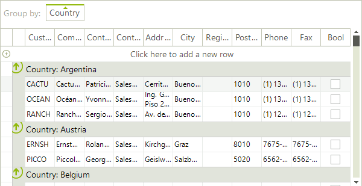
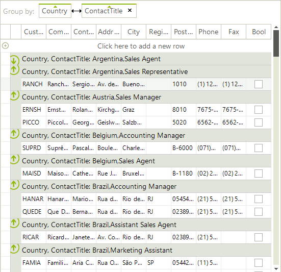

# Setting Groups Programmatically

## Overview

RadGridView has a __GroupDescriptors__ property at the GridViewTemplate level which is exposed in RadGridView class for MasterTemplate instance. This collection allows you to use descriptors which define the grouping criteria and the group's sorting direction for the data that is bound to the RadGridView.

As this is a collection, you are able not only to add, but to remove or clear the its entries as well. Adding descriptors to the collection makes the current view display the items sorted and divided into groups. 

## Using GroupDescriptors

#### Using simple group descriptor

{{source=..\SamplesCS\GridView\Grouping\Grouping.cs region=usingSimpleGroupDescriptor}} 
{{source=..\SamplesVB\GridView\Grouping\Grouping.vb region=usingSimpleGroupDescriptor}} 

````C#
GroupDescriptor descriptor = new GroupDescriptor();
descriptor.GroupNames.Add("Country", ListSortDirection.Ascending);
this.radGridView1.GroupDescriptors.Add(descriptor);

````
````VB.NET
Dim descriptor As New GroupDescriptor()
descriptor.GroupNames.Add("Country", ListSortDirection.Ascending)
Me.RadGridView1.GroupDescriptors.Add(descriptor)

````

{{endregion}} 



The __GroupNames__ property defines the property, by which the data will be grouped. The __GroupNames__ is a __SortDescriptorCollection__ and defines group names for one grouping criteria.

RadGridView supports grouping using one or more property names. The following example demonstrates how you can group by two properties:

#### Grouping by more than one column name

{{source=..\SamplesCS\GridView\Grouping\Grouping.cs region=groupingByMoreThanOneColumnName}} 
{{source=..\SamplesVB\GridView\Grouping\Grouping.vb region=groupingByMoreThanOneColumnName}} 

````C#
GroupDescriptor descriptor1 = new GroupDescriptor();
descriptor1.GroupNames.Add("Country", ListSortDirection.Ascending);
descriptor1.GroupNames.Add("ContactTitle", ListSortDirection.Descending);
this.radGridView1.GroupDescriptors.Add(descriptor1);

````
````VB.NET
Dim descriptor1 As New GroupDescriptor()
descriptor1.GroupNames.Add("Country", ListSortDirection.Ascending)
descriptor1.GroupNames.Add("ContactTitle", ListSortDirection.Descending)
Me.RadGridView1.GroupDescriptors.Add(descriptor1)

````

{{endregion}} 




RadGridView supports grouping on one or more levels. The following example demonstrates how you can group on two levels:

#### Grouping on one or more levels

{{source=..\SamplesCS\GridView\Grouping\Grouping.cs region=groupingOnOneOrMoreLevels}} 
{{source=..\SamplesVB\GridView\Grouping\Grouping.vb region=groupingOnOneOrMoreLevels}} 

````C#
GroupDescriptor descriptor2 = new GroupDescriptor();
descriptor2.GroupNames.Add("Country", ListSortDirection.Ascending);
GroupDescriptor descriptor3 = new GroupDescriptor();
descriptor3.GroupNames.Add("ContactTitle", ListSortDirection.Ascending);
this.radGridView1.GroupDescriptors.Add(descriptor2);
this.radGridView1.GroupDescriptors.Add(descriptor3);

````
````VB.NET
Dim descriptor2 As New GroupDescriptor()
descriptor2.GroupNames.Add("Country", ListSortDirection.Ascending)
Dim descriptor3 As New GroupDescriptor()
descriptor3.GroupNames.Add("ContactTitle", ListSortDirection.Ascending)
Me.RadGridView1.GroupDescriptors.Add(descriptor2)
Me.RadGridView1.GroupDescriptors.Add(descriptor3)

````

{{endregion}} 


# See Also
* [Basic Grouping]()

* [Custom Grouping]()

* [Events]()

* [Formatting Group Header Row]()

* [Group Aggregates]()

* [Groups Collection]()

* [Sorting group rows]()

* [Using Grouping Expressions]()

