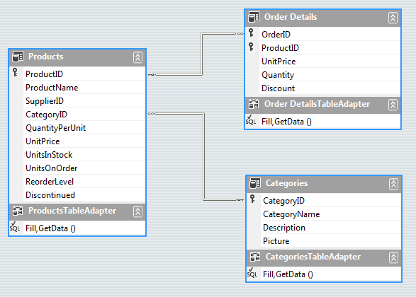
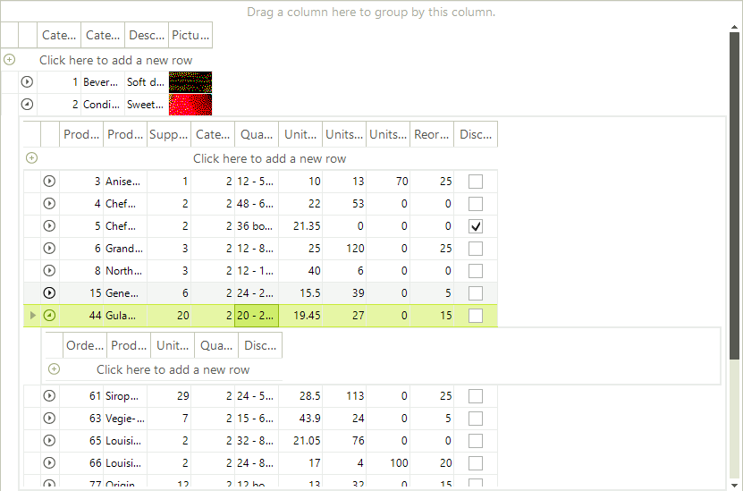

# Binding to Hierarchical Data Automatically

## Generating two-level hierarchy
<table><th><tr><td>

RELATED VIDEOS</td><td></td></tr></th><tr><td>

[RadGridView for WinForms Hierarchy Overview](http://tv.telerik.com/winforms/radgrid/radgridview-winforms-hierarchy-overview)
              In this video you will learn the various ways you can display hierarchical data in a RadGridView. (Runtime: 12:13)
           </td><td>

</td></tr></table>

At runtime, if the data source for the grid is a __System.Data.DataSet__ type and there are relations defined in
			it, the hierarchy can be created automatically. Set the	__AutoGenerateHierarchy__ property	__true__
			to get this behavior. In the example below, the Northwind dataset has Categories and Products joined by CategoryID.
		

The run-time code fills the categories and products data tables, sets the __AutoGenerateHierarchy__ to 
        	__true__, assigns the data set containing both tables to the grid __DataSource__ and
        	the __DataMember__ is the name of the parent table. The last three lines of code below can be configured at design time.
        

#### __[C#] Generating Hierarchy From a DataSet__

{{source=..\SamplesCS\GridView\HierarchicalGrid\BindingToHierarchicalGridAutomatically.cs region=BindingToHierarchicalGridAutomatically}}
	        
	        private void BindingToHierarchicalGridAutomatically_Load(object sender, EventArgs e)
	        {
	            this.productsTableAdapter.Fill(this.nwindDataSet.Products);
	            this.categoriesTableAdapter.Fill(this.nwindDataSet.Categories);
	            radGridView1.AutoGenerateHierarchy = true;
	            radGridView1.DataSource = this.nwindDataSet;
	            radGridView1.DataMember = "Categories";
	        }
	        
	{{endregion}}

#### __[VB.NET] Generating Hierarchy From a DataSet__

{{source=..\SamplesVB\GridView\HierarchicalGrid\BindingToHierarchicalGridAutomatically.vb region=BindingToHierarchicalGridAutomatically}}
	    Private Sub BindingToHierarchicalGridAutomatically_Load(ByVal sender As System.Object, ByVal e As System.EventArgs) Handles MyBase.Load
	        'TODO: This line of code loads data into the 'NwindDataSet.Order_Details' table. You can move, or remove it, as needed.
	        Me.Order_DetailsTableAdapter.Fill(Me.NwindDataSet.Order_Details)
	        'TODO: This line of code loads data into the 'NwindDataSet.Order_Details' table. You can move, or remove it, as needed.
	
	        Me.ProductsTableAdapter.Fill(Me.NwindDataSet.Products)
	        Me.CategoriesTableAdapter.Fill(Me.NwindDataSet.Categories)
	        RadGridView1.AutoGenerateHierarchy = True
	        RadGridView1.DataSource = Me.NwindDataSet
	        RadGridView1.DataMember = "Categories"
	    End Sub
	{{endregion}}

## Generating multi-level hierarchy

It is possible to auto generate Multi-level hierarchy as well. You should again set the __DataSource__ and __AutoGenerateHierarachy__ properties of the RadGridView.
        Here are the three data tables from the Northwind database, used in the code snippet to generate the three-level hierarchy:

#### __[C#] Generating Three-Level Hierarchy From a DataSet__

{{source=..\SamplesCS\GridView\HierarchicalGrid\BindingToHierarchicalGridAutomatically.cs region=BindingToMultiLevelHierarchicalGridAutomatically}}
	        
	        public void Dummy()
	        { 
	            this.productsTableAdapter.Fill(this.nwindDataSet.Products);
	            this.categoriesTableAdapter.Fill(this.nwindDataSet.Categories);
	            this.order_DetailsTableAdapter.Fill(this.nwindDataSet.Order_Details);
	            radGridView1.DataSource = nwindDataSet;
	            radGridView1.DataMember = "Categories";
	            radGridView1.AutoGenerateHierarchy = true;
	        }
	        
	{{endregion}}

#### __[VB.NET] Generating Three-Level Hierarchy From a DataSet__

{{source=..\SamplesVB\GridView\HierarchicalGrid\BindingToHierarchicalGridAutomatically.vb region=BindingToMultiLevelHierarchicalGridAutomatically}}
	
	    Public Sub Dummy()
	        Me.ProductsTableAdapter.Fill(Me.NwindDataSet.Products)
	        Me.CategoriesTableAdapter.Fill(Me.NwindDataSet.Categories)
	        RadGridView1.DataSource = NwindDataSet
	        RadGridView1.DataMember = "Categories"
	        RadGridView1.AutoGenerateHierarchy = True
	    End Sub
	
	    '#End Region
	End Class

