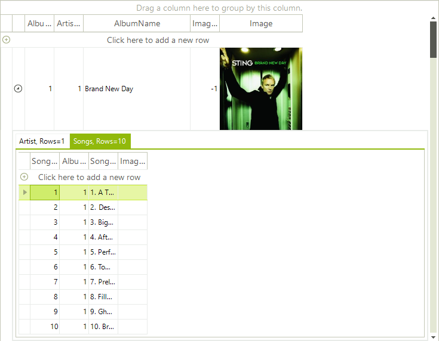

# Hierarchy of one to many relations

## 

__RadGridView__ supports binding to a hierarchy containing one to many relations. The result is presented in tabs inside child views.

Follow these steps to setup the hierarchy:

__1.__ Bind to a data source (e.g. DataTable)

__2.__ Add at least two child templates and set their data source.

__3.__ Add relations to connect the child templates with the master template.

__4.__ Run the project.
        

#### __[C#] Hierarchy of one to many relation__

{{region HierarchyOfOneToManyRelation}}
	        private void HierarchyOfOneToManyRelation_Load(object sender, EventArgs e)
	        {
	            this.songsTableAdapter.Fill(this.musicCollectionDataSet.Songs);
	            this.artistsTableAdapter.Fill(this.musicCollectionDataSet.Artists);
	            this.albumsTableAdapter.Fill(this.musicCollectionDataSet.Albums);
	           
	            this.radGridView1.DataSource = albumsBindingSource;
	            radGridView1.Columns["Image"].ImageLayout = ImageLayout.Zoom;
	
	            GridViewTemplate childTemplate1 = new GridViewTemplate();
	            childTemplate1.DataSource = artistsBindingSource;
	            childTemplate1.Columns["Image"].ImageLayout = ImageLayout.Zoom;
	            childTemplate1.Caption = "Artist";
	            
	            this.radGridView1.MasterTemplate.Templates.Add(childTemplate1);
	
	            GridViewRelation relation1 = new GridViewRelation(this.radGridView1.MasterTemplate);
	            relation1.RelationName = "productmodel_productModelDescription";
	            relation1.ParentColumnNames.Add("ArtistID");
	            relation1.ChildColumnNames.Add("ArtistID");
	            relation1.ChildTemplate = childTemplate1;
	            this.radGridView1.Relations.Add(relation1);
	
	            GridViewTemplate childTemplate2 = new GridViewTemplate();
	            childTemplate2.DataSource = songsBindingSource;
	            childTemplate2.Caption = "Songs";
	            this.radGridView1.MasterTemplate.Templates.Add(childTemplate2);
	
	            GridViewRelation relation2 = new GridViewRelation(this.radGridView1.MasterTemplate);
	            relation2.RelationName = "productdescription_productModelDescription";
	            relation2.ParentColumnNames.Add("AlbumID");
	            relation2.ChildColumnNames.Add("AlbumID");
	            relation2.ChildTemplate = childTemplate2;
	            this.radGridView1.Relations.Add(relation2);
	        }
	{{endregion}}

#### __[VB.NET] Hierarchy of one to many relation__

{{region HierarchyOfOneToManyRelation}}
	    Private Sub HierarchyOfOneToManyRelation_Load(ByVal sender As System.Object, ByVal e As System.EventArgs) Handles MyBase.Load
	        Me.SongsTableAdapter.Fill(Me.MusicCollectionDataSet.Songs)
	        Me.ArtistsTableAdapter.Fill(Me.MusicCollectionDataSet.Artists)
	        Me.AlbumsTableAdapter.Fill(Me.MusicCollectionDataSet.Albums)
	
	        Me.RadGridView1.DataSource = AlbumsBindingSource
	        RadGridView1.Columns("Image").ImageLayout = ImageLayout.Zoom
	
	        Dim childTemplate1 As New GridViewTemplate()
	        childTemplate1.DataSource = ArtistsBindingSource
	        childTemplate1.Columns("Image").ImageLayout = ImageLayout.Zoom
	        childTemplate1.Caption = "Artist"
	
	        Me.RadGridView1.MasterTemplate.Templates.Add(childTemplate1)
	
	        Dim relation1 As New GridViewRelation(Me.RadGridView1.MasterTemplate)
	        relation1.RelationName = "productmodel_productModelDescription"
	        relation1.ParentColumnNames.Add("ArtistID")
	        relation1.ChildColumnNames.Add("ArtistID")
	        relation1.ChildTemplate = childTemplate1
	        Me.RadGridView1.Relations.Add(relation1)
	
	        Dim childTemplate2 As New GridViewTemplate()
	        childTemplate2.DataSource = SongsBindingSource
	        childTemplate2.Caption = "Songs"
	        Me.RadGridView1.MasterTemplate.Templates.Add(childTemplate2)
	
	        Dim relation2 As New GridViewRelation(Me.RadGridView1.MasterTemplate)
	        relation2.RelationName = "productdescription_productModelDescription"
	        relation2.ParentColumnNames.Add("AlbumID")
	        relation2.ChildColumnNames.Add("AlbumID")
	        relation2.ChildTemplate = childTemplate2
	        Me.RadGridView1.Relations.Add(relation2)
	    End Sub
	{{endregion}}

>There is an example demonstrating how to build hierarchy containing one-to-many relations in the demo application.

## 
    Formatting tabs
    
    

In some cases you may want to set custom text to the tabs of the child views different than
    the text of the template's caption. In this case, the solution is to use the 
    [
    
    
    Formatting events]()
    that RadGridView exposes, and more specifically, the ViewCellFormatting event. This event will give you
    access to the detail cell that contains the whole RadPageViewElement and from this element you will be
    able to set the text of each tab separately. For example, if we need to display the count of the 
    rows in each view, we can use the following code snippet in order to apply our custom text:
    
    

#### __[C#]__

{{region formattingTabs}}
	        void radGridView1_ViewCellFormatting(object sender, CellFormattingEventArgs e)
	        {
	            GridDetailViewCellElement detailCell = e.CellElement as GridDetailViewCellElement;
	            if (detailCell != null)
	            {
	                for (int i = 0; i < detailCell.PageViewElement.Items.Count; i++)
	                {
	                    // We take the view that contains the child rows from the corresponding RadPageViewStripItem
	                    GridViewInfo info = (GridViewInfo)detailCell.PageViewElement.Items[i].Tag;
	                    // We set our custom text to the tab, taking the count of rows that the child view has
	                    detailCell.PageViewElement.Items[i].Text = string.Format("{0}, Rows={1}", info.ViewTemplate.Caption, info.Rows.Count.ToString());
	                }
	            }
	        }
	{{endregion}}

#### __[VB.NET]__

{{region formattingTabs}}
	    Private Sub RadGridView1_ViewCellFormatting(ByVal sender As Object, ByVal e As Telerik.WinControls.UI.CellFormattingEventArgs) Handles RadGridView1.ViewCellFormatting
	        Dim detailCell As GridDetailViewCellElement = TryCast(e.CellElement, GridDetailViewCellElement)
	        If detailCell IsNot Nothing Then
	            For i As Integer = 0 To detailCell.PageViewElement.Items.Count - 1
	                ' We take the view that contains the child rows from the corresponding RadPageViewStripItem
	                Dim info As GridViewInfo = CType(detailCell.PageViewElement.Items(i).Tag, GridViewInfo)
	                ' We set our custom text to the tab, taking the count of rows that the child view has
	                detailCell.PageViewElement.Items(i).Text = String.Format("{0}, Rows={1}", info.ViewTemplate.Caption, info.Rows.Count.ToString())
	            Next i
	        End If
	    End Sub
	{{endregion}}

The result is shown on the screenshot below:
    
