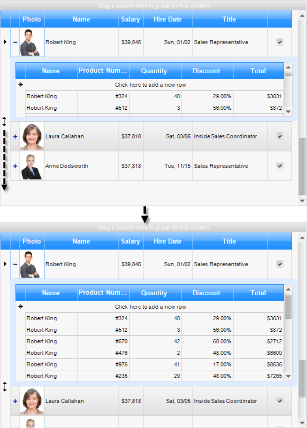

# Resizing child GridViewInfo


RadGridView supports resizing child GridViewInfos at runtime by a mouse drag operation. You should simply position your
          mouse pointer over the left part of the bottom line of the child GridViewInfo and then resize this GridViewInfo by a mouse drag operation:
      


## Resizing a child GridViewInfo programmatically

Another option for you is to set a custom size for a child GridViewInfo programmatically. In order to do so,
            subscribe to the ChildViewExpanded event and set the custom size by setting the __Height__ property
            of the __ChildRow__ to a specific value. Please note that the following code will work only when the
          __UseScrollbarsInHierarchy__ property is set to *true*.
        #_[C#] Setting a custom size for a child GridViewInfo by passing a specific value_

	


{{source=..\SamplesCS\GridView\HierarchicalGrid\CreatingHierarchyUsingXmlDataSource.cs region=setChildRowHeight}} 
{{source=..\SamplesVB\GridView\HierarchicalGrid\CreatingHierarchyUsingXmlDataSource.vb region=setChildRowHeight}} 

````C#
        void radGridView1_ChildViewExpanded(object sender, ChildViewExpandedEventArgs e)
        {
            e.ChildRow.Height = 300;
        }
````
````VB.NET
    Private Sub RadGridView1_ChildViewExpanded(ByVal sender As Object, ByVal e As Telerik.WinControls.UI.ChildViewExpandedEventArgs) Handles RadGridView1.ChildViewExpanded
        e.ChildRow.Height = 300
    End Sub
    '
````

{{endregion}} 


