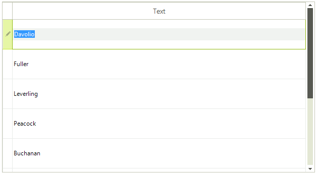
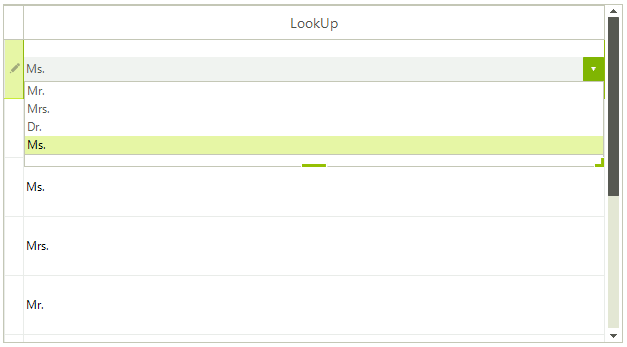
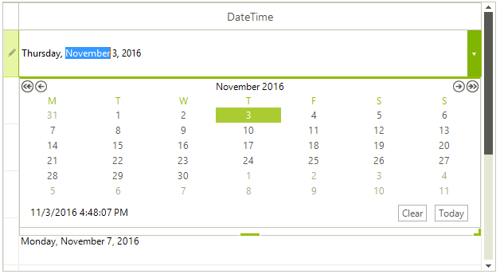
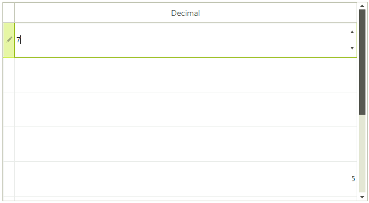

# Data Editing Support

## Control Cell Editing, Addition and Removal of rows

The following properties can be used to restrict user interaction and data modification:

* __AllowEditRow__

* __AllowDeleteRow__

* __AllowAddNewRow__

* __AddNewRowPosition__ determines if a new grid row will be shown at the top or bottom of the grid.

* __BeginEditMode__ determines the action that will initiate editing and can be one of the following __RadGridViewBeginEditingMode__ enumeration members: __BeginEditOnEnter__, __BeginEditOnKeystroke__, __BeginEditOnKeystrokeOrF2__, __BeginEditOnF2__ or __BeginEditProgrammatically__.

## Column Types

RadGridView has the following types of columns capable of editing data that will be persisted automatically:

* [GridViewTextBoxColumn]()

* [GridViewCheckBoxColumn]()

* [GridViewComboBoxColumn]()

* [GridViewDateTimeColumn]()

* [GridViewCommandColumn]()

* [GridViewDecimalColumn]()

* [GridViewImageColumn]()

* [GridViewMaskBoxColumn]()

By default __RadGridView__ will extract the values from the corresponding editors of the currently edited element when updating or inserting a new record. You can get a reference to the editor object being edited using the RadGridView __ActiveEditor__ property.

## Editors

## RadTextBoxEditor

This editor is intended for displaying and entering text strings and is used for editing [GridViewTextBoxColumn]() column types. Visually it appears and behaves similar to the __RadTextBox__ control. When the value is loaded in this editor, it is formatted according to setting of the column’s __FormatString__property. __ValueChanging__ and __ValueChanged__ event are fired on each text modification. 

## RadCheckBoxEditor

This editor is specialized to indicate the binary state of a cell value and is used for editing [GridViewCheckBoxColumn]() column types. Unlike other editors it is present in the grid elements hierarchy as a child element of the __GridCheckBoxCellElement__ and is always visible even if the cell is not edited at the moment. Visually it appears and behaves similar to the __RadCheckBox__ control. __ValueChanging__ and __ValueChanged__ event are fired on every user action that changes the value. 

## RadComboBoxEditor

This editor provides the ability to select textual values from a list of predefined items and is used for editing [GridViewComboBoxColumn]() column types. The list with the items is populated by a data source set to the __GridViewComboBoxColumn.DataSource__ property. Visually it appears and behaves similar to the __RadComboBox__ control (see the screenshot above). If __RadComboBoxEditor__ is configured as a look-up editor then the __ValueMember__ property field will be persisted. __ValueChanging__ and __ValueChanged__ event are fired on change of the selected item in the combo box.  

## RadDateTimeEditor

This editor provides the ability to select or enter dates and is used for editing [GridViewDateTimeColumn]() column types. Visually it appears and behaves similar to the standard DateTimePicker control. The date value can be entered as a text directly in the text box part of the editor or selected in the drop-down calendar.  When the value is loaded in this editor, it is formatted according to setting of the column’s __FormatString__ property. __ValueChanging__ and __ValueChanged__ event are fired on every change of the date value. 

## RadSpinEditor

This editor is intended to provide a convenient way for editing numeric values and is used within [GridViewDecimalColumn]() column types. Visually it appears and behaves similar to the standard __NumericUpDown__ control. There are two buttons on the right side for increasing and decreasing the value in the editor. If the value has decimal places after the decimal point, only the integral part of the value is changed. __ValueChanging__ and __ValueChanged__ event are fired on every change of the value. 
