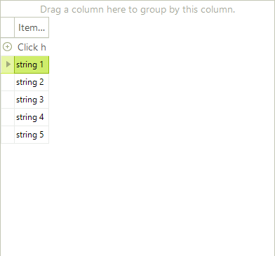
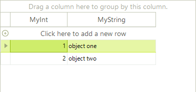

# Binding to Array and ArrayList


The examples below demonstrate binding to a generic list, an arrays of custom objects, and an ArrayList of custom objects. This collections have limitations when used as a datasource in which case a __BindingList__ must be used. 
      

>note Note: BindingList is the preferred collection since its changes are automatically reflected on the data-bound control.
>


## Binding to a Generic List

The example below creates an __ArrayList__ of generic objects initialized with five values and assigned as a __DataSource__ to the __RadGridView__.<br> 

{{source=..\SamplesCS\GridView\PopulatingWithData\BindingToArrayAndArrayList.cs region=bindingToSimpleArrayClass}} 
{{source=..\SamplesVB\GridView\PopulatingWithData\BindingToArrayAndArrayList.vb region=bindingToSimpleArrayClass}} 

````C#
        public class ValueType<T>
        {
            T item;

            public ValueType() { }

            public ValueType(T item)
            {
                this.item = item;
            }

            public T ItemProperty
            {
                get { return this.item; }
                set { this.item = value; }
            }
        }
````
````VB.NET
    Public Class ValueType(Of T)
        Private item As T
        Public Sub New()
        End Sub
        Public Sub New(ByVal item As T)
            Me.item = item
        End Sub
        Public Property ItemProperty() As T
            Get
                Return Me.item
            End Get
            Set(ByVal value As T)
                Me.item = value
            End Set
        End Property
    End Class
    '
````

{{endregion}} 

{{source=..\SamplesCS\GridView\PopulatingWithData\BindingToArrayAndArrayList.cs region=bindingToSimpleArray}} 
{{source=..\SamplesVB\GridView\PopulatingWithData\BindingToArrayAndArrayList.vb region=bindingToSimpleArray}} 

````C#
            ArrayList list = new ArrayList();
            for (int i = 0; i < 5; i++)
            {
                list.Add(new ValueType<string>("string " + (i + 1).ToString()));
            }

            this.radGridView1.DataSource = list;
````
````VB.NET
        Dim list As New ArrayList()
        Dim i As Integer = 0
        While i < 5
            list.Add(New ValueType(Of String)("string " + (i + 1).ToString()))
            System.Math.Max(System.Threading.Interlocked.Increment(i), i - 1)
        End While
        Me.RadGridView1.DataSource = list
        '
````

{{endregion}} 


## Binding to an Array of Objects

Arrays of objects containing [bindable types]() can be bound to RadGridView by assigning the array to the __DataSource__ property of the grid. 
        

The example below defines a "MyObject" class containing one integer and one string property. The snippet of code at end of the example creates an array of MyObject, initializes the array with two objects and assigns the array to the __DataSource__. The MyObject class would typically be placed in its own separate class file and the array creation, initialization and assignment code might be placed in a Form_Load event handler.<br> 

{{source=..\SamplesCS\GridView\PopulatingWithData\BindingToArrayAndArrayList.cs region=bindingToArrayOfObjectsClass}} 
{{source=..\SamplesVB\GridView\PopulatingWithData\BindingToArrayAndArrayList.vb region=bindingToArrayOfObjectsClass}} 

````C#
        public class MyObject
        {
            public MyObject(int myInt, string myString)
            {
                _myInt = myInt;
                _myString = myString;
            }
            private int _myInt;
            public int MyInt
            {
                get { return _myInt; }
                set { _myInt = value; }
            }
            private string _myString;
            public string MyString
            {
                get { return _myString; }
                set { _myString = value; }
            }
        }
````
````VB.NET
    Public Class MyObject
        Public Sub New(ByVal myInt As Integer, ByVal myString As String)
            _myInt = myInt
            _myString = myString
        End Sub
        Private _myInt As Integer
        Public Property MyInt() As Integer
            Get
                Return _myInt
            End Get
            Set(ByVal value As Integer)
                _myInt = value
            End Set
        End Property
        Private _myString As String
        Public Property MyString() As String
            Get
                Return _myString
            End Get
            Set(ByVal value As String)
                _myString = value
            End Set
        End Property
    End Class
    '
````

{{endregion}} 

{{source=..\SamplesCS\GridView\PopulatingWithData\BindingToArrayAndArrayList.cs region=bindingToArrayOfObjects}} 
{{source=..\SamplesVB\GridView\PopulatingWithData\BindingToArrayAndArrayList.vb region=bindingToArrayOfObjects}} 

````C#
            MyObject[] myArray = new MyObject[2] {new MyObject(1, "object one"), new MyObject(2, "object two") };
            radGridView1.DataSource = myArray;
````
````VB.NET
        Dim myArray As MyObject() = New MyObject(1) {New MyObject(1, "object one"), New MyObject(2, "object two")}
        RadGridView1.DataSource = myArray
        '
````

{{endregion}} 


## Binding to ArrayList

The code below demonstrates how to use an __ArrayList__ for RadGridView structure generation(*note: the sample object is used from the previous example*):

{{source=..\SamplesCS\GridView\PopulatingWithData\BindingToArrayAndArrayList.cs region=BindingToArrayList}} 
{{source=..\SamplesVB\GridView\PopulatingWithData\BindingToArrayAndArrayList.vb region=BindingToArrayList}} 

````C#
		    ArrayList arrayList = new System.Collections.ArrayList();
            arrayList.Add(new MyObject(1, "Object one") );
            arrayList.Add(new MyObject(2, "Object two") );
            arrayList.Add(new MyObject(3, "Object three") );
            radGridView1.DataSource = arrayList;
````
````VB.NET
        Dim arrayList As New System.Collections.ArrayList()
        arrayList.Add(New MyObject(1, "Object one"))
        arrayList.Add(New MyObject(2, "Object two"))
        arrayList.Add(New MyObject(3, "Object three"))
        RadGridView1.DataSource = arrayList
        '
````

{{endregion}} 


