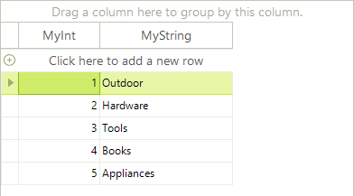

# Binding to BindingList


## 

BindingList is a generic list type that has additional binding support. While you can [bind to a generic list](), BindingList provides additional control over list items, i.e. if they can be edited, removed or added. BindingList also surfaces events that notify when the list has been changed. The example below creates a list of MyObject, initializes the list and assigns the list to the grid DataSource property. The example also uses a ListChangedEventHandler that reports the type of change that occurred, the new index of the item and the content of the item.

#_[C#] Creating sample class_

	


{{source=..\SamplesCS\GridView\PopulatingWithData\BindingToBindingList.cs region=MyObjectClass}} 
{{source=..\SamplesVB\GridView\PopulatingWithData\BindingToBindingList.vb region=MyObjectClass}} 

````C#
        public class MyObject
        {
            public MyObject(int myInt, string myString)
            {
                _myInt = myInt;
                _myString = myString;
            }
            private int _myInt;
            public int MyInt
            {
                get { return _myInt; }
                set { _myInt = value; }
            }
            private string _myString;
            public string MyString
            {
                get { return _myString; }
                set { _myString = value; }
            }
        }
````
````VB.NET
    Public Class MyObject
        Public Sub New(ByVal myInt As Integer, ByVal myString As String)
            _myInt = myInt
            _myString = myString
        End Sub
        Private _myInt As Integer
        Public Property MyInt() As Integer
            Get
                Return _myInt
            End Get
            Set(ByVal value As Integer)
                _myInt = value
            End Set
        End Property
        Private _myString As String
        Public Property MyString() As String
            Get
                Return _myString
            End Get
            Set(ByVal value As String)
                _myString = value
            End Set
        End Property
    End Class
    '
````

{{endregion}} 


#_[C#] Binding to BindingList_

	


{{source=..\SamplesCS\GridView\PopulatingWithData\BindingToBindingList.cs region=bindingToBindingList}} 
{{source=..\SamplesVB\GridView\PopulatingWithData\BindingToBindingList.vb region=bindingToBindingList}} 

````C#
        private BindingList<MyObject> myList;
        private void Form1_Load(object sender, EventArgs e)
        {
            myList = new BindingList<MyObject>();
            myList.Add(new MyObject(1, "Outdoor"));
            myList.Add(new MyObject(2, "Hardware"));
            myList.Add(new MyObject(3, "Tools"));
            myList.Add(new MyObject(4, "Books"));
            myList.Add(new MyObject(5, "Appliances"));
            myList.RaiseListChangedEvents = true;
            myList.ListChanged += new ListChangedEventHandler(myList_ListChanged);
            radGridView1.DataSource = myList;
        }
        void myList_ListChanged(object sender, ListChangedEventArgs e)
        {
            MessageBox.Show(e.ListChangedType.ToString() + ": at index: " + e.NewIndex.ToString() + ", \"" + myList[e.NewIndex].MyString + "\"");
        }
        private void radButton1_Click(object sender, EventArgs e)
        {
            myList.Add(new MyObject(6, "Plants"));
        }
````
````VB.NET
    Private myList As BindingList(Of MyObject)
    Private Sub Form1_Load(ByVal sender As Object, ByVal e As EventArgs) Handles Me.Load
        myList = New BindingList(Of MyObject)()
        myList.Add(New MyObject(1, "Outdoor"))
        myList.Add(New MyObject(2, "Hardware"))
        myList.Add(New MyObject(3, "Tools"))
        myList.Add(New MyObject(4, "Books"))
        myList.Add(New MyObject(5, "Appliances"))
        myList.RaiseListChangedEvents = True
        AddHandler myList.ListChanged, AddressOf myList_ListChanged
        RadGridView1.DataSource = myList
    End Sub
    Sub myList_ListChanged(ByVal sender As Object, ByVal e As ListChangedEventArgs)
        MessageBox.Show(e.ListChangedType.ToString() + ": at index: " + e.NewIndex.ToString() + ", """ + myList(e.NewIndex).MyString + """")
    End Sub
    Private Sub RadButton1_Click_1(ByVal sender As System.Object, ByVal e As System.EventArgs) Handles RadButton1.Click
        myList.Add(New MyObject(6, "Plants"))
    End Sub
    '
````

{{endregion}} 


