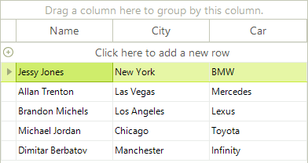

# Binding to Sub Objects


## 

RadGridView supports out-of-the-box binding to sub objects by intuitive and simple __dot (.)__ syntax (specified through the __FieldName__ property of declaratively bound columns). The example below includes a "Person" class that has three properties, one of which is a reference type "Car":
        

* Name - string

* City - string

* Car - object Car

Follows the implementation of the Person and the Car classes:

#### Defining the Class and Sub Class

{{source=..\SamplesCS\GridView\PopulatingWithData\BindingToSubObjects.cs region=classes}} 
{{source=..\SamplesVB\GridView\PopulatingWithData\BindingToSubObjects.vb region=classes}} 

````C#
public class Person
{
    public string _name = "";
    public string _city = "";
    public Car _car = null;
    public Person()
    {
        this._car = new Car();
    }
    public Person(string name, string city, Car car)
    {
        this._name = name;
        this._city = city;
        this._car = car;
    }
    public string Name
    {
        get
        {
            return this._name;
        }
    }
    public string City
    {
        get
        {
            return this._city;
        }
    }
    public Car Car
    {
        get
        {
            return this._car;
        }
    }
}
public class Car
{
    string _model;
    int _year;
    public Car()
    {
    }
    public Car(string model, int year)
    {
        this._model = model;
        this._year = year;
    }
    public string Model
    {
        get
        {
            return this._model;
        }
    }
    public int Year
    {
        get
        {
            return this._year;
        }
    }
}

````
````VB.NET
Public Class Person
    Public _name As String = ""
    Public _city As String = ""
    Public _car As Car = Nothing
    Public Sub New()
        Me._car = New Car()
    End Sub
    Public Sub New(name As String, city As String, car As Car)
        Me._name = name
        Me._city = city
        Me._car = car
    End Sub
    Public ReadOnly Property Name() As String
        Get
            Return Me._name
        End Get
    End Property
    Public ReadOnly Property City() As String
        Get
            Return Me._city
        End Get
    End Property
    Public ReadOnly Property Car() As Car
        Get
            Return Me._car
        End Get
    End Property
End Class
Public Class Car
    Private _model As String
    Private _year As Integer
    Public Sub New()
    End Sub
    Public Sub New(model As String, year As Integer)
        Me._model = model
        Me._year = year
    End Sub
    Public ReadOnly Property Model() As String
        Get
            Return Me._model
        End Get
    End Property
    Public ReadOnly Property Year() As Integer
        Get
            Return Me._year
        End Get
    End Property
End Class

````

{{endregion}} 


Lets populate a BindingList of Person with some objects and bind RadGridView.
        

Binding RadGridView to "Person" automatically creates three columns for all properties of the Person object. The value properties are displayed correctly, but the reference proerty is displayed in "dot" notation (see the third (Car) column in the screenshot below).

{{source=..\SamplesCS\GridView\PopulatingWithData\BindingToSubObjects.cs region=bind radgridview}} 
{{source=..\SamplesVB\GridView\PopulatingWithData\BindingToSubObjects.vb region=bind radgridview}} 

````C#
BindingList<Person> list = new BindingList<Person>();
list.Add(new Person("Jessy Jones", "New York", new Car("BMW", 2011)));
list.Add(new Person("Allan Trenton", "Las Vegas", new Car("Mercedes", 2011)));
list.Add(new Person("Brandon Michels", "Los Angeles", new Car("Lexus", 2010)));
list.Add(new Person("Michael Jordan", "Chicago", new Car("Toyota", 2009)));
list.Add(new Person("Dimitar Berbatov", "Manchester", new Car("Infinity", 2008)));
radGridView1.DataSource = list;

````
````VB.NET
Dim list As New BindingList(Of Person)
list.Add(New Person("Jessy Jones", "New York", New Car("BMW", 2011)))
list.Add(New Person("Allan Trenton", "Las Vegas", New Car("Mercedes", 2011)))
list.Add(New Person("Brandon Michels", "Los Angeles", New Car("Lexus", 2010)))
list.Add(New Person("Michael Jordan", "Chicago", New Car("Toyota", 2009)))
list.Add(New Person("Dimitar Berbatov", "Manchester", New Car("Infinity", 2008)))
RadGridView1.DataSource = list

````

{{endregion}} 


Now to setup the sub-property binding of the Car column, all you have to do is to declare in the __FieldName__ property of the column, the name of the Car object property that you want to bind the column to (Model or Year), using the __dot__ notation:

{{source=..\SamplesCS\GridView\PopulatingWithData\BindingToSubObjects.cs region=add sub property binding}} 
{{source=..\SamplesVB\GridView\PopulatingWithData\BindingToSubObjects.vb region=add sub property binding}} 

````C#
radGridView1.Columns[2].FieldName = "Car.Model";

````
````VB.NET
RadGridView1.Columns(2).FieldName = "Car.Model"

````

{{endregion}} 

The result is that the Car column is now bound to the Model property of the Car object


