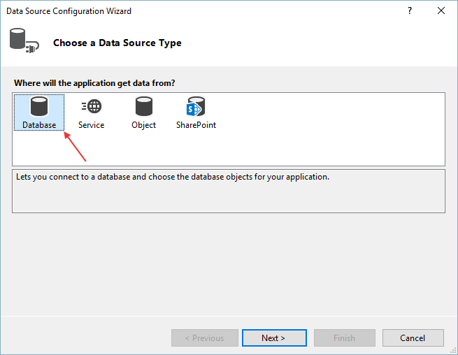
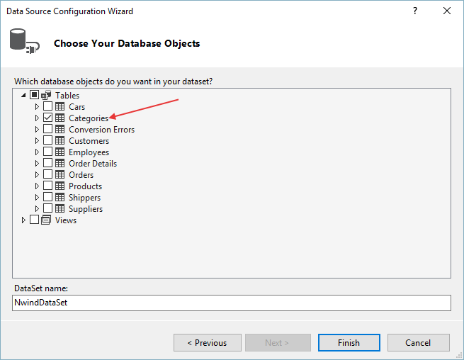
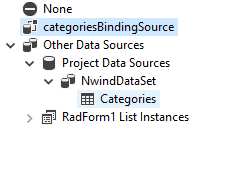

# Tutorial: Binding to DataTable or DataSet


## 

The following tutorial demonstrates binding to a single database table. For information on binding to multiple tables see the [Binding to Hierarchical Data]() topic.
        

1. Place a RadGridView component on a form. Set the Dock property to Fill.

1. In the Properties window locate the DataSource property and click the arrow to open the list. Select the __Add Project Data Source...__ link. *This step will display the Data Source Configuration Wizard.*

1. In the Data Source Configuration Wizard __Choose a Data Source Type page__, select the __Database__ icon. Click the __Next__ button.
            

1. In the Choose Your data Connection page click the __New Connection...__ button. *This step will display the Add Connection dialog.*

1. In the Add Connection dialog click the __Change...__ button. *This step will display the Change Data Source dialog.*

1. Select the __Microsoft Access Database File__ data source. Click the __OK__ button to close the Change Data Source dialog.
            

1. The Add Connection dialog will appear. Click the Database File Name __Browse__button and locate the "NWind.mdb" file from the Telerik UI for WinForms directory in the "\Examples\DataSources" directory.  Click the __OK__button to close the Add Connection dialog.
            

1. In the Choose Your Database Objects page, select the __"Categories"__ checkbox. Click the __Finish__ button to close the Data Source Configuration Wizard.
            

1. In the Visual Studio Properties window for the grid __DataSource__ property select the __"Categories"__ table. *This step will create DataSet, BindingSource and TableAdapter objects for the categories table.*

1. The project design should look something like the screenshot below. Note the new data components in the component tray under the design surface.

1. Replace the Form_Load event handler with the following code. *The "foreach" code iterates all the columns in the grid and calls BestFit() so that the columns will expand to show the data.*#_[C#] Best fit columns_

	


{{source=..\SamplesCS\GridView\PopulatingWithData\TutorialBindingToDataTableOrDataSet.cs region=bestFitColumns}} 
{{source=..\SamplesVB\GridView\PopulatingWithData\TutorialBindingToDataTableOrDataSet.vb region=bestFitColumns}} 

````C#
        private void TutorialBindingToDataTableOrDataSet_Load(object sender, EventArgs e)
        {
            this.categoriesTableAdapter.Fill(this.nwindDataSet.Categories);
            foreach (GridViewDataColumn column in radGridView1.Columns)
            {
                column.BestFit();
            }
        }
````
````VB.NET
    Private Sub TutorialBindingToDataTableOrDataSet_Load(ByVal sender As System.Object, ByVal e As System.EventArgs) Handles MyBase.Load
        Me.CategoriesTableAdapter.Fill(Me.NwindDataSet.Categories)
        For Each column As GridViewDataColumn In RadGridView1.Columns
            column.BestFit()
        Next
    End Sub
    '
````

{{endregion}} 


1. Press __F5__ to run the application.
            
