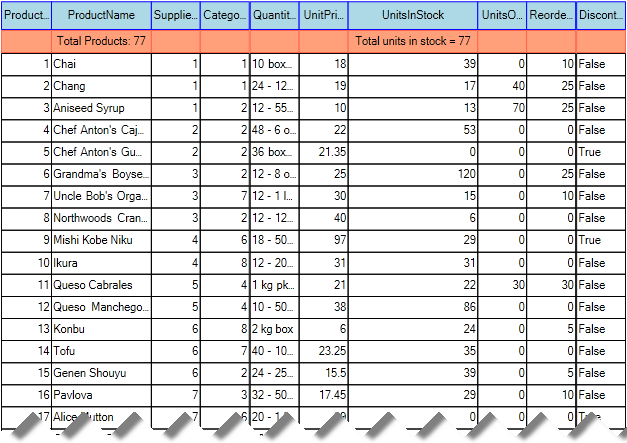
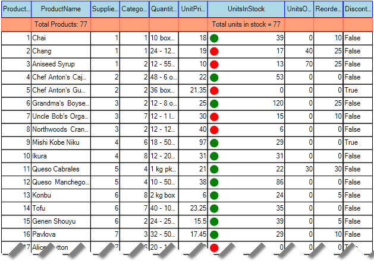

# Events and Customization

The print events in RadGridView allow the developer to customize the print output for each individual cell. There are two events namely __PrintCellFormatting__ and __PrintCellPaint__.

## PrintCellFormatting

Just like the other formatting events of RadGridView, this event allows you to format the appearance of the cells in the printed document. Here is a very simple example, which demonstrates how to customize the appearance of the header and the summary rows:

{{source=..\SamplesCS\GridView\Printing support\EventsAndCustomization.cs region=PrintCellFormatting}} 
{{source=..\SamplesVB\GridView\Printing support\EventsAndCustomization.vb region=PrintCellFormatting}} 

````C#
private void radGridView1_PrintCellFormatting(object sender, PrintCellFormattingEventArgs e)
{
    if (e.Row is GridViewTableHeaderRowInfo)
    {
        e.PrintCell.DrawFill = true;
        e.PrintCell.BackColor = Color.LightBlue;
        e.PrintCell.BorderColor = Color.Blue;
    }
    else if (e.Row is GridViewSummaryRowInfo)
    {
        e.PrintCell.DrawFill = true;
        e.PrintCell.BackColor = Color.LightSalmon;
        e.PrintCell.BorderColor = Color.Tomato;
    }
}

````
````VB.NET
Private Sub radGridView1_PrintCellFormatting(sender As Object, e As PrintCellFormattingEventArgs)
    If TypeOf e.Row Is GridViewTableHeaderRowInfo Then
        e.PrintCell.DrawFill = True
        e.PrintCell.BackColor = Color.LightBlue
        e.PrintCell.BorderColor = Color.Blue
    ElseIf TypeOf e.Row Is GridViewSummaryRowInfo Then
        e.PrintCell.DrawFill = True
        e.PrintCell.BackColor = Color.LightSalmon
        e.PrintCell.BorderColor = Color.Tomato
    End If
End Sub

````

{{endregion}} 




## PrintCellPaint

This event allow you to access the cell and to paint in it whatever you need. Here is a sample, where we will paint a green dot when the product quantity is more than 20 and a red dot if it is less:

{{source=..\SamplesCS\GridView\Printing support\EventsAndCustomization.cs region=PrintCellPaint}} 
{{source=..\SamplesVB\GridView\Printing support\EventsAndCustomization.vb region=PrintCellPaint}} 

````C#
private void radGridView1_PrintCellPaint(object sender, PrintCellPaintEventArgs e)
{
    if (e.Row is GridViewDataRowInfo & e.Column.Name == "UnitsInStock")
    {
        int side = e.CellRect.Height - 8;
        int x = e.CellRect.X + 4;
        int y = e.CellRect.Y + 4;
        Rectangle rect = new Rectangle(x, y, side, side);
        Brush brush = default(Brush);
        if (Convert.ToInt32(e.Row.Cells[e.Column.Name].Value) < 20)
        {
            brush = Brushes.Red;
        }
        else
        {
            brush = Brushes.Green;
        }
        e.Graphics.FillEllipse(brush, rect);
    }
}

````
````VB.NET
Private Sub radGridView1_PrintCellPaint(sender As Object, e As PrintCellPaintEventArgs)
    If TypeOf e.Row Is GridViewDataRowInfo And e.Column.Name = "UnitsInStock" Then
        Dim side As Integer = e.CellRect.Height - 8
        Dim x As Integer = e.CellRect.X + 4
        Dim y As Integer = e.CellRect.Y + 4
        Dim rect As New Rectangle(x, y, side, side)
        Dim brush As Brush
        If CInt(e.Row.Cells(e.Column.Name).Value) < 20 Then
            brush = Brushes.Red
        Else
            brush = Brushes.Green
        End If
        e.Graphics.FillEllipse(brush, rect)
    End If
End Sub

````

{{endregion}} 


# See Also
* [GridPrintStyle]({[%slug winforms/gridview/printing-support/gridprintstyle%]}

* [Printing Hierarchical Grid]({[%slug winforms/gridview/printing-support/printing-hierarchical-grid%]}

* [Overview]({[%slug winforms/gridview/printing-support%]}

