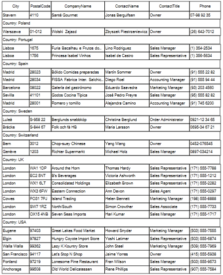
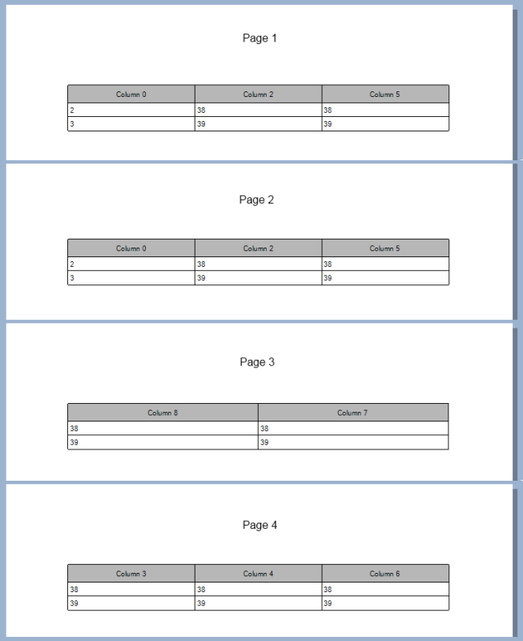

# GridPrintStyle


You can customize the settings of the grid print job by setting the __PrintStyle__ property of the RadGridView to a new instance of the __GridPrintStyle__ class or editing the current one. The available properties are:

* __PrintGrouping__ – determines if grouping will be printed.

* __PrintSummaries__ – determines if summary rows will be printed.

* __PrintHiddenRows__ – determines if hidden rows will be printed.

* __PrintHiddenColumns__ – determines if hidden columns will be printed.

* __PrintHeaderOnEachPage__ – determines if header cells will be printed on each page.

* __FitWidthMode__ – determines how the RadGridView will be positioned on the page. There are three possible settings for this property:

    * NoFit – the grid is aligned to the left and its size is not changed

    * NoFitCentered – the grid is center aligned and its size is not changed

    * FitPageWidth – the grid is resized, keeping the columns width ratios, so it would fill the whole page.

    * You can also set the header cells font, data cells font, group cells font and summary cells font.

## Customizing GridPrintStyle

{{source=..\SamplesCS\GridView\Printing support\GridPrintStyle1.cs region=PrintStyle}} 
{{source=..\SamplesVB\GridView\Printing support\GridPrintStyle1.vb region=PrintStyle}} 

````C#
GridPrintStyle style = new GridPrintStyle();
style.FitWidthMode = PrintFitWidthMode.FitPageWidth;
style.PrintGrouping = true;
style.PrintSummaries = false;
style.PrintHeaderOnEachPage = true;
style.PrintHiddenColumns = false;
this.radGridView1.PrintStyle = style;
this.radGridView1.Print();

````
````VB.NET
Dim style As New GridPrintStyle()
style.FitWidthMode = PrintFitWidthMode.FitPageWidth
style.PrintGrouping = True
style.PrintSummaries = False
style.PrintHeaderOnEachPage = True
style.PrintHiddenColumns = False
Me.RadGridView1.PrintStyle = style
Me.RadGridView1.Print()

````

{{endregion}} 



## Multi-page printing

Multi-page printing is supported for grids with ViewDefinition set to TableViewDefinition. To enable the functionality you should define the collection of columns each page will contain. For this purpose you can use the PrintPages collection of the TableViewDefinitionPrintRenderer. The PrintPages collection contains collections of columns, each representing a separate page. Here is an example which assumes the grid has 10 columns:

{{source=..\SamplesCS\GridView\Printing support\GridPrintStyle1.cs region=MultiPagePrintingPrintStyle}} 
{{source=..\SamplesVB\GridView\Printing support\GridPrintStyle1.vb region=MultiPagePrintingPrintStyle}} 

````C#
GridPrintStyle printStyle = new GridPrintStyle(this.radGridView1);
TableViewDefinitionPrintRenderer renderer = new TableViewDefinitionPrintRenderer(this.radGridView1);
renderer.PrintPages.Add(this.radGridView1.Columns[0], this.radGridView1.Columns[2], this.radGridView1.Columns[5]);
renderer.PrintPages.Add(this.radGridView1.Columns[0], this.radGridView1.Columns[1], this.radGridView1.Columns[9]);
renderer.PrintPages.Add(this.radGridView1.Columns[8], this.radGridView1.Columns[7]);
renderer.PrintPages.Add(this.radGridView1.Columns[3], this.radGridView1.Columns[4], this.radGridView1.Columns[6]);
printStyle.PrintRenderer = renderer;
this.radGridView1.PrintStyle = printStyle;

````
````VB.NET
Dim printStyle As GridPrintStyle = New GridPrintStyle(RadGridView1)
Dim renderer As TableViewDefinitionPrintRenderer = New TableViewDefinitionPrintRenderer(RadGridView1)
renderer.PrintPages.Add(RadGridView1.Columns(0), RadGridView1.Columns(2), RadGridView1.Columns(5))
renderer.PrintPages.Add(RadGridView1.Columns(0), RadGridView1.Columns(1), RadGridView1.Columns(9))
renderer.PrintPages.Add(RadGridView1.Columns(8), RadGridView1.Columns(7))
renderer.PrintPages.Add(RadGridView1.Columns(3), RadGridView1.Columns(4), RadGridView1.Columns(6))
printStyle.PrintRenderer = renderer
RadGridView1.PrintStyle = printStyle
RadGridView1.PrintPreview()

````

{{endregion}} 

This code defines four pages where the content of the pages is as follows:

* Page 1 will contain the grid columns at indexes 0, 2 and 5.
            

* Page 2 will contain the grid columns at indexes 0, 1 and 9.
            

* Page 3 will contain the grid columns at indexes 8 and 7.
            

* Page 4 will contain the grid columns at indexes 3, 4 and 6.

You should note that one column can appear on several pages. Here is the result of the above code when previewed in the PrintPreviewDialog:<br>
