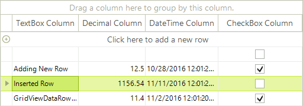

# Adding and Inserting Rows

## Adding rows to RadGridView

Adding new rows in the RadGridView can be achieved via the __Rows__ collection. 
      	For example if the grid control contains three columns – 
        	[GridViewTextBoxColumn](),
        	[GridViewDecimalColumn](),
        	[GridViewDateTimeColumn]() and
        	[GridViewCheckBoxColumn](BCA512FB-1394-4EE4-98A2-9B81CA5DEB72)
        	you can add an empty row as follows:
      	

__RadGridView.Rows.AddNew()__ adds an empty row and allows the user to enter a value for each column cells’

#### __[C#]__

{{source=..\SamplesCS\GridView\Rows\AddingAndInsertingRows.cs region=addNewRow}}
	            radGridView1.Rows.AddNew();
	{{endregion}}

#### __[VB.NET]__

{{source=..\SamplesVB\GridView\Rows\AddingAndInsertingRows.vb region=addNewRow}}
	        RadGridView1.Rows.AddNew()
	{{endregion}}

__RadGridView.Rows.Add(value_for_first_column, value_for_second_column, value_for_third_column)__ – adds a new rows with the
        	specified values. You can use the following code snippet to add values for each column
        

#### __[C#]__

{{source=..\SamplesCS\GridView\Rows\AddingAndInsertingRows.cs region=addRow}}
	            radGridView1.Rows.Add("Adding New Row", 12.5, DateTime.Now, true);
	{{endregion}}

#### __[VB.NET]__

{{source=..\SamplesVB\GridView\Rows\AddingAndInsertingRows.vb region=addRow}}
	        RadGridView1.Rows.Add("Adding New Row", 12.5, DateTime.Now, True)
	{{endregion}}

You can also add rows by creating an instance of __GridViewDataRowInfo__ and adding it to the __Rows__ collection of RadGridView

#### __[C#]__

{{source=..\SamplesCS\GridView\Rows\AddingAndInsertingRows.cs region=addRowWithRowInfo}}
	            GridViewDataRowInfo rowInfo = new GridViewDataRowInfo(this.radGridView1.MasterView);
	            rowInfo.Cells[0].Value = "GridViewDataRowInfo";
	            rowInfo.Cells[1].Value = 11.4;
	            rowInfo.Cells[2].Value = DateTime.Now.AddDays(5);
	            rowInfo.Cells[3].Value = true;
	            radGridView1.Rows.Add(rowInfo);
	{{endregion}}

#### __[VB.NET]__

{{source=..\SamplesVB\GridView\Rows\AddingAndInsertingRows.vb region=addRowWithRowInfo}}
	        Dim rowInfo As New GridViewDataRowInfo(Me.RadGridView1.MasterView)
	        rowInfo.Cells(0).Value = "GridViewDataRowInfo"
	        rowInfo.Cells(1).Value = 11.4
	        rowInfo.Cells(2).Value = DateTime.Now.AddDays(5)
	        rowInfo.Cells(3).Value = True
	        RadGridView1.Rows.Add(rowInfo)
	{{endregion}}

## Inserting rows in RadGridView

Rows can be inserted at a specified position by using the __Insert__ method of the __Rows__ collection of RadGridView.
    	Below you can see an example of this functionality:
    

#### __[C#]__

{{source=..\SamplesCS\GridView\Rows\AddingAndInsertingRows.cs region=insertRow}}
	            GridViewDataRowInfo dataRowInfo = new GridViewDataRowInfo(this.radGridView1.MasterView);
	            dataRowInfo.Cells[0].Value = "Inserted Row";
	            dataRowInfo.Cells[1].Value = 1156.54;
	            dataRowInfo.Cells[2].Value = DateTime.Now.AddDays(14);
	            radGridView1.Rows.Insert(2, dataRowInfo);
	{{endregion}}

#### __[VB.NET]__

{{source=..\SamplesVB\GridView\Rows\AddingAndInsertingRows.vb region=insertRow}}
	        Dim dataRowInfo As New GridViewDataRowInfo(Me.RadGridView1.MasterView)
	        rowInfo.Cells(0).Value = "Inserted Row"
	        rowInfo.Cells(1).Value = 1154.54
	        rowInfo.Cells(2).Value = DateTime.Now.AddDays(14)
	        RadGridView1.Rows.Insert(2, dataRowInfo)
	{{endregion}}

