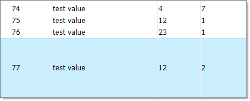

# GridViewRowInfo

__GridViewRowInfo__ class is the logical representation of a single row. Some of the significant properties include:
      

* __IsEditable:__The row can be edited.
          

* __IsExpanded:__This property indicates if the row has been expanded when the row is a grouping header row or when displaying hierarchy.
          

* [IsPinned](): Can be pinned to the top of the grid so the row will always be visible, even when scrolling.
          

* [IsSelected:]() If set to __True,__ the row is selected.
          

* __Height__: The height of the row in pixels.
          

* [IsCurrent:]() If set to __True,__ the row is selected.
          

* __AllowResize__: If __True__, the height of the row can be resized. If __False__ the splitter mouse cursor does not display and the row is prevented from being resized.
          

* __IsVisible__determines whether the row is visible. Note this is NOT related to scrolling but visible in general.
          

GridViewRowInfo also has an __EnsureVisible()__ method that scrolls a row into view.
      

The example below demonstrates the behavior of several of these properties:

#### __[C#] Using GridViewRowInfo__

{{region GridViewRowInfo}}
	            GridViewRowInfo lastRow = radGridView1.Rows[radGridView1.Rows.Count - 1];
	            lastRow.EnsureVisible();
	            lastRow.IsSelected = true;
	            lastRow.Height = 100;
	            lastRow.AllowResize = false;
	{{endregion}}

#### __[VB.NET] Using GridViewRowInfo__

{{region GridViewRowInfo}}
	        Dim lastRow As GridViewRowInfo = RadGridView1.Rows(RadGridView1.Rows.Count - 1)
	        lastRow.EnsureVisible()
	        lastRow.IsSelected = True
	        lastRow.Height = 100
	        lastRow.AllowResize = False
	{{endregion}}

## 

__Difference between GridViewInfo.Rows and GridViewTemplate.Rows__

One __GridViewTemplate__corresponds to one DataSource. As its name speaks, it is a template and it defines the structure of the data presented - the number, order, header text and other properties of the columns. In addition it has properties for user interaction - *AllowAddNewRow*, *ShowColumnHeaders*, etc.

          On the other side, you may have several __GridViewInfo__'s____(views) for one DataSource. In a RadGridView displaying flat data, there is one __GridViewTemplate__and one __GridViewInfo__for one DataSource. Therefore, you will find that some of their properties will return one and the same values.

          In order to understand the actual difference, let's analyze the case of hierarchical grid with 2 levels of hierarchy - one parent and one child levels. Since there are two DataSources in this case, there are two __GridViewTemplates__- one per level. These __GridViewTemplates__govern the data structure properties.
          However, you may have several __GridViewInfos__for one __GridViewTemplate__- if you have three rows of the __MasterTemplate__ expanded, you will have three GridViewInfos for the child GridViewTemplate.
        

__GridViewInfo.Rows__ are a subset of __GridVIewTemplate.Rows__. The subset is created dynamically so it is slower operation.
        
