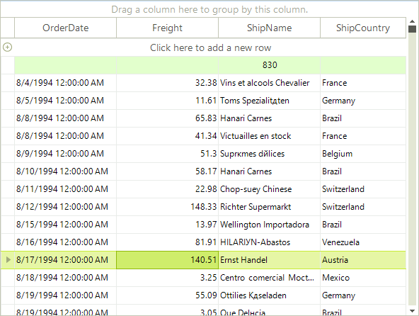
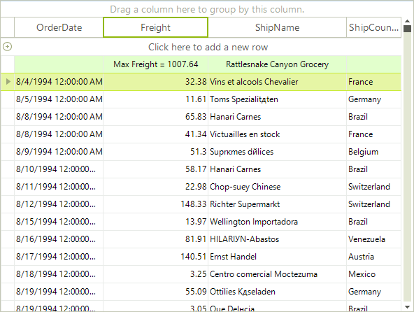
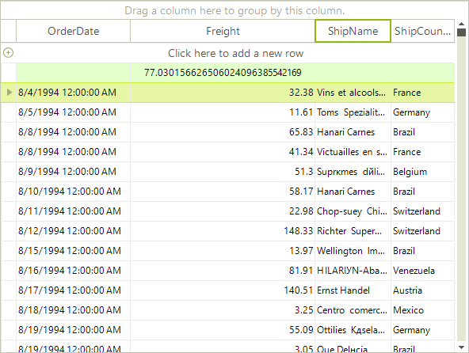
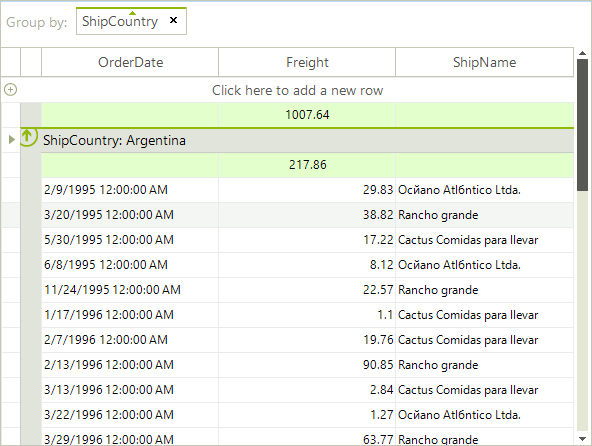
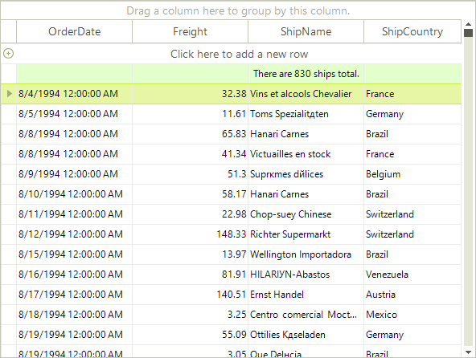
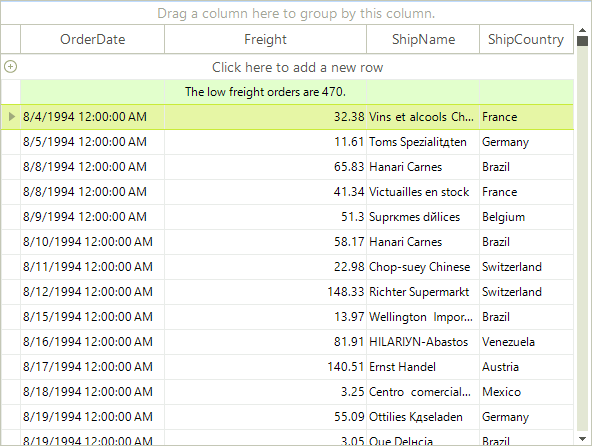

# Summary Rows

Summary rows are RadGridView rows which allow you to display information about the data in the control such as first item, last item, count of items, etc. The summary rows are top and bottom pinned rows. They can be used in a flat RadGridView or in groups and hierarchical views.
      

## Basic Example

The following example demonstrates how to create a top pinned summary row, showing the count of the RadGridView rows:

{{source=..\SamplesCS\GridView\Rows\SummaryRows.cs region=addingSummaryRow}} 
{{source=..\SamplesVB\GridView\Rows\SummaryRows.vb region=addingSummaryRow}} 

````C#
GridViewSummaryItem summaryItem = new GridViewSummaryItem();
summaryItem.Name = "ShipName";
summaryItem.Aggregate = GridAggregateFunction.Count;
GridViewSummaryRowItem summaryRowItem = new GridViewSummaryRowItem();
summaryRowItem.Add(summaryItem);
this.radGridView1.SummaryRowsTop.Add(summaryRowItem);
this.radGridView1.SummaryRowsBottom.Add(summaryRowItem);

````
````VB.NET
Dim summaryItem As New GridViewSummaryItem()
summaryItem.Name = "ShipName"
summaryItem.Aggregate = GridAggregateFunction.Count
Dim summaryRowItem As New GridViewSummaryRowItem()
summaryRowItem.Add(summaryItem)
Me.RadGridView1.SummaryRowsTop.Add(summaryRowItem)
Me.RadGridView1.SummaryRowsBottom.Add(summaryRowItem)

````

{{endregion}} 




## SummaryItem properties

Summary item major properties are:

* Name – The name of the column which the summary item refers to.

* Aggregate – The function which will be evaluated.

* AggregateExpression – The final expression to evaluate.

* FormatString – Formatting string which is applied to the calculated value of the summary item.

## Predefined aggregates

The predefined aggregates are:

* None – No expression is evaluated.

* Sum – Returns the sum of all values.

* Min – Returns the minimum value.

* Max – Returns the maximum value.

* Last – Returns the last value.

* First – Returns the first value.

* Count – Returns the count of all values.

* Avg – Returns the average of all values.

* StDev – Returns the standard deviation of all values.

* Var – Returns the sample variance of all values.

## Using the FormatString

The following example demonstrates how to add several summary items in a summary row and how the FormatString is used:

{{source=..\SamplesCS\GridView\Rows\SummaryRows.cs region=formatString}} 
{{source=..\SamplesVB\GridView\Rows\SummaryRows.vb region=formatString}} 

````C#
GridViewSummaryItem summaryItemShipName = new GridViewSummaryItem("ShipName", "{0}", GridAggregateFunction.Last);
GridViewSummaryItem summaryItemFreight = new GridViewSummaryItem("Freight", "Max Freight = {0}", GridAggregateFunction.Max);
GridViewSummaryRowItem summaryRowItem = new GridViewSummaryRowItem(
    new GridViewSummaryItem[] { summaryItemShipName, summaryItemFreight });
this.radGridView1.SummaryRowsTop.Add(summaryRowItem);

````
````VB.NET
Dim summaryItemShipName As New GridViewSummaryItem("ShipName", "{0}", GridAggregateFunction.Last)
Dim summaryItemFreight As New GridViewSummaryItem("Freight", "Max Freight = {0}", GridAggregateFunction.Max)
Dim summaryRowItem As New GridViewSummaryRowItem(New GridViewSummaryItem() {summaryItemShipName, summaryItemFreight})
Me.RadGridView1.SummaryRowsTop.Add(summaryRowItem)

````

{{endregion}} 




## Using an AggregateExpression

The next example demonstrates how to use AggregateExpression to calculate an average value excluding the Max and Min value:

{{source=..\SamplesCS\GridView\Rows\SummaryRows.cs region=aggregateExpression}} 
{{source=..\SamplesVB\GridView\Rows\SummaryRows.vb region=aggregateExpression}} 

````C#
GridViewSummaryItem summaryItem = new GridViewSummaryItem();
summaryItem.Name = "Freight";
summaryItem.AggregateExpression = "(Sum(Freight) - Max(Freight) - Min(Freight)) / Count(Freight)";
GridViewSummaryRowItem summaryRowItem = new GridViewSummaryRowItem();
summaryRowItem.Add(summaryItem);
this.radGridView1.SummaryRowsTop.Add(summaryRowItem);

````
````VB.NET
Dim summaryItem As New GridViewSummaryItem()
summaryItem.Name = "Freight"
summaryItem.AggregateExpression = "(Sum(Freight) - Max(Freight) - Min(Freight)) / Count(Freight)"
Dim summaryRowItem As New GridViewSummaryRowItem()
summaryRowItem.Add(summaryItem)
Me.RadGridView1.SummaryRowsTop.Add(summaryRowItem)

````

{{endregion}} 




## Summary rows in grouped RadGridView

When you use grouping, the summary rows are calculated for each group child rows and displayed as top or bottom pinned rows in each group. Using the template property ShowTotals you can define if total summary rows will be shown. They are calculated for the child rows of all groups and pinned at the top or bottom of all groups.

The next example demonstrates how to use summary rows in grouping:

{{source=..\SamplesCS\GridView\Rows\SummaryRows.cs region=grouping}} 
{{source=..\SamplesVB\GridView\Rows\SummaryRows.vb region=grouping}} 

````C#
this.radGridView1.MasterTemplate.ShowTotals = true;
GridViewSummaryItem summaryItem = new GridViewSummaryItem("Freight", "{0}", GridAggregateFunction.Max);
GridViewSummaryRowItem summaryRowItem = new GridViewSummaryRowItem();
summaryRowItem.Add(summaryItem);
this.radGridView1.SummaryRowsTop.Add(summaryRowItem);

````
````VB.NET
Me.RadGridView1.MasterTemplate.ShowTotals = True
Dim summaryItem As New GridViewSummaryItem("Freight", "{0}", GridAggregateFunction.Max)
Dim summaryRowItem As New GridViewSummaryRowItem()
summaryRowItem.Add(summaryItem)
Me.RadGridView1.SummaryRowsTop.Add(summaryRowItem)

````

{{endregion}} 




## Summary rows in hierarchical RadGridView

You can add summary rows in hierarchical views. They are calculated for the child rows in the current view.
        

The following example demonstrates how to add a summary row to the first level of RadGridView hierarchy:

{{source=..\SamplesCS\GridView\Rows\SummaryRows.cs region=hierarchy}} 
{{source=..\SamplesVB\GridView\Rows\SummaryRows.vb region=hierarchy}} 

````C#
GridViewSummaryItem summaryItem = new GridViewSummaryItem("Quantity", "Max quantity = {0}", GridAggregateFunction.Max);
GridViewSummaryRowItem summaryRowItem = new GridViewSummaryRowItem();
summaryRowItem.Add(summaryItem);
this.radGridView1.MasterTemplate.Templates[0].SummaryRowsTop.Add(summaryRowItem);

````
````VB.NET
Dim summaryItem As New GridViewSummaryItem("Quantity", "Max quantity = {0}", GridAggregateFunction.Max)
Dim summaryRowItem As New GridViewSummaryRowItem()
summaryRowItem.Add(summaryItem)
Me.RadGridView1.MasterTemplate.Templates(0).SummaryRowsTop.Add(summaryRowItem)

````

{{endregion}} 


## Customizing the summary row

The GroupSummaryEvaluate event is fired after a summary item is calculated and before the summary row is displayed. You can use it to apply custom formatting to the summary row:

{{source=..\SamplesCS\GridView\Rows\SummaryRows.cs region=customFormatting}} 
{{source=..\SamplesVB\GridView\Rows\SummaryRows.vb region=customFormatting}}

````C#
void CustomFormatting()
{
    
    this.radGridView1.GroupSummaryEvaluate += new GroupSummaryEvaluateEventHandler(radGridView1_GroupSummaryEvaluate);
    GridViewSummaryItem summaryItem = new GridViewSummaryItem("Quantity", "Max quantity = {0}", GridAggregateFunction.Max);
    GridViewSummaryRowItem summaryRowItem = new GridViewSummaryRowItem();
    summaryRowItem.Add(summaryItem);
    this.radGridView1.MasterTemplate.Templates[0].SummaryRowsTop.Add(summaryRowItem);
}
private void radGridView1_GroupSummaryEvaluate(object sender, GroupSummaryEvaluationEventArgs e)
{
    if (e.Parent == this.radGridView1.MasterTemplate)
    {
        e.FormatString = String.Format("There are {0} ships total.", e.Value);
    }
}

````
````VB.NET
Private Sub CustomFormatting()
    AddHandler RadGridView1.GroupSummaryEvaluate, AddressOf radGridView1_GroupSummaryEvaluate
    Dim summaryItem As New GridViewSummaryItem("Quantity", "Max quantity = {0}", GridAggregateFunction.Max)
    Dim summaryRowItem As New GridViewSummaryRowItem()
    summaryRowItem.Add(summaryItem)
    Me.RadGridView1.MasterTemplate.Templates(0).SummaryRowsTop.Add(summaryRowItem)
End Sub
Private Sub radGridView1_GroupSummaryEvaluate(ByVal sender As Object, ByVal e As GroupSummaryEvaluationEventArgs)
    If e.Parent Is Me.RadGridView1.MasterTemplate Then
        e.FormatString = String.Format("There are {0} ships total.", e.Value)
    End If
End Sub

```` 

{{endregion}}	



The same event is used to format the group header so it is important to check the Parent in the event arguments, as shown in the above example.
        

## Extending the GridViewSummaryItem

You can write your own logic for summary items evaluation by inheriting the GridViewSummaryItem class and overriding the Evaluate event.

The following example demonstrates how to create a custom summaryitem which calculates the count of orders with Freight is less than 50:

{{source=..\SamplesCS\GridView\Rows\SummaryRows.cs region=customSummaryItemUsage}} 
{{source=..\SamplesVB\GridView\Rows\SummaryRows.vb region=customSummaryItemUsage}}

````C#
void CustomSummaryItemUsage()
{
    CustomSummaryItem summaryItem = new CustomSummaryItem("Freight", "The low freight orders are {0}.", GridAggregateFunction.Count);
    GridViewSummaryRowItem summaryRowItem = new GridViewSummaryRowItem();
    summaryRowItem.Add(summaryItem);
    this.radGridView1.SummaryRowsTop.Add(summaryRowItem);
}
public class CustomSummaryItem : GridViewSummaryItem
{
    public CustomSummaryItem(string name, string formatString, GridAggregateFunction aggregate)
        : base(name, formatString, aggregate)
    { }
    public override object Evaluate(IHierarchicalRow row)
    {
        int lowFreightsCount = 0;
        foreach (GridViewRowInfo childRow in row.ChildRows)
        {
            if ((decimal)childRow.Cells["Freight"].Value < 50m)
            {
                lowFreightsCount++;
            }
        }
        return lowFreightsCount;
    }
}

````
````VB.NET
Private Sub CustomSummaryItemUsage()
    Dim summaryItem As New CustomSummaryItem("Freight", "The low freight orders are {0}.", GridAggregateFunction.Count)
    Dim summaryRowItem As New GridViewSummaryRowItem()
    summaryRowItem.Add(summaryItem)
    Me.RadGridView1.SummaryRowsTop.Add(summaryRowItem)
End Sub
Public Class CustomSummaryItem
    Inherits GridViewSummaryItem
    Public Sub New(ByVal name As String, ByVal formatString As String, ByVal aggregate As GridAggregateFunction)
        MyBase.New(name, formatString, aggregate)
    End Sub
    Public Overrides Function Evaluate(ByVal row As IHierarchicalRow) As Object
        Dim lowFreightsCount As Integer = 0
        For Each childRow As GridViewRowInfo In row.ChildRows
            If CDec(childRow.Cells("Freight").Value) < 50D Then
                lowFreightsCount += 1
            End If
        Next childRow
        Return lowFreightsCount
    End Function
End Class

```` 

{{endregion}}


