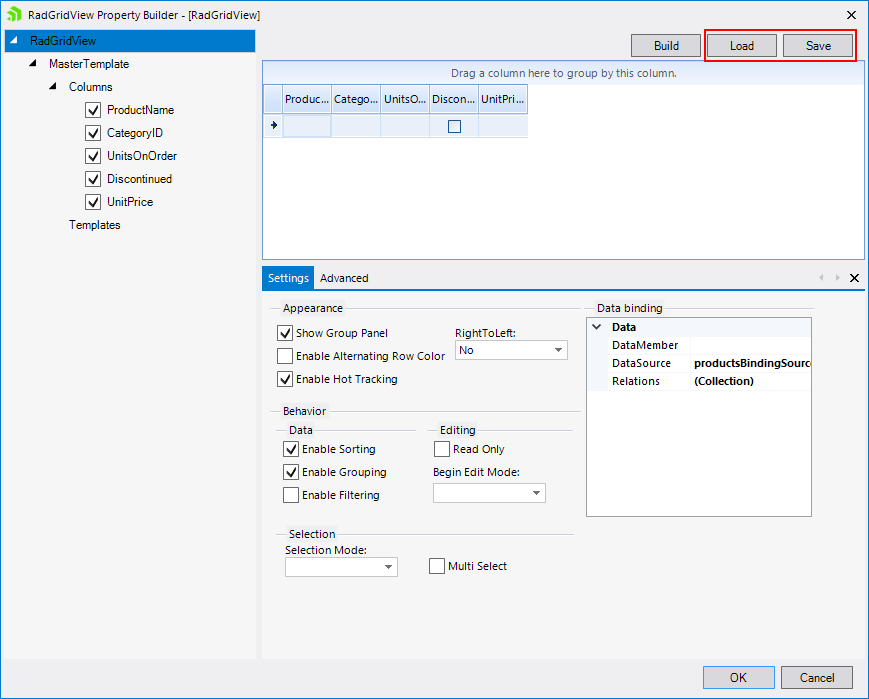
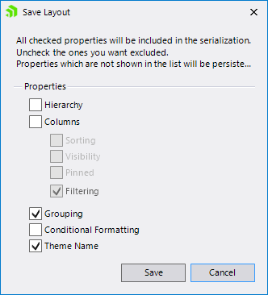

# Save/Load layout buttons in the Property Grid

RadGridView settings can be saved and loaded at design time and there is a fine-grained control over which settings you want to include/exclude from the generated XML file. Thus if you are using multiple grids, you can use the same settings over and over again which saves time.

*Load Settings form file* and *Save Settings to file* buttons are located in the lower left corner of *RadGridView Property Builder*:

When you click on *Save, Settings to file* the Save Layout dialog appears: 

The label in the upper part of the dialog describes its function:

>caution All checked properties will be included in the serialization. Uncheck the ones you want excluded. Properties which are not shown in the list will be persisted.
>

# See Also
* [Advanced]({[%slug winforms/gridview/save-and-load-layout/advanced%]}

* [Overview]({[%slug winforms/gridview/save-and-load-layout/overview%]}

