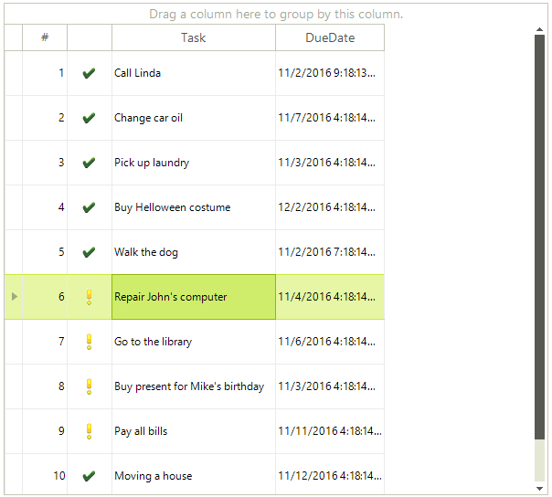
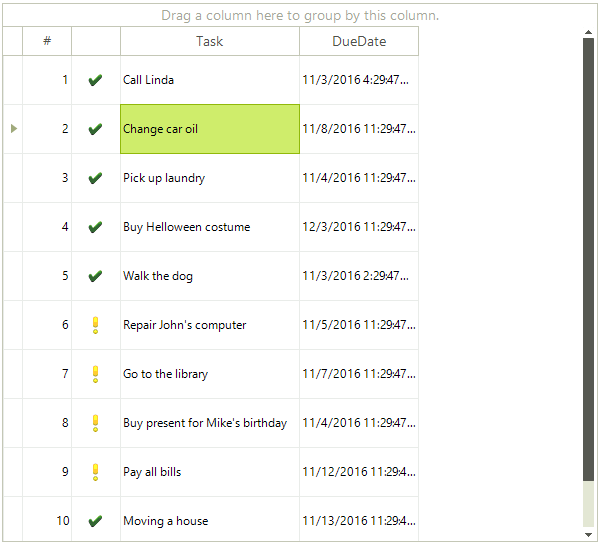

# Basic Selection

RadGridView provides you with a selection functionality, which allows the user to select one or
      more items (rows or cells) from the data displayed by the control.    
      

>tipThe selection mechanism can be controlled programmatically as well. 
			For more information, take a look at the topic  [
			Selecting Rows and Cells Programmatically]().     
          

## Basic row selection

By default RadGridView allows the user to select only one row. In this case the default property settings are:
        

#### __[C#]__

{{region basicRowSelection}}
	            radGridView1.MultiSelect = false;
	            radGridView1.SelectionMode = GridViewSelectionMode.FullRowSelect;
	{{endregion}}

#### __[VB.NET]__

{{region basicRowSelection}}
	        RadGridView1.MultiSelect = False
	        RadGridView1.SelectionMode = GridViewSelectionMode.FullRowSelect
	        '#End Region
	
	        '			#Region "basicCellSelection"
	        RadGridView1.MultiSelect = False
	        RadGridView1.SelectionMode = GridViewSelectionMode.CellSelect
	        '#End Region
	
	        '			#Region "collections"
	        Dim selectedRows As GridViewSelectedRowsCollection = RadGridView1.SelectedRows
	        Dim selectedCells As GridViewSelectedCellsCollection = RadGridView1.SelectedCells
	        '#End Region
	
	        '			#Region "currentRowCell"
	        'gets an instance of the current row
	        Dim row As GridViewRowInfo = RadGridView1.CurrentRow
	        'gets an instance of the current cell
	        Dim cell As GridDataCellElement = RadGridView1.CurrentCell
	        'gets or sets if the first row of radGridView1 is current or not
	        RadGridView1.Rows(0).IsCurrent = True
	        '#End Region
	
	        'gets or sets if the first cell of radGridView1 is current or not
	        'RadGridView1.Rows(0).Cells(0).IsCurrent = True
	
	        '#region multipleRowSelection
	        RadGridView1.MultiSelect = True
	        RadGridView1.SelectionMode = GridViewSelectionMode.FullRowSelect
	{{endregion}}

To select an item in RadGridView click in the rectangle area of the desired row.
         

## Basic cell selection

You can modify RadGridView to select single cells instead of rows by setting its
          SelectionMode property to CellSelect from the GridViewSelectionMode enumeration:
        

#### __[C#]__

{{region basicCellSelection}}
	            radGridView1.MultiSelect = false;
	            radGridView1.SelectionMode = GridViewSelectionMode.CellSelect;
	{{endregion}}

#### __[VB.NET]__

{{region basicCellSelection}}
	        RadGridView1.MultiSelect = False
	        RadGridView1.SelectionMode = GridViewSelectionMode.CellSelect
	        '#End Region
	
	        '			#Region "collections"
	        Dim selectedRows As GridViewSelectedRowsCollection = RadGridView1.SelectedRows
	        Dim selectedCells As GridViewSelectedCellsCollection = RadGridView1.SelectedCells
	        '#End Region
	
	        '			#Region "currentRowCell"
	        'gets an instance of the current row
	        Dim row As GridViewRowInfo = RadGridView1.CurrentRow
	        'gets an instance of the current cell
	        Dim cell As GridDataCellElement = RadGridView1.CurrentCell
	        'gets or sets if the first row of radGridView1 is current or not
	        RadGridView1.Rows(0).IsCurrent = True
	        '#End Region
	
	        'gets or sets if the first cell of radGridView1 is current or not
	        'RadGridView1.Rows(0).Cells(0).IsCurrent = True
	
	        '#region multipleRowSelection
	        RadGridView1.MultiSelect = True
	        RadGridView1.SelectionMode = GridViewSelectionMode.FullRowSelect
	{{endregion}}

After setting these properties, to select a cell in RadGridView, click the desired cell.
        

## Selected items

Once an item is selected (row or cell), you can find this item in the SelectedRows and SelectedCells collections respectively.
          The following code described how to access those collections:
        

#### __[C#]__

{{region collections}}
	            GridViewSelectedRowsCollection selectedRows = radGridView1.SelectedRows;
	            GridViewSelectedCellsCollection selectedCells = radGridView1.SelectedCells;
	{{endregion}}

#### __[VB.NET]__

{{region collections}}
	        Dim selectedRows As GridViewSelectedRowsCollection = RadGridView1.SelectedRows
	        Dim selectedCells As GridViewSelectedCellsCollection = RadGridView1.SelectedCells
	        '#End Region
	
	        '			#Region "currentRowCell"
	        'gets an instance of the current row
	        Dim row As GridViewRowInfo = RadGridView1.CurrentRow
	        'gets an instance of the current cell
	        Dim cell As GridDataCellElement = RadGridView1.CurrentCell
	        'gets or sets if the first row of radGridView1 is current or not
	        RadGridView1.Rows(0).IsCurrent = True
	        '#End Region
	
	        'gets or sets if the first cell of radGridView1 is current or not
	        'RadGridView1.Rows(0).Cells(0).IsCurrent = True
	
	        '#region multipleRowSelection
	        RadGridView1.MultiSelect = True
	        RadGridView1.SelectionMode = GridViewSelectionMode.FullRowSelect
	{{endregion}}

## Events

There are two events relevant to the selection in the gridview: SelectionChanged, CurrentCellChanged. The sequence of the is as follows –
 the CurrentCellChanged is fired first and after that the SelectionChangedEvent event fires.     
        

## CurrentRow/CurrentCell

Once an item is selected, it automatically becomes current (when basic selection is used).
 This means that if you select the first row (cell) of RadGridView, its IsCurrent property will 
 be automatically set to true and CurrentRow (CurrentCell) property of RadGridView will hold an 
 instance of this row (respectively cell). The following example demonstrates how to access the 
 CurrentRow and CurrentCell properties and additionally the IsCurrent property of a row or a cell:
          

#### __[C#]__

{{region currentRowCell}}
	            //gets an instance of the current row
	            GridViewRowInfo row = radGridView1.CurrentRow;
	            //gets an instance of the current cell
	            GridDataCellElement cell = radGridView1.CurrentCell;
	            //gets or sets if the first row of radGridView1 is current or not
	            radGridView1.Rows[0].IsCurrent = true;
	{{endregion}}

#### __[VB.NET]__

{{region currentRowCell}}
	        'gets an instance of the current row
	        Dim row As GridViewRowInfo = RadGridView1.CurrentRow
	        'gets an instance of the current cell
	        Dim cell As GridDataCellElement = RadGridView1.CurrentCell
	        'gets or sets if the first row of radGridView1 is current or not
	        RadGridView1.Rows(0).IsCurrent = True
	        '#End Region
	
	        'gets or sets if the first cell of radGridView1 is current or not
	        'RadGridView1.Rows(0).Cells(0).IsCurrent = True
	
	        '#region multipleRowSelection
	        RadGridView1.MultiSelect = True
	        RadGridView1.SelectionMode = GridViewSelectionMode.FullRowSelect
	{{endregion}}

When basic selection is used, the opposite is also valid – if you set the CurrentRow or CurrentCell (or the IsCurrent property to true for a cell or row) in RadGridView and only if  basic selection is used 
        (MultiSelect = false ), the selected row(cell) will be the same as the current row(cell).
      
