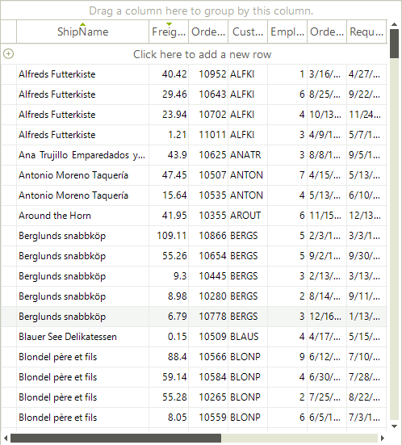

# Setting Sorting Programmatically

## Overview

The RadGridView control includes __SortDescriptors__ property at the GridViewTemplate
            level which is exposed in RadGridView class for MasterTemplate instance. This collection allows you to
            use descriptors which define the sorting property and the sorting direction for the data that is bound to the RadGridView.
            As this is a collection, you are able not only to add, but to remove or clear the its entries as well. 
            When you add a new descriptor to the collection, the data is automatically sorted according to it.
		

## Using SortDescriptor 

To enable sorting you need to set the EnableSorting property of the desired template:

#### __[C#] Enable sorting__

{{region enableSorting}}
	            this.radGridView1.MasterTemplate.EnableSorting = true;
	{{endregion}}

#### __[VB.NET] Enable sorting__

{{region enableSorting}}
	        Me.RadGridView1.MasterTemplate.EnableSorting = True
	{{endregion}}

Here is how to create and add new SortDescriptor

#### __[C#] Using SortDescriptor__

{{region usingSortDescriptor}}
	            SortDescriptor descriptor = new SortDescriptor();
	            descriptor.PropertyName = "ShipCountry";
	            descriptor.Direction = ListSortDirection.Ascending;
	            this.radGridView1.MasterTemplate.SortDescriptors.Add(descriptor);
	{{endregion}}

#### __[Vb.NET] Using SortDescriptor__

{{region usingSortDescriptor}}
	        Dim descriptor As New SortDescriptor()
	        descriptor.PropertyName = "ShipCountry"
	        descriptor.Direction = ListSortDirection.Ascending
	        Me.RadGridView1.MasterTemplate.SortDescriptors.Add(descriptor)
	{{endregion}}

The __PropertyName__ property defines the property, by which the data will be sorted, 
            and the __SortDirection__ property allows you to define the sort direction.
        

## Sorting by two or more columns

RadGridView supports sorting by one or more columns. Example of sorting by 2 columns:

#### __[C#] Sorting by two columns__

{{region sortingByTwoOrMoreColumns}}
	            SortDescriptor descriptorShipName = new SortDescriptor();
	            descriptorShipName.PropertyName = "ShipName";
	            descriptorShipName.Direction = ListSortDirection.Ascending;
	            SortDescriptor descriptorFreight = new SortDescriptor();
	            descriptorFreight.PropertyName = "Freight";
	            descriptorFreight.Direction = ListSortDirection.Descending;
	            this.radGridView1.SortDescriptors.Add(descriptorShipName);
	            this.radGridView1.SortDescriptors.Add(descriptorFreight);
	{{endregion}}

#### __[VB.NET] Sorting by two columns__

{{region sortingByTwoOrMoreColumns}}
	        Dim descriptorShipName As New SortDescriptor()
	        descriptorShipName.PropertyName = "ShipName"
	        descriptorShipName.Direction = ListSortDirection.Ascending
	
	        Dim descriptorFreight As New SortDescriptor()
	        descriptorFreight.PropertyName = "Freight"
	        descriptorFreight.Direction = ListSortDirection.Descending
	
	        Me.RadGridView1.SortDescriptors.Add(descriptorShipName)
	        Me.RadGridView1.SortDescriptors.Add(descriptorFreight)
	{{endregion}}

>The order of adding the sort expressions to the SortDescriptors collections matters. 
            In the example above, the grid will be first sorted by the ShipName column and then each group will be sorted according to the Freight column.
