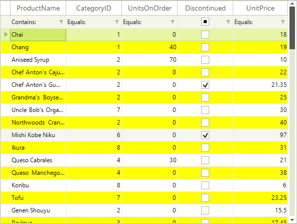

# Alternating Row Color


## 

RadGridView supports alternating row color mode which allows you to easily distinguish one row from another. 


In order to enable the feature, you should set the EnableAlternatingRowColor property to true:#_[C#] Enable alternating row color_

	


{{source=..\SamplesCS\GridView\StylingAndAppearance\AlternatingRowColor1.cs region=alternatingColor}} 
{{source=..\SamplesVB\GridView\StylingAndAppearance\AlternatingRowColor1.vb region=alternatingColor}} 

````C#
            this.radGridView1.EnableAlternatingRowColor = true;
````
````VB.NET
        Me.RadGridView1.EnableAlternatingRowColor = True
        '
````

{{endregion}} 


In order to change the default alternating row color, set the AlternatingRowColor property:#_[C#] Changing the alternating row color_

	


{{source=..\SamplesCS\GridView\StylingAndAppearance\AlternatingRowColor1.cs region=changeAlternatingRow}} 
{{source=..\SamplesVB\GridView\StylingAndAppearance\AlternatingRowColor1.vb region=changeAlternatingRow}} 

````C#
            ((GridTableElement)this.radGridView1.TableElement).AlternatingRowColor = Color.Yellow;
````
````VB.NET
        CType(Me.RadGridView1.TableElement, GridTableElement).AlternatingRowColor = Color.Yellow
        '
````

{{endregion}} 


The result is shown on the screenshot below:
