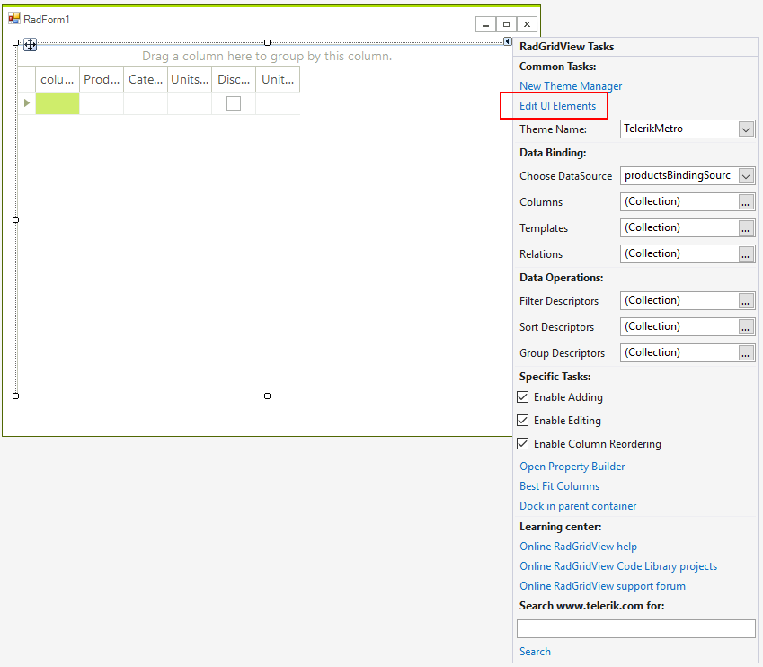

# Four ways to customize RadGridView appearance

There are four ways to customize RadGridView appearance - Themes, UI editor (DesignTime), Events, and Conditional Formatting. Each one has a field of applicability although they may overlap. 

## Themes

Just as all our WinForms controls, RadGridView supports our theming mechanism. You can use one of the default themes or create your own theme. Please refer to our [Themes]() section in the documentation for more details. 
        

## UI editor (DesignTime)  

*Edit UI Elements *can be started from the *smart tag *of the control. In particular for the RadGridView, it has a limited functionality so that row and cell properties __cannot__ be edited. Cells and Rows are formatted using the other 3 approaches. Note also that there are no similar kind of limitations in Edit UI Elements dialog for the rest of our controls. The reason for this is that RadGridView employs UI virtualization and certain elements, for instance, cells are reused.
        

Therefore, you can edit properties of other elements like *GridTableElement* and *GridTableBodyElement*. Actually these elements contain some properties that control behavior and appearance of grid cells and rows, like GridTableElement.RowHeight, RowSpacing and so on.
        

Setting properties through *Edit UI Elements* dialog will override the corresponding values specified by the theme, which can be edited through the *Visual Style Builder*. On the other hand, if set through a theme, these property values will be distributed to RadGridView instances across the entire application for you to have more consistent look.
        

## Events 

Events are the most advanced way to edit cells and rows visual properties conditionally and unconditionally. Using events you can achieve everything that you can do with Conditional Formatting but the reverse is not true. The main advantage of Conditional Formatting is that formatting is set declaratively instead of procedurally as in the events approach. Please refer to the following two topics about [row]() and [cell]() events.   
        

## Conditional Formatting

The main advantage of conditional formatting is the declarative approach used to describe formatting. It has limitations compared to events but also requires less code. Please refer to the following two section about [cells]() and [rows]() Conditional Formatting. 
        
