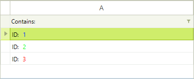

# HTML-like Text Formatting

Html-like formatting is a feature of Telerik Presentation Framework and therefore it can be also used in RadGridView. The screenshot below demonstrates the color tag applied to RadGridView cells:



Tags are only parsed if __DisableHTMLRendering__ is set to *false*. If you skip that, all tags will be shown as text. In the code snippet, HTML rendering is only enabled for the first column:

#### HTML-like text formatting

{{source=..\SamplesCS\GridView\StylingAndAppearance\HtmlLikeTextFormatting.cs region=htmlLikeTextFormatting}} 
{{source=..\SamplesVB\GridView\StylingAndAppearance\HtmlLikeTextFormatting.vb region=htmlLikeTextFormatting}} 

````C#
DataTable t = new DataTable();
t.Columns.Add("A");
t.Rows.Add("<html> ID: <color= 0, 0, 255> 1");
t.Rows.Add("<html> ID: <color= 0, 255, 0> 2");
t.Rows.Add("<html> ID: <color= 255, 0, 0> 3");
this.radGridView1.DataSource = t;
this.radGridView1.Columns[0].DisableHTMLRendering = false;

````
````VB.NET
Dim t As New DataTable()
t.Columns.Add("A")
t.Rows.Add("<html> ID: <color= 0, 0, 255> 1")
t.Rows.Add("<html> ID: <color= 0, 255, 0> 2")
t.Rows.Add("<html> ID: <color= 255, 0, 0> 3")
Me.RadGridView1.DataSource = t
Me.RadGridView1.Columns(0).DisableHTMLRendering = False

````

{{endregion}} 

>note Please refer to *HTML-like Text formatting* topic in *Telerik Presentation Framework* section for the list of support tags.
>

