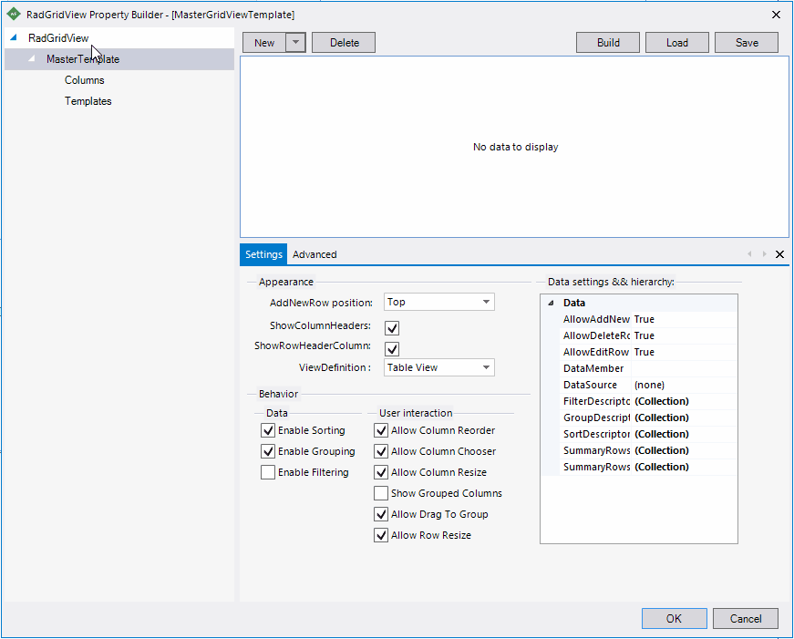
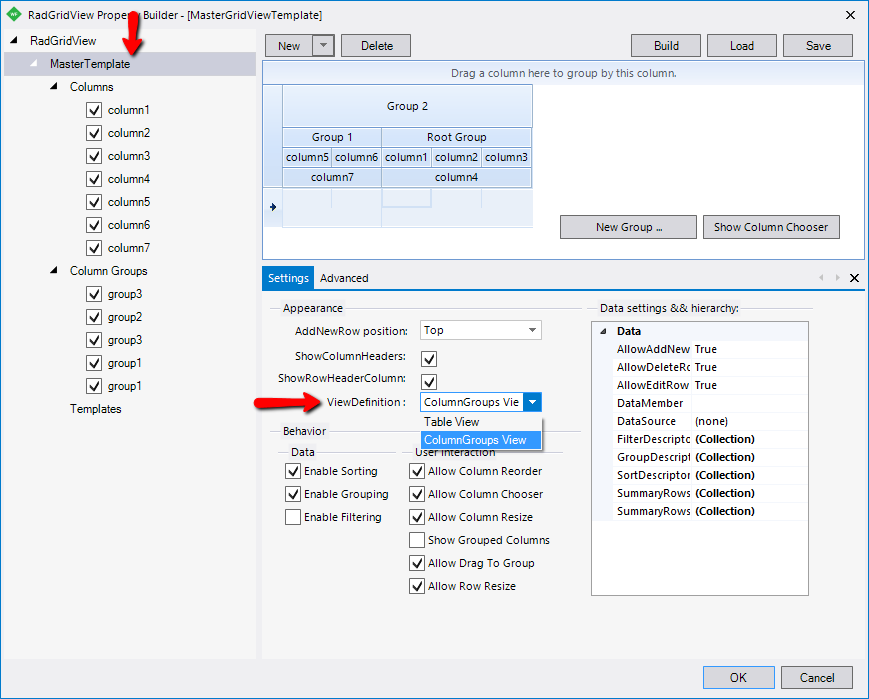
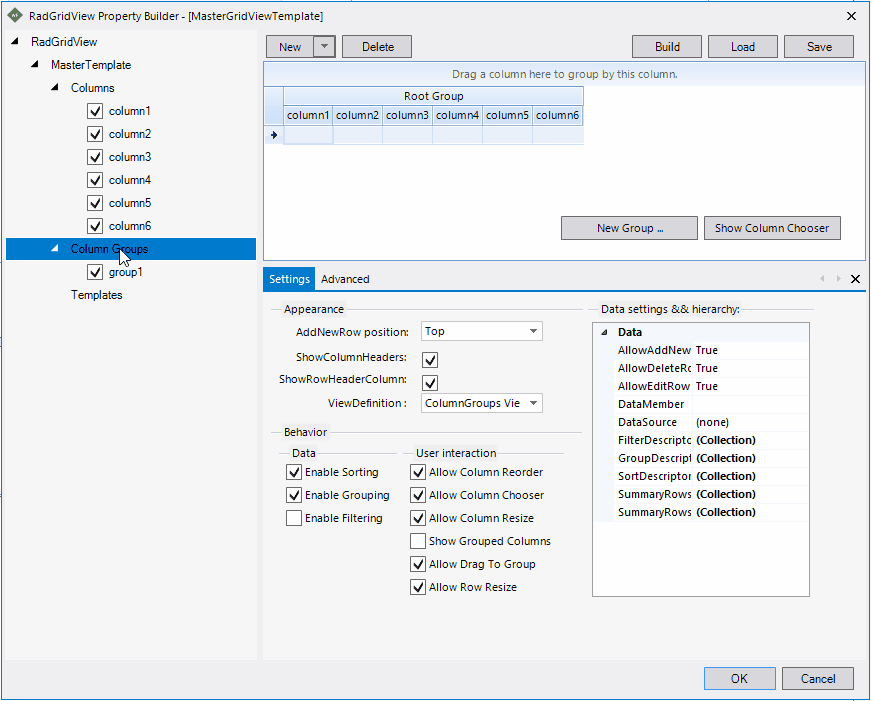
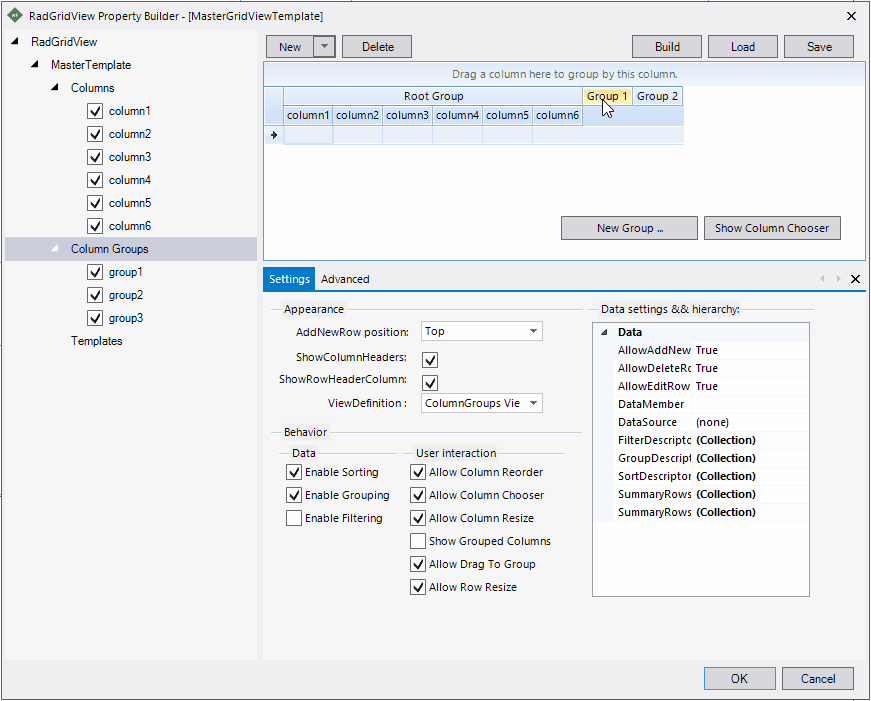
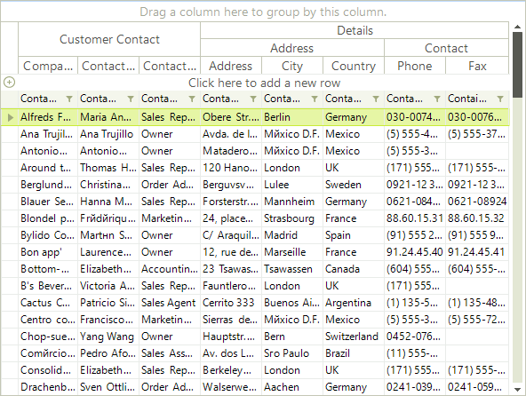

# Column Groups View

## Add groups view definition by using the Property Builder

Since R3 2015 you can add and configure the groups view definition in the [property builder](). This section will show you how you can use the property builder to setup the groups view definition.

1. Before configuring the view definition you should add all regular columns to the grid. For example you can add some columns directly in the property builder window. Figure 2 shows how you can do that.
            
>caption Figure 2: Add the default columns.



1. The next step is to change the __ViewDefinition__ to __ColumnGroups View__. `Figure 3` shows where you can find this property. Changing the view will add the default root group.
            
>caption Figure 3: Change the ViewDefinition



1. Now you are ready to add the groups. This can be achieved by selecting the __Columns groups__ node which will show the button for adding groups.
            
>caption Figure 4: Add Groups



1. The final step is to arrange the groups. This can easily achieved by just drag and drop columns or groups to the desired position.
            
>caption Figure 5: Arrange the columns and groups



The property builder allows you to edit the groups properties as well. Once a particular group is selected you will be able to change its properties.
        
>caption Figure 6 Change the group properties


## 

Just as its name says, this view enables grouping of columns. Every column group can have an unlimited number of subgroups or rows containing columns. In the following example, the grid is bound to the `Customers` table from the Northwind data base. 

First instantiate __ColumnGroupsViewDefinition__ and add some groups.

#### Create groups

{{source=..\SamplesCS\GridView\ViewDefinitions\ColumnGroupsView.cs region=createGroups}} 
{{source=..\SamplesVB\GridView\ViewDefinitions\ColumnGroupsView.vb region=createGroups}} 

````C#
ColumnGroupsViewDefinition view = new ColumnGroupsViewDefinition();
view.ColumnGroups.Add(new GridViewColumnGroup("Customer Contact"));
view.ColumnGroups.Add(new GridViewColumnGroup("Details"));
view.ColumnGroups[1].Groups.Add(new GridViewColumnGroup("Address"));
view.ColumnGroups[1].Groups.Add(new GridViewColumnGroup("Contact"));

````
````VB.NET
Dim view As New ColumnGroupsViewDefinition()
view.ColumnGroups.Add(New GridViewColumnGroup("Customer Contact"))
view.ColumnGroups.Add(New GridViewColumnGroup("Details"))
view.ColumnGroups(1).Groups.Add(New GridViewColumnGroup("Address"))
view.ColumnGroups(1).Groups.Add(New GridViewColumnGroup("Contact"))

````

{{endregion}}

Then add at least one row. This row will contain the desired columns.

#### Add rows to groups

{{source=..\SamplesCS\GridView\ViewDefinitions\ColumnGroupsView.cs region=addRows}} 
{{source=..\SamplesVB\GridView\ViewDefinitions\ColumnGroupsView.vb region=addRows}} 

````C#
view.ColumnGroups[0].Rows.Add(new GridViewColumnGroupRow());
view.ColumnGroups[0].Rows[0].ColumnNames.Add("CompanyName");
view.ColumnGroups[0].Rows[0].ColumnNames.Add("ContactName");
view.ColumnGroups[0].Rows[0].ColumnNames.Add("ContactTitle");
view.ColumnGroups[1].Groups[0].Rows.Add(new GridViewColumnGroupRow());
view.ColumnGroups[1].Groups[0].Rows[0].ColumnNames.Add("Address");
view.ColumnGroups[1].Groups[0].Rows[0].ColumnNames.Add("City");
view.ColumnGroups[1].Groups[0].Rows[0].ColumnNames.Add("Country");
view.ColumnGroups[1].Groups[1].Rows.Add(new GridViewColumnGroupRow());
view.ColumnGroups[1].Groups[1].Rows[0].ColumnNames.Add("Phone");
view.ColumnGroups[1].Groups[1].Rows[0].ColumnNames.Add("Fax");

````
````VB.NET
view.ColumnGroups(0).Rows.Add(New GridViewColumnGroupRow())
view.ColumnGroups(0).Rows(0).ColumnNames.Add("CompanyName")
view.ColumnGroups(0).Rows(0).ColumnNames.Add("ContactName")
view.ColumnGroups(0).Rows(0).ColumnNames.Add("ContactTitle")
view.ColumnGroups(1).Groups(0).Rows.Add(New GridViewColumnGroupRow())
view.ColumnGroups(1).Groups(0).Rows(0).ColumnNames.Add("Address")
view.ColumnGroups(1).Groups(0).Rows(0).ColumnNames.Add("City")
view.ColumnGroups(1).Groups(0).Rows(0).ColumnNames.Add("Country")
view.ColumnGroups(1).Groups(1).Rows.Add(New GridViewColumnGroupRow())
view.ColumnGroups(1).Groups(1).Rows(0).ColumnNames.Add("Phone")
view.ColumnGroups(1).Groups(1).Rows(0).ColumnNames.Add("Fax")

````

{{endregion}} 

At the end simply set the __ViewDefinitions__ property to the newly created __ViewDefinition__ instance.

#### Set the ViewDefinition property of RadGridView

{{source=..\SamplesCS\GridView\ViewDefinitions\ColumnGroupsView.cs region=setTheViewDefinition}} 
{{source=..\SamplesVB\GridView\ViewDefinitions\ColumnGroupsView.vb region=setTheViewDefinition}} 

````C#
radGridView1.ViewDefinition = view;

````
````VB.NET
RadGridView1.ViewDefinition = view

````

{{endregion}} 

The result is:
        
>caption Figure 1: ColumnGroups ViewDefinition



>caution In order to pin a certain group, you should do it after the RadGridView.__ViewDefinition__ property is set and the grid is populated with data. 
