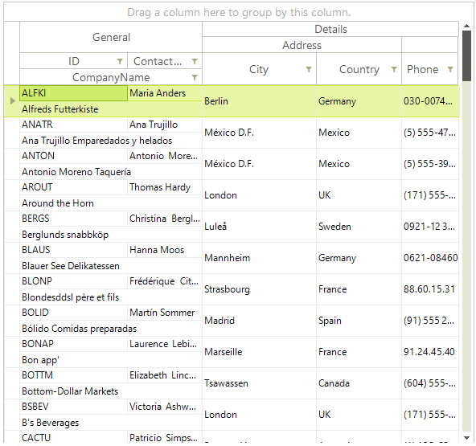

# View Definitions Overview


## 

You can change __RadGridView__ visual appearance and behavior by using a view definition. To define the view definition you have to set the __ViewDefinition__property of __RadGridView__:#_[C#] Assign ViewDefinition_

	


{{source=..\SamplesCS\GridView\ViewDefinitions\Overview.cs region=ViewDefinition}} 
{{source=..\SamplesVB\GridView\ViewDefinitions\Overview.vb region=ViewDefinition}} 

````C#
            this.radGridView1.ViewDefinition = myDefinition;
````
````VB.NET
        Me.RadGridView1.ViewDefinition = myDefinition
        '
````

{{endregion}} 


All view definitions implement the __IViewDefinition__ interface and you could create your own definitions, if you wish. Three different view definitions are currently included: 

* [TableViewDefinition]() 
            - this is the default view definition.

* [ColumnGroupsViewDefinition]() 
            - enables grouping of columns and multiple rows in one row.

* [HtmlViewDefinition]() -
            uses layout similar to the one existing in html tables.

Some of the available views that you can achieve are demonstrated in the picture below:
		
