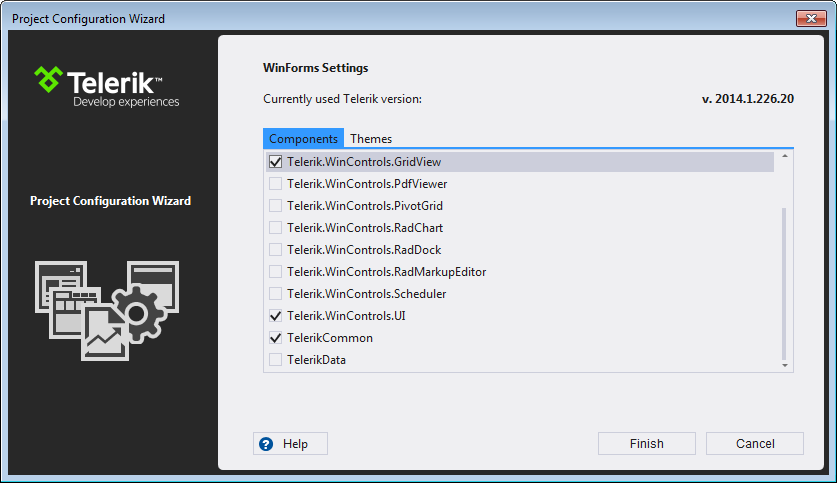
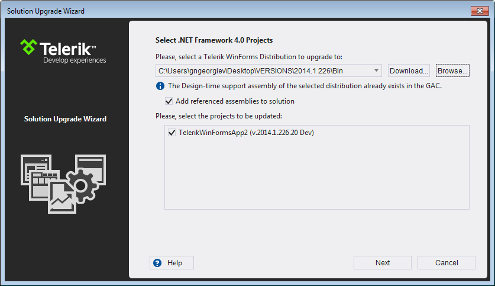

# Automatic dependency resolving

## 

To improve the experience of your clients and reduce your application’s
          size it is crucial to use only the subset of the Telerik UI for WinForms assemblies you really need.
        

Some controls require multiple assemblies and mistakes are not unlikely to happen.
          For example, in the urge to optimize, you could remove an assembly the project needs,
          thus breaking the application compilation.
        

When using the new Project Templates, Project Configuration Wizard or Project Upgrade Wizard,
          the possibility to make such mistakes is lowered to a minimum, thanks to the dependency analysis
          in the Visual Studio Extensions.
        

The VSExtensions assembly list control is controlled by the dependency analyzer, which won’t let you
          select Telerik UI for WinForms assemblies without selecting the assemblies they depend on. Both the aspects are covered:
        

* Selecting a Telerik UI for WinForms assembly will automatically select the additional assemblies it depends on as well.
            

* Deselecting a Telerik UI for WinForms assembly will deselect assemblies depending on it along with it.
            

Another handy feature available in the VSExtensions assembly list control is the design-time assembly warning.
        

You will be warned when using an assembly that will have limited design-time support.
          The cause for this is the absence of its corresponding design-time support assembly.
        
