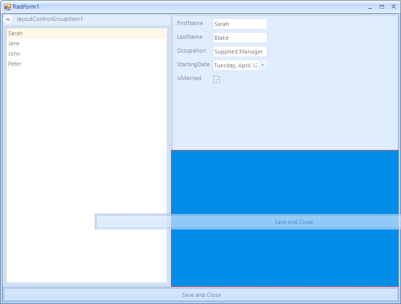

# Customizing Appearance


This article demonstrates how you can customize the appearance of the __RadLayoutControl__ and its items.
      

## Customizing RadLayoutControl

You can use the __PreviewRectangleFill__ and __PreviewRectangleStroke__  properties to customize the drag and drop preview rectangle fill and stroke.

#### Setting PreviewRectangleFill and PreviewRectangleStroke.

{{source=..\SamplesCS\LayoutControl\CustomizeLayoutControl.cs region=FillStroke}} 
{{source=..\SamplesVB\LayoutControl\CustomizeLayoutControl.vb region=FillStroke}} 

````C#
radLayoutControl1.ContainerElement.PreviewRectangleFill = ColorTranslator.FromHtml("#008de7");
radLayoutControl1.ContainerElement.PreviewRectangleStroke = ColorTranslator.FromHtml("#e83737");

````
````VB.NET
radLayoutControl1.ContainerElement.PreviewRectangleFill = ColorTranslator.FromHtml("#008de7")
radLayoutControl1.ContainerElement.PreviewRectangleStroke = ColorTranslator.FromHtml("#e83737")

````

{{endregion}} 

>caption Figure 1: Changed PreviewRectangleFill and PreviewRectangleStroke.<br>

## Customizing items

* __LayoutControlLabelItem:__ The following snipped shows how you can change the font and the __BackColor__ of this item.

#### Change item BackColor and font.

{{source=..\SamplesCS\LayoutControl\CustomizeLayoutControl.cs region=LabelItem}} 
{{source=..\SamplesVB\LayoutControl\CustomizeLayoutControl.vb region=LabelItem}} 

````C#
layoutControlLabelItem5.BackColor = ColorTranslator.FromHtml("#008de7");
layoutControlLabelItem5.GradientStyle = Telerik.WinControls.GradientStyles.Solid;
layoutControlLabelItem5.DrawFill = true;
layoutControlLabelItem5.Font = new Font("Segoe Script", 16, FontStyle.Regular);

````
````VB.NET
layoutControlLabelItem5.BackColor = ColorTranslator.FromHtml("#008de7")
layoutControlLabelItem5.GradientStyle = Telerik.WinControls.GradientStyles.Solid
layoutControlLabelItem5.DrawFill = True
layoutControlLabelItem5.Font = New Font("Segoe Script", 16, FontStyle.Regular)

````

{{endregion}} 

* __LayoutControlSeparatorItem:__ By default this item shows only a single line, however you can customize its __Thickness__ and __BackColor__.

#### Customize separator item.

{{source=..\SamplesCS\LayoutControl\CustomizeLayoutControl.cs region=Separator}} 
{{source=..\SamplesVB\LayoutControl\CustomizeLayoutControl.vb region=Separator}} 

````C#
layoutControlSeparatorItem1.Thickness = 10;
layoutControlSeparatorItem1.DrawFill = true;
layoutControlSeparatorItem1.BackColor = ColorTranslator.FromHtml("#008de7");
layoutControlSeparatorItem1.GradientStyle = Telerik.WinControls.GradientStyles.Solid;

````
````VB.NET
layoutControlSeparatorItem1.Thickness = 10
layoutControlSeparatorItem1.DrawFill = True
layoutControlSeparatorItem1.BackColor = ColorTranslator.FromHtml("#008de7")
layoutControlSeparatorItem1.GradientStyle = Telerik.WinControls.GradientStyles.Solid

````

{{endregion}} 

* __LayoutControlSplitterItem:__ By default this element does not draw its fill. The following snippet shows how you can change its __BackColor__ and __Thickness__.

#### Customize splitter item.

{{source=..\SamplesCS\LayoutControl\CustomizeLayoutControl.cs region=Splitter}} 
{{source=..\SamplesVB\LayoutControl\CustomizeLayoutControl.vb region=Splitter}} 

````C#
layoutControlSplitterItem1.Thickness = 10;
layoutControlSplitterItem1.DrawFill = true;
layoutControlSplitterItem1.BackColor = ColorTranslator.FromHtml("#e83737");
layoutControlSplitterItem1.GradientStyle = Telerik.WinControls.GradientStyles.Solid;

````
````VB.NET
layoutControlSplitterItem1.Thickness = 10
layoutControlSplitterItem1.DrawFill = True
layoutControlSplitterItem1.BackColor = ColorTranslator.FromHtml("#e83737")
layoutControlSplitterItem1.GradientStyle = Telerik.WinControls.GradientStyles.Solid

````

{{endregion}} 

* __LayoutControlGroupItem:__ The following code shows how you can access and customize the group item header.

#### Customize group header.

{{source=..\SamplesCS\LayoutControl\CustomizeLayoutControl.cs region=Group}} 
{{source=..\SamplesVB\LayoutControl\CustomizeLayoutControl.vb region=Group}} 

````C#
this.layoutControlGroupItem1.HeaderElement.Font = new Font("Segoe Script", 14, FontStyle.Regular);
this.layoutControlGroupItem1.HeaderElement.BackColor = ColorTranslator.FromHtml("#008de7");
this.layoutControlGroupItem1.HeaderElement.GradientStyle = Telerik.WinControls.GradientStyles.Solid;
this.layoutControlGroupItem1.HeaderElement.HeaderButtonElement.DrawFill = false;
this.layoutControlGroupItem1.HeaderElement.HeaderButtonElement.DrawBorder = false;
this.layoutControlGroupItem1.ShowHeaderLine = false;

````
````VB.NET
Me.layoutControlGroupItem1.HeaderElement.Font = New Font("Segoe Script", 14, FontStyle.Regular)
Me.layoutControlGroupItem1.HeaderElement.BackColor = ColorTranslator.FromHtml("#008de7")
Me.layoutControlGroupItem1.HeaderElement.GradientStyle = Telerik.WinControls.GradientStyles.Solid
Me.layoutControlGroupItem1.HeaderElement.HeaderButtonElement.DrawFill = False
Me.layoutControlGroupItem1.HeaderElement.HeaderButtonElement.DrawBorder = False
Me.layoutControlGroupItem1.ShowHeaderLine = False

````

{{endregion}} 

* __LayoutControlTabbedGroup:__ this item gives you access to the underlying TabStrip, this way you can customize its appearance.

#### Customize tabs.

{{source=..\SamplesCS\LayoutControl\CustomizeLayoutControl.cs region=Tab}} 
{{source=..\SamplesVB\LayoutControl\CustomizeLayoutControl.vb region=Tab}} 

````C#
this.layoutControlTabbedGroup1.TabStrip.Font = new Font("Segoe Script", 14, FontStyle.Regular);
this.layoutControlTabbedGroup1.TabStrip.ItemFitMode = StripViewItemFitMode.Fill;
this.layoutControlTabbedGroup1.TabStrip.Items[0].ForeColor = ColorTranslator.FromHtml("#e83737");
this.layoutControlTabbedGroup1.TabStrip.Items[1].ForeColor = ColorTranslator.FromHtml("#008de7");

````
````VB.NET
Me.layoutControlTabbedGroup1.TabStrip.Font = New Font("Segoe Script", 14, FontStyle.Regular)
Me.layoutControlTabbedGroup1.TabStrip.ItemFitMode = StripViewItemFitMode.Fill
Me.layoutControlTabbedGroup1.TabStrip.Items(0).ForeColor = ColorTranslator.FromHtml("#e83737")
Me.layoutControlTabbedGroup1.TabStrip.Items(1).ForeColor = ColorTranslator.FromHtml("#008de7")

````

{{endregion}} 

# See Also

 * [Properties, Events and Methods]()
