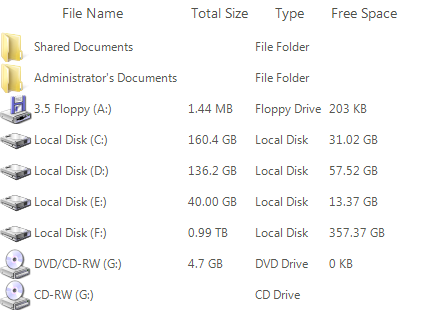

# Grouping


## 

RadListView supports both custom grouping and automatic grouping based on a certain property. The latter is achievable by enabling the __EnableGrouping__ and __ShowGroups__ properties and then adding the desired __GroupDescriptors__ to the __GroupDescriptors__ collection of the control. The following code will group the items according to their __Value__ property:

#### Group by value

{{source=..\SamplesCS\ListView\Features\ListViewGrouping.cs region=groupByValue}} 
{{source=..\SamplesVB\ListView\Features\ListViewGrouping.vb region=groupByValue}} 

````C#
            radListView1.EnableGrouping = true;
            radListView1.ShowGroups = true;
            GroupDescriptor groupByValue = new GroupDescriptor(new SortDescriptor[] { new SortDescriptor("Value", ListSortDirection.Descending) });
            radListView1.GroupDescriptors.Add(groupByValue);
````
````VB.NET
        RadListView1.EnableGrouping = True
        RadListView1.ShowGroups = True
        Dim groupByValue As New GroupDescriptor(New SortDescriptor() {New SortDescriptor("Value", ListSortDirection.Descending)})
        RadListView1.GroupDescriptors.Add(groupByValue)
        '#End Region

        '#Region groupByColumn
        RadListView1.EnableGrouping = True
        RadListView1.ShowGroups = True
        Dim groupByType As New GroupDescriptor(New SortDescriptor() {New SortDescriptor("Type", ListSortDirection.Descending)})
        RadListView1.GroupDescriptors.Add(groupByType)
        '#End Region

        '#Region customGrouping
        RadListView1.EnableCustomGrouping = True
        RadListView1.ShowGroups = True
        Dim docGroup As New ListViewDataItemGroup("Documents")
        Dim diskGroup As New ListViewDataItemGroup("Disks")
        RadListView1.Groups.Add(docGroup)
        RadListView1.Groups.Add(diskGroup)
        For Each item As ListViewDataItem In RadListView1.Items
            If item.Value = "Shared Documents" OrElse item.Value = "Administrator's Documents" Then
                item.Group = docGroup
            Else
                item.Group = diskGroup
            End If
        Next
        '#End Region

        '#region ExpandCollapseAll
        Me.RadListView1.ExpandAll()
        Me.RadListView1.CollapseAll()
        '
````

{{endregion}} 


And here is how you can group by a certain column when __DetailsView__ is used:

#### Group by column

{{source=..\SamplesCS\ListView\Features\ListViewGrouping.cs region=groupByColumn}} 
{{source=..\SamplesVB\ListView\Features\ListViewGrouping.vb region=groupByColumn}} 

````C#
            radListView1.EnableGrouping = true;
            radListView1.ShowGroups = true;
            GroupDescriptor groupByType = new GroupDescriptor(new SortDescriptor[] 
            {
                new SortDescriptor("Type", ListSortDirection.Descending), 
            });
            radListView1.GroupDescriptors.Add(groupByType);
````
````VB.NET
        RadListView1.EnableGrouping = True
        RadListView1.ShowGroups = True
        Dim groupByType As New GroupDescriptor(New SortDescriptor() {New SortDescriptor("Type", ListSortDirection.Descending)})
        RadListView1.GroupDescriptors.Add(groupByType)
        '#End Region

        '#Region customGrouping
        RadListView1.EnableCustomGrouping = True
        RadListView1.ShowGroups = True
        Dim docGroup As New ListViewDataItemGroup("Documents")
        Dim diskGroup As New ListViewDataItemGroup("Disks")
        RadListView1.Groups.Add(docGroup)
        RadListView1.Groups.Add(diskGroup)
        For Each item As ListViewDataItem In RadListView1.Items
            If item.Value = "Shared Documents" OrElse item.Value = "Administrator's Documents" Then
                item.Group = docGroup
            Else
                item.Group = diskGroup
            End If
        Next
        '#End Region

        '#region ExpandCollapseAll
        Me.RadListView1.ExpandAll()
        Me.RadListView1.CollapseAll()
        '
````

{{endregion}} 



To take advantage of the custom grouping feature of RadListView, just enable the __EnableCustomGrouping__ property and add the desired descriptor. Here is an example for custom grouping:


#### Custom grouping

{{source=..\SamplesCS\ListView\Features\ListViewGrouping.cs region=customGrouping}} 
{{source=..\SamplesVB\ListView\Features\ListViewGrouping.vb region=customGrouping}} 

````C#
            radListView1.EnableCustomGrouping = true;
            radListView1.ShowGroups = true;
            ListViewDataItemGroup docGroup = new ListViewDataItemGroup("Documents");
            ListViewDataItemGroup diskGroup = new ListViewDataItemGroup("Disks");
            radListView1.Groups.Add(docGroup);
            radListView1.Groups.Add(diskGroup);
            foreach (ListViewDataItem item in radListView1.Items)
            {
                if (item.Value.ToString() == "Shared Documents" || item.Value.ToString() == "Administrator's Documents")
                {
                    item.Group = docGroup;
                }
                else
                {
                    item.Group = diskGroup;
                }
            }
````
````VB.NET
        RadListView1.EnableCustomGrouping = True
        RadListView1.ShowGroups = True
        Dim docGroup As New ListViewDataItemGroup("Documents")
        Dim diskGroup As New ListViewDataItemGroup("Disks")
        RadListView1.Groups.Add(docGroup)
        RadListView1.Groups.Add(diskGroup)
        For Each item As ListViewDataItem In RadListView1.Items
            If item.Value = "Shared Documents" OrElse item.Value = "Administrator's Documents" Then
                item.Group = docGroup
            Else
                item.Group = diskGroup
            End If
        Next
        '#End Region

        '#region ExpandCollapseAll
        Me.RadListView1.ExpandAll()
        Me.RadListView1.CollapseAll()
        '
````

{{endregion}} 

Please note, that if you are using data binding, you can use the __ItemDataBound__ event,  to assign certain item to a certain group.


When grouping is enabled you have the option to quickly expand or collapse all groups in __RadListView__ throught the __ExpandAll__ and __CollapseAll__ methods:

#### Expand and collapse all groups

{{source=..\SamplesCS\ListView\Features\ListViewGrouping.cs region=ExpandCollapseAll}} 
{{source=..\SamplesVB\ListView\Features\ListViewGrouping.vb region=ExpandCollapseAll}} 

````C#
            this.radListView1.ExpandAll();
            this.radListView1.CollapseAll();
````
````VB.NET
        Me.RadListView1.ExpandAll()
        Me.RadListView1.CollapseAll()
        '
````

{{endregion}} 


