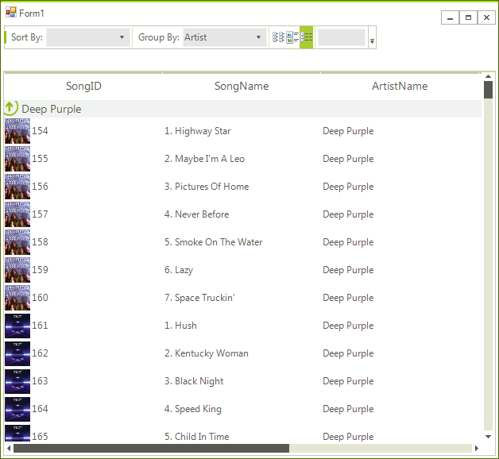
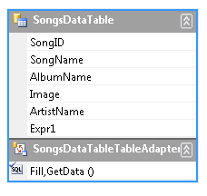
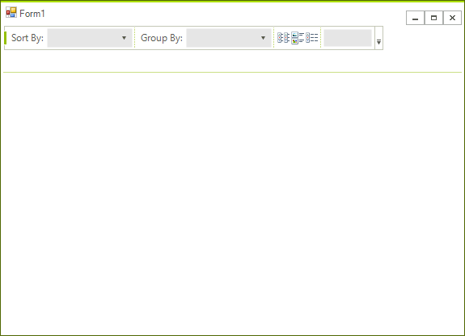

# Getting started


## 

This article will demonstrate the basic capabilities of RadListView, like filtering, grouping, sorting,
          customizing items, etc. and it will show you in a step-by-step manner how to start creating applications
          with RadListView.
        

For the sake of this example we are going to use a DataTable containing data about Artists, Albums, Songs and Image.
        

First let’s create a form with
          [RadCommandBar]()
          docked *Top* and RadListView docked *Fill*. Add a
          __Strip__ to
          [RadCommandBar]()
          and populate it with the following items:
        


| __CommandBarLabel__ |

* Text: “Sort By:”|
| __CommandBarDropDownList__ |

* Name: commandBarDropDownSort

* Text: ""

* Items: None, Song Name, Artist, Album|
| __CommandBarSeparatorItem__ ||
| __CommandBarLabel__ |

* Text: “Group By:”|
| __CommandBarDropDownList__ |

* Name: commandBarDropDownGroup

* Text: ""

* Items: None, Album, Artist|
| __CommandBarSeparatorItem__ ||
| __CommandBarToggleButton__ |

* Name: commandBarToggleButtonList

* ToolTipText: “ListView”

* Image: Some image representing ListView|
| __CommandBarToggleButton__ |

* Name: commandBarToggleButtonTiles

* ToolTipText: “IconsView”

* Image: Some image representing IconsView|
| __CommandBarToggleButton__ |

* Name: commandBarToggleButtonDetails

* ToolTipText: “DetailsView”

* Image: Some image representing DetailsView|
| __CommandBarSeparatorItem__ ||
| __CommandBarTextBox__ |

* Name: commandBarTextBoxFilter

* Text: “”|

At this point the form should like something similar to this:

Now let continue with setting the control __DataSource__, allow edit and remove
          operations and subscribe to the events that we are going to use in this example.
        #_[C#] Initial settings_

	


{{source=..\SamplesCS\ListView\ListViewGettingStarted.cs region=initialSettings}} 
{{source=..\SamplesVB\ListView\ListViewGettingStarted.vb region=initialSettings}} 

````C#
            this.radListView1.ItemDataBound += new Telerik.WinControls.UI.ListViewItemEventHandler(radListView1_ItemDataBound);
            this.radListView1.VisualItemFormatting += new Telerik.WinControls.UI.ListViewVisualItemEventHandler(radListView1_VisualItemFormatting);
            this.radListView1.CellFormatting += new Telerik.WinControls.UI.ListViewCellFormattingEventHandler(radListView1_CellFormatting);
            this.radListView1.ColumnCreating += new ListViewColumnCreatingEventHandler(radListView1_ColumnCreating);
            this.radListView1.ViewTypeChanged += new EventHandler(radListView1_ViewTypeChanged);

            this.radListView1.AllowEdit = false;
            this.radListView1.AllowRemove = false;
            this.radListView1.DataSource = this.songsDataTableBindingSource;
            this.radListView1.DisplayMember = "SongName";
            this.radListView1.ValueMember = "SongID";

            this.radListView1.ViewType = ListViewType.IconsView;
````
````VB.NET
        AddHandler Me.RadListView1.ItemDataBound, AddressOf radListView1_ItemDataBound
        AddHandler Me.RadListView1.VisualItemFormatting, AddressOf radListView1_VisualItemFormatting
        AddHandler Me.RadListView1.ViewTypeChanged, AddressOf radListView1_ViewTypeChanged
        AddHandler Me.RadListView1.CellFormatting, AddressOf radListView1_CellFormatting
        AddHandler Me.RadListView1.ColumnCreating, AddressOf radListView1_ColumnCreating

        Me.RadListView1.AllowEdit = False
        Me.RadListView1.AllowRemove = False
        Me.RadListView1.DataSource = Me.SongsDataTableBindingSource
        Me.RadListView1.DisplayMember = "SongName"
        Me.RadListView1.ValueMember = "SongID"
        '
````

{{endregion}} 


Now, lets handle those events. In the event handler for the __ItemDataBound__ event, we
          will take the corresponding item image from the data source and we will assign it to the ListViewDataItem.
        #_[C#] Set the item image to the data item_

	


{{source=..\SamplesCS\ListView\ListViewGettingStarted.cs region=ItemDataBound}} 
{{source=..\SamplesVB\ListView\ListViewGettingStarted.vb region=ItemDataBound}} 

````C#
        void radListView1_ItemDataBound(object sender, Telerik.WinControls.UI.ListViewItemEventArgs e)
        {
            DataRowView row = e.Item.DataBoundItem as DataRowView;
            MusicCollectionDataSet.SongsDataTableRow songRow = row.Row as MusicCollectionDataSet.SongsDataTableRow;
            e.Item.Image = Image.FromStream(new MemoryStream(songRow.Image), false, false);
        }
````
````VB.NET
    Private Sub radListView1_ItemDataBound(sender As Object, e As Telerik.WinControls.UI.ListViewItemEventArgs)
        Dim row As DataRowView = TryCast(e.Item.DataBoundItem, DataRowView)
        Dim songRow As MusicCollectionDataSet.SongsDataTableRow = TryCast(row.Row, MusicCollectionDataSet.SongsDataTableRow)
        e.Item.Image = Image.FromStream(New MemoryStream(songRow.Image), False, False)
    End Sub
    '
````

{{endregion}} 


Next lets hand the __VisualItemFormatting__ event, where we will set the visual item
          image. Additionally, for IconsView we will set the visual item text to a html-like combination
          of the *AlbumName*, *ArtistName* and *SongName*.
        #_[C#] Customize visual item_

	


{{source=..\SamplesCS\ListView\ListViewGettingStarted.cs region=VisualItemFormatting}} 
{{source=..\SamplesVB\ListView\ListViewGettingStarted.vb region=VisualItemFormatting}} 

````C#
        void radListView1_VisualItemFormatting(object sender, Telerik.WinControls.UI.ListViewVisualItemEventArgs e)
        {
            if (e.VisualItem.Data.Image != null)
            {
                e.VisualItem.Image = e.VisualItem.Data.Image.GetThumbnailImage(32, 32, null, IntPtr.Zero);
                e.VisualItem.Layout.RightPart.Margin = new Padding(2, 0, 0, 0);
            }

            if (this.radListView1.ViewType == Telerik.WinControls.UI.ListViewType.IconsView && e.VisualItem.Data.DataBoundItem != null)
            {
                string albumName = ((MusicCollectionDataSet.SongsDataTableRow)(((System.Data.DataRowView)(e.VisualItem.Data.DataBoundItem)).Row)).AlbumName;
                string artisName = ((MusicCollectionDataSet.SongsDataTableRow)(((System.Data.DataRowView)(e.VisualItem.Data.DataBoundItem)).Row)).ArtistName;
                string songName = ((MusicCollectionDataSet.SongsDataTableRow)(((System.Data.DataRowView)(e.VisualItem.Data.DataBoundItem)).Row)).SongName;
                e.VisualItem.Text = "<html> " + songName + "<br><span style=\"color:#999999\"> " + artisName + "<br> " + albumName + "</span>";
            }
        }
````
````VB.NET
    Private Sub radListView1_VisualItemFormatting(sender As Object, e As Telerik.WinControls.UI.ListViewVisualItemEventArgs)
        If e.VisualItem.Data.Image IsNot Nothing Then
            e.VisualItem.Image = e.VisualItem.Data.Image.GetThumbnailImage(32, 32, Nothing, IntPtr.Zero)
            e.VisualItem.Layout.RightPart.Margin = New Windows.Forms.Padding(2, 0, 0, 0)
        End If

        If Me.RadListView1.ViewType = Telerik.WinControls.UI.ListViewType.IconsView AndAlso e.VisualItem.Data.DataBoundItem IsNot Nothing Then
            Dim albumName As String = DirectCast(DirectCast(e.VisualItem.Data.DataBoundItem, System.Data.DataRowView).Row, MusicCollectionDataSet.SongsDataTableRow).AlbumName
            Dim artisName As String = DirectCast(DirectCast(e.VisualItem.Data.DataBoundItem, System.Data.DataRowView).Row, MusicCollectionDataSet.SongsDataTableRow).ArtistName
            Dim songName As String = DirectCast(DirectCast(e.VisualItem.Data.DataBoundItem, System.Data.DataRowView).Row, MusicCollectionDataSet.SongsDataTableRow).SongName
            e.VisualItem.Text = "<html> " + songName + "<br><span style=""color:#999999""> " + artisName + "<br> " + albumName + "</span>"
        End If
    End Sub
    '
````

{{endregion}} 


The __CellFormatting__ event is handled in order to customize the appearance
          of the cells, when RadListView is in __DetailsView__. Here we will set the cell image.
        #_[C#] Set the cell image_

	


{{source=..\SamplesCS\ListView\ListViewGettingStarted.cs region=CellFormatting}} 
{{source=..\SamplesVB\ListView\ListViewGettingStarted.vb region=CellFormatting}} 

````C#
        void radListView1_CellFormatting(object sender, ListViewCellFormattingEventArgs e)
        {
            if (e.CellElement.Image != null)
            {
                e.CellElement.Image = e.CellElement.Image.GetThumbnailImage(32, 32, null, IntPtr.Zero);
            }
        }
````
````VB.NET
    Private Sub radListView1_CellFormatting(sender As Object, e As ListViewCellFormattingEventArgs)
        If e.CellElement.Image IsNot Nothing Then
            e.CellElement.Image = e.CellElement.Image.GetThumbnailImage(32, 32, Nothing, IntPtr.Zero)
        End If
    End Sub
    '
````

{{endregion}} 


The __ColumnCreating__ event is fired when a column is being created. This is convenient event to hide unwanted columns.
          Additionally, we will use this event to set some more user friendly column headers.
        #_[C#] Customize columns_

	


{{source=..\SamplesCS\ListView\ListViewGettingStarted.cs region=ColumnCreating}} 
{{source=..\SamplesVB\ListView\ListViewGettingStarted.vb region=ColumnCreating}} 

````C#
        void radListView1_ColumnCreating(object sender, ListViewColumnCreatingEventArgs e)
        {
            if (e.Column.FieldName == "SongID" || e.Column.FieldName == "Image")
            {
                e.Column.Visible = false;
            }

            if (e.Column.FieldName == "SongName")
            {
                e.Column.HeaderText = "Song Title";
            }

            if (e.Column.FieldName == "ArtistName")
            {
                e.Column.HeaderText = "Artist";
            }

            if (e.Column.FieldName == "AlbumName")
            {
                e.Column.HeaderText = "Album";
            }
        }
````
````VB.NET
    Private Sub radListView1_ColumnCreating(sender As Object, e As ListViewColumnCreatingEventArgs)
        If e.Column.FieldName = "SongID" OrElse e.Column.FieldName = "Image" Then
            e.Column.Visible = False
        End If

        If e.Column.FieldName = "SongName" Then
            e.Column.HeaderText = "Song Title"
        End If

        If e.Column.FieldName = "ArtistName" Then
            e.Column.HeaderText = "Artist"
        End If

        If e.Column.FieldName = "AlbumName" Then
            e.Column.HeaderText = "Album"
        End If
    End Sub
    '
````

{{endregion}} 


The last event of RadListView, which we are going to handle is the ViewTypeChanged event - fired when
          the ViewType of the control is changed. This event is convenient to set view specific settings.
          To handle the event, we will create three helper methods:
        

* __SetupDetailsView__ - here we will set the __AllowArbitraryItemHeight__,
              property to *true*, in order to allow the items to size themselves in height,
              according to their content.
            

* __SetupIconsView__ - here we will define a custom size for the items, set some
              spacing between the items and again set the __AllowArbitraryItemHeight__,
              property to *true*

* __SetupSimpleListView__ - in this method we will only set the __AllowArbitraryItemHeight__,
              property to *true*.
            

In the ViewTypeChanged event handler, we will simply check which is the new view and call the corresponding setup method#_[C#] Handling view type changes_

	


{{source=..\SamplesCS\ListView\ListViewGettingStarted.cs region=ViewTypeChanged}} 
{{source=..\SamplesVB\ListView\ListViewGettingStarted.vb region=ViewTypeChanged}} 

````C#
        private void SetupDetailsView()
        {
            this.radListView1.AllowArbitraryItemHeight = true;
        }

        private void SetupIconsView()
        {
            this.radListView1.ItemSize = new Size(200, 64);
            this.radListView1.ItemSpacing = 5;
            this.radListView1.AllowArbitraryItemHeight = true;
        }

        private void SetupSimpleListView()
        {
            this.radListView1.AllowArbitraryItemHeight = true;
        }

        void radListView1_ViewTypeChanged(object sender, EventArgs e)
        {
            switch (radListView1.ViewType)
            {
                case ListViewType.ListView:
                    SetupSimpleListView();
                    break;
                case ListViewType.IconsView:
                    SetupIconsView();
                    break;
                case ListViewType.DetailsView:
                    SetupDetailsView();
                    break;
            }
        }
````
````VB.NET
    Private Sub SetupDetailsView()
        Me.RadListView1.AllowArbitraryItemHeight = True
    End Sub

    Private Sub SetupIconsView()
        Me.RadListView1.ItemSize = New Size(200, 64)
        Me.RadListView1.ItemSpacing = 5
        Me.RadListView1.AllowArbitraryItemHeight = True
    End Sub

    Private Sub SetupSimpleListView()
        Me.RadListView1.AllowArbitraryItemHeight = True
    End Sub

    Private Sub radListView1_ViewTypeChanged(sender As Object, e As EventArgs)
        Select Case RadListView1.ViewType
            Case ListViewType.ListView
                SetupSimpleListView()
                Exit Select
            Case ListViewType.IconsView
                SetupIconsView()
                Exit Select
            Case ListViewType.DetailsView
                SetupDetailsView()
                Exit Select
        End Select
    End Sub
    '
````

{{endregion}} 


Now we only need to fill up the __RadCommandBar__ elements functionality.
          First we are going to handle the view changing buttons. For this purpose, subscribe for the
          __ToggleStateChanged__ and __ToggleStateChanging__ events
          of all the __CommandBarToggleButtons__ that we have added earlier. In the ToggleStateChanged
          event handler, check which is the clicked button, and set the rest of the buttons to *Off*. Additionally, set the __RadListView____ViewType__ according to the pressed button.
        #_[C#] Handle the toggle buttons_

	


{{source=..\SamplesCS\ListView\ListViewGettingStarted.cs region=toggleButtons}} 
{{source=..\SamplesVB\ListView\ListViewGettingStarted.vb region=toggleButtons}} 

````C#
        private bool updatingToggleState = false;

        private void ViewToggleButton_ToggleStateChanged(object sender, StateChangedEventArgs args)
        {
            if (updatingToggleState)
            {
                return;
            }

            this.updatingToggleState = true;

            if (this.commandBarToggleButtonDetails != sender)
            {
                this.commandBarToggleButtonDetails.ToggleState = ToggleState.Off;
            }

            if (this.commandBarToggleButtonList != sender)
            {
                this.commandBarToggleButtonList.ToggleState = ToggleState.Off;
            }

            if (this.commandBarToggleButtonTiles != sender)
            {
                this.commandBarToggleButtonTiles.ToggleState = ToggleState.Off;
            }

            this.updatingToggleState = false;

            if (this.commandBarToggleButtonDetails.ToggleState == ToggleState.On)
            {
                this.radListView1.ViewType = ListViewType.DetailsView;
            }

            if (this.commandBarToggleButtonList.ToggleState == ToggleState.On)
            {
                this.radListView1.ViewType = ListViewType.ListView;
            }

            if (this.commandBarToggleButtonTiles.ToggleState == ToggleState.On)
            {
                this.radListView1.ViewType = ListViewType.IconsView;
            }
         }

        private void ViewToggleButton_ToggleStateChanging(object sender, StateChangingEventArgs args)
        {
            if (!updatingToggleState && args.OldValue == ToggleState.On)
            {
                args.Cancel = true;
            }
        }
````
````VB.NET
    Private updatingToggleState As Boolean = False

    Private Sub ViewToggleButton_ToggleStateChanged(sender As Object, args As StateChangedEventArgs) Handles commandBarToggleButtonTiles.ToggleStateChanged, commandBarToggleButtonList.ToggleStateChanged, commandBarToggleButtonDetails.ToggleStateChanged
        If updatingToggleState Then
            Return
        End If

        Me.updatingToggleState = True

        If Me.commandBarToggleButtonDetails IsNot sender Then
            Me.commandBarToggleButtonDetails.ToggleState = ToggleState.Off
        End If

        If Me.commandBarToggleButtonList IsNot sender Then
            Me.commandBarToggleButtonList.ToggleState = ToggleState.Off
        End If

        If Me.commandBarToggleButtonTiles IsNot sender Then
            Me.commandBarToggleButtonTiles.ToggleState = ToggleState.Off
        End If

        Me.updatingToggleState = False

        If Me.commandBarToggleButtonDetails.ToggleState = ToggleState.[On] Then
            Me.RadListView1.ViewType = ListViewType.DetailsView
        End If

        If Me.commandBarToggleButtonList.ToggleState = ToggleState.[On] Then
            Me.RadListView1.ViewType = ListViewType.ListView
        End If

        If Me.commandBarToggleButtonTiles.ToggleState = ToggleState.[On] Then
            Me.RadListView1.ViewType = ListViewType.IconsView
        End If

    End Sub

    Private Sub ViewToggleButton_ToggleStateChanging(sender As Object, args As StateChangingEventArgs) Handles commandBarToggleButtonTiles.ToggleStateChanging, commandBarToggleButtonList.ToggleStateChanging, commandBarToggleButtonDetails.ToggleStateChanging
        If Not updatingToggleState AndAlso args.OldValue = ToggleState.[On] Then
            args.Cancel = True
        End If
    End Sub
    '
````

{{endregion}} 


Next, subscribe to the __SelectedIndexChanged__ event of
          *commandBarDropDownSort*__CommandBarDropDownList__. In the
          event handler, we are going to add the desired __SortDescriptors__, according to the
          selected item in the drop down.
        #_[C#] Handle sorting functionality_

	


{{source=..\SamplesCS\ListView\ListViewGettingStarted.cs region=sort}} 
{{source=..\SamplesVB\ListView\ListViewGettingStarted.vb region=sort}} 

````C#
        private void commandBarDropDownSort_SelectedIndexChanged(object sender, Telerik.WinControls.UI.Data.PositionChangedEventArgs e)
        {
            this.radListView1.SortDescriptors.Clear();
            switch (this.commandBarDropDownSort.Text)
            {
                case "Song Name":
                    this.radListView1.SortDescriptors.Add(new SortDescriptor("SongName", ListSortDirection.Ascending));
                    this.radListView1.EnableSorting = true;
                    break;
                case "Album":
                    this.radListView1.SortDescriptors.Add(new SortDescriptor("AlbumName", ListSortDirection.Ascending));
                    this.radListView1.EnableSorting = true;
                    break;
                case "Artist":
                    this.radListView1.SortDescriptors.Add(new SortDescriptor("ArtistName", ListSortDirection.Ascending));
                    this.radListView1.EnableSorting = true;
                    break;
            }
        }
````
````VB.NET
    Private Sub commandBarDropDownSort_SelectedIndexChanged(sender As Object, e As Telerik.WinControls.UI.Data.PositionChangedEventArgs) Handles commandBarDropDownSort.SelectedIndexChanged
        Me.RadListView1.SortDescriptors.Clear()
        Select Case Me.commandBarDropDownSort.Text
            Case "Song Name"
                Me.RadListView1.SortDescriptors.Add(New SortDescriptor("SongName", ListSortDirection.Ascending))
                Me.RadListView1.EnableSorting = True
                Exit Select
            Case "Album"
                Me.RadListView1.SortDescriptors.Add(New SortDescriptor("AlbumName", ListSortDirection.Ascending))
                Me.RadListView1.EnableSorting = True
                Exit Select
            Case "Artist"
                Me.RadListView1.SortDescriptors.Add(New SortDescriptor("ArtistName", ListSortDirection.Ascending))
                Me.RadListView1.EnableSorting = True
                Exit Select
        End Select
    End Sub
    '
````

{{endregion}} 


To add the grouping functionality, subscribe to the __SelectedIndexChanged__ event of
          *commandBarDropDownGroup*, __CommandBarDropDownList__. Similar
          to the sorting functionality, add the desired __GroupDescriptors__ according to the selected item.
        #_[C#] Handle grouping functionality_

	


{{source=..\SamplesCS\ListView\ListViewGettingStarted.cs region=group}} 
{{source=..\SamplesVB\ListView\ListViewGettingStarted.vb region=group}} 

````C#
        private void commandBarDropDownGroup_SelectedIndexChanged(object sender, Telerik.WinControls.UI.Data.PositionChangedEventArgs e)
        {
            this.radListView1.GroupDescriptors.Clear();
            switch (this.commandBarDropDownGroup.Text)
            {
                case "None":
                    this.radListView1.EnableGrouping = false;
                    this.radListView1.ShowGroups = false;
                    break;
                case "Album":
                    this.radListView1.GroupDescriptors.Add(new GroupDescriptor(
                        new SortDescriptor[] { new SortDescriptor("AlbumName", ListSortDirection.Ascending) }));
                    this.radListView1.EnableGrouping = true;
                    this.radListView1.ShowGroups = true;
                    break;
                case "Artist":
                    this.radListView1.GroupDescriptors.Add(new GroupDescriptor(
                        new SortDescriptor[] { new SortDescriptor("ArtistName", ListSortDirection.Ascending) }));
                    this.radListView1.EnableGrouping = true;
                    this.radListView1.ShowGroups = true;
                    break;
            }
        }
````
````VB.NET
    Private Sub commandBarDropDownGroup_SelectedIndexChanged(sender As Object, e As Telerik.WinControls.UI.Data.PositionChangedEventArgs) Handles commandBarDropDownGroup.SelectedIndexChanged
        Me.RadListView1.GroupDescriptors.Clear()
        Select Case Me.commandBarDropDownGroup.Text
            Case "None"
                Me.RadListView1.EnableGrouping = False
                Me.RadListView1.ShowGroups = False
                Exit Select
            Case "Album"
                Me.RadListView1.GroupDescriptors.Add(New GroupDescriptor(New SortDescriptor() {New SortDescriptor("AlbumName", ListSortDirection.Ascending)}))
                Me.RadListView1.EnableGrouping = True
                Me.RadListView1.ShowGroups = True
                Exit Select
            Case "Artist"
                Me.RadListView1.GroupDescriptors.Add(New GroupDescriptor(New SortDescriptor() {New SortDescriptor("ArtistName", ListSortDirection.Ascending)}))
                Me.RadListView1.EnableGrouping = True
                Me.RadListView1.ShowGroups = True
                Exit Select
        End Select
    End Sub
    '
````

{{endregion}} 


Lastly, lets subscribe ot the __TextChanged__ event of
          *commandBarTextBoxFilter*__CommandBarTextBox__. Here we will
          add __FilterDescriptor__ according to the text entered in the text box:
        #_[C#] Handle filtering functionality_

	


{{source=..\SamplesCS\ListView\ListViewGettingStarted.cs region=filter}} 
{{source=..\SamplesVB\ListView\ListViewGettingStarted.vb region=filter}} 

````C#
        private void commandBarTextBoxFilter_TextChanged(object sender, EventArgs e)
        {
            this.radListView1.FilterDescriptors.Clear();

            if (String.IsNullOrEmpty(this.commandBarTextBoxFilter.Text))
            {
                this.radListView1.EnableFiltering = false;
            }
            else
            {
                this.radListView1.FilterDescriptors.LogicalOperator = FilterLogicalOperator.Or;
                this.radListView1.FilterDescriptors.Add("SongName", FilterOperator.Contains, this.commandBarTextBoxFilter.Text);
                this.radListView1.FilterDescriptors.Add("AlbumName", FilterOperator.Contains, this.commandBarTextBoxFilter.Text);
                this.radListView1.FilterDescriptors.Add("ArtistName", FilterOperator.Contains, this.commandBarTextBoxFilter.Text);
                this.radListView1.EnableFiltering = true;
            }
        }
````
````VB.NET
    Private Sub commandBarTextBoxFilter_TextChanged(sender As Object, e As EventArgs) Handles commandBarTextBoxFilter.TextChanged
        Me.RadListView1.FilterDescriptors.Clear()

        If [String].IsNullOrEmpty(Me.commandBarTextBoxFilter.Text) Then
            Me.RadListView1.EnableFiltering = False
        Else
            Me.RadListView1.FilterDescriptors.LogicalOperator = FilterLogicalOperator.[Or]
            Me.RadListView1.FilterDescriptors.Add("SongName", FilterOperator.Contains, Me.commandBarTextBoxFilter.Text)
            Me.RadListView1.FilterDescriptors.Add("AlbumName", FilterOperator.Contains, Me.commandBarTextBoxFilter.Text)
            Me.RadListView1.FilterDescriptors.Add("ArtistName", FilterOperator.Contains, Me.commandBarTextBoxFilter.Text)
            Me.RadListView1.EnableFiltering = True
        End If
    End Sub
    '
````

{{endregion}} 


Run the application and try the different functionalties:
