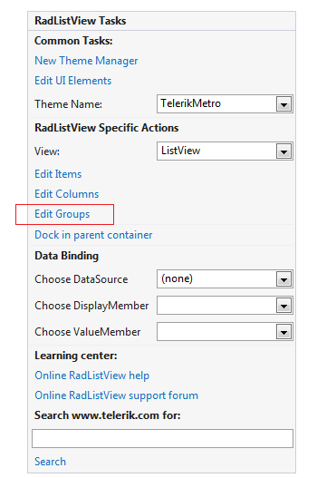
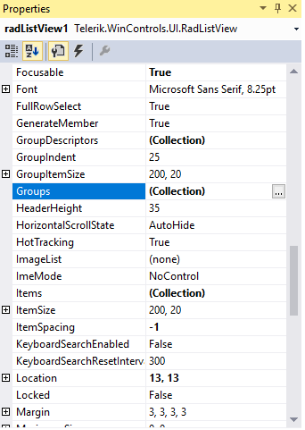
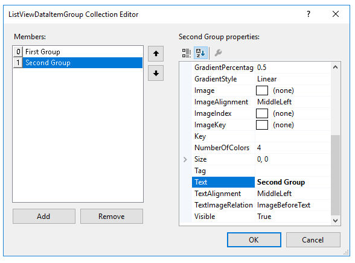
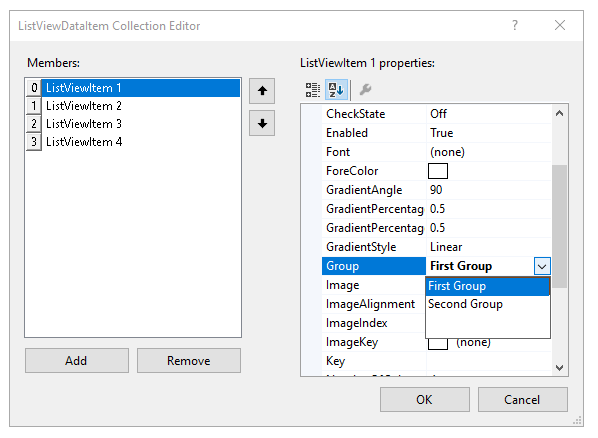

# Adding groups

## 

Items in RadListView can be grouped conveniently into different groups, which will enhance 
        	your end-user experience when working with RadListView. Grouping the items at design time can
        	be achieved by setting the __EnableCustomGroups__ and 
        	__ShowGroups__ properties of the control to true and, adding the desired
        	groups into the __Groups__ collection of RadListControl. This collection
        	is accessible either through the __Smart Tag__ of the control or through 
        	the __Groups__ collection property located in the property grid.
        

Once the __ListViewDataItemGroup__ collection is opened, you can add the desired
        	groups by using the __Add__ button on the bottom, and also, you can modify the group
        	settings in the property grid.
        

After the desired groups are added, you can easily assign each __ListViewDataItem__
        	to the group of your choice by setting the __ListViewDataItem.Group__ property:
        

Here is how the grouped items will look like:

