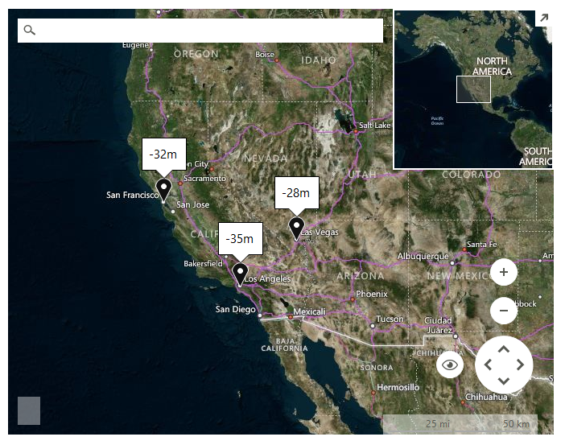

# SeaLevel ElevationType

ElevationType.*SeaLevel* __ElevationRequest__  gets the offset of the geoid sea level Earth model from the ellipsoid Earth model at a set of latitude and longitude coordinates.

>caption Figure 1: SeaLevel ElevationRequest 



#### SeaLevel ElevationType request

{{source=..\SamplesCS\Map\BingProvider.cs region=SeaLevelElevationRequest}} 
{{source=..\SamplesVB\Map\BingProvider.vb region=SeaLevelElevationRequest}}

````C#
            
        public void SetupSeaLevelElevation()
        { 
            //add pins to the map 
            Telerik.WinControls.UI.Map.PointG point1 = new Telerik.WinControls.UI.Map.PointG(36.114647, -115.172813);
            Telerik.WinControls.UI.Map.PointG point2 = new Telerik.WinControls.UI.Map.PointG(34.05223, -118.24368);
            Telerik.WinControls.UI.Map.PointG point3 = new Telerik.WinControls.UI.Map.PointG(37.77493, -122.41942);
            MapPin pin1 = new MapPin(point1);
            MapPin pin2 = new MapPin(point2);
            MapPin pin3 = new MapPin(point3);

            MapLayer pinsLayer = new MapLayer("Pins");
            this.radMap1.Layers.Add(pinsLayer);
            
            MapLayer calloutsLayer = new MapLayer("Callouts");
            this.radMap1.Layers.Add(calloutsLayer);
            this.radMap1.Layers["Pins"].Add(pin1);
            this.radMap1.Layers["Pins"].Add(pin2);
            this.radMap1.Layers["Pins"].Add(pin3);
            ElevationRequest boundsRequest = new ElevationRequest();
            boundsRequest.ElevationType = ElevationType.SeaLevel;
            boundsRequest.Points.Add(point1);
            boundsRequest.Points.Add(point2);
            boundsRequest.Points.Add(point3);
            
            BingRestMapProvider bingProvider = this.radMap1.Providers[0] as BingRestMapProvider;
            bingProvider.CalculateElevationCompleted += BingProviderBounds_CalculateSeaLevelElevationCompleted;
            bingProvider.CalculateElevationAsync(boundsRequest);
        }
            
        private void BingProviderBounds_CalculateSeaLevelElevationCompleted(object sender, ElevationCompletedEventArgs e)
        {
            for (int i = 0; i < this.radMap1.Layers["Pins"].Overlays.Count; i++)
            {
                MapPin pin = this.radMap1.Layers["Pins"].Overlays[i] as MapPin;
                    
                if (pin != null)
                {
                    MapCallout callout = new MapCallout(pin);
                    callout.MaxWidth = 35;
                    callout.Text = e.SeaLevels[0].Offsets[i].ToString() + "m";
                    this.radMap1.Layers["Callouts"].Add(callout);
                }
            }
        }

````
````VB.NET

    Public Sub SetupSeaLevelElevation()
        'add pins to the map 
        Dim point1 As New Telerik.WinControls.UI.Map.PointG(36.114647, -115.172813)
        Dim point2 As New Telerik.WinControls.UI.Map.PointG(34.05223, -118.24368)
        Dim point3 As New Telerik.WinControls.UI.Map.PointG(37.77493, -122.41942)
        Dim pin1 As New MapPin(point1)
        Dim pin2 As New MapPin(point2)
        Dim pin3 As New MapPin(point3)

        Dim pinsLayer As New MapLayer("Pins")
        Me.radMap1.Layers.Add(pinsLayer)

        Dim calloutsLayer As New MapLayer("Callouts")
        Me.radMap1.Layers.Add(calloutsLayer)
        Me.radMap1.Layers("Pins").Add(pin1)
        Me.radMap1.Layers("Pins").Add(pin2)
        Me.radMap1.Layers("Pins").Add(pin3)
        Dim boundsRequest As New ElevationRequest()
        boundsRequest.ElevationType = ElevationType.SeaLevel
        boundsRequest.Points.Add(point1)
        boundsRequest.Points.Add(point2)
        boundsRequest.Points.Add(point3)

        Dim bingProvider As BingRestMapProvider = TryCast(Me.radMap1.Providers(0), BingRestMapProvider)
        AddHandler bingProvider.CalculateElevationCompleted, AddressOf BingProviderBounds_CalculateSeaLevelElevationCompleted
        bingProvider.CalculateElevationAsync(boundsRequest)
    End Sub

    Private Sub BingProviderBounds_CalculateSeaLevelElevationCompleted(sender As Object, e As ElevationCompletedEventArgs)
        For i As Integer = 0 To Me.radMap1.Layers("Pins").Overlays.Count - 1
            Dim pin As MapPin = TryCast(Me.radMap1.Layers("Pins").Overlays(i), MapPin)

            If pin IsNot Nothing Then
                Dim callout As New MapCallout(pin)
                callout.MaxWidth = 35
                callout.Text = e.SeaLevels(0).Offsets(i).ToString() + "m"
                Me.radMap1.Layers("Callouts").Add(callout)
            End If
        Next
    End Sub

````

{{endregion}} 

# See Also
* [Bing Elevation](https://msdn.microsoft.com/en-us/library/jj158961.aspx)
* [BingRestMapProvider]()
* [Elevation]()