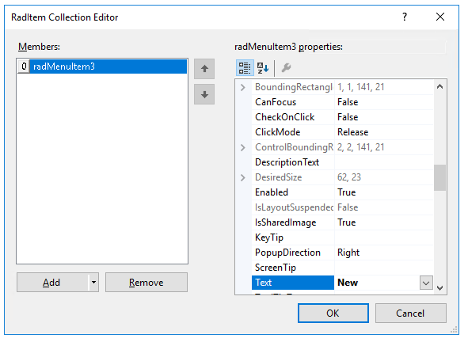
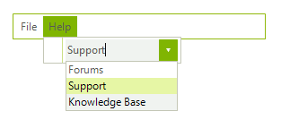

# Getting Started


## 

The following tutorial demonstrates creating a RadMenu with standard menu items with shortcuts, ComboBox menu elements and also shows how to apply a theme to RadMenu.

1. Drag a __RadMenu__ control from the toolbox to a form.
            

1. Click in the area labeled __Type Here__ and type "File".
              

1. Press __Enter__.
            

1. Click in the area labeled __Type Here__ and type "Help".
            

1. Press __Enter__.
            

1. Drag Office2010Black theme component from your ToolBox to your form.
            

1. Select the __RadMenu__ control.
            

1. Set the __ThemeName__ property to __Office2010Black__.
            

1. Select the "File" menu item.
            

1. In the __Properties__ window, click in the __Items__ property.
            

1. Click the ellipsis button.
            

1. In the __RadItem Collection Editor__, click the drop-down arrow on the __Add__ button. Select the __RadMenuItem__.
            

1. Set the __Text__ property of the new __RadMenuItem__ to "New".
            

1. Add two more RadMenuItems. Set their __Text__ properties to "Open" and "Save".
            

1. Click __OK__.
            

1. Select the "Help" menu item.
            

1. In the __Properties__ window, click in the __Items__ property.
            

1. Click the ellipsis button.
            

1. In the __RadItem Collection Editor__, click the drop-down arrow on the __Add__ button.
              Select the __RadMenuComboItem__.
            

1. Clear the __Text__ property of the new RadMenuComboItem.
            

1. Expand the __ComboBoxElement__ property of the RadMenuComboItem.
            

1. Click in the __Items__ property of the ComboBoxElement.
            

1. Click the ellipsis button.
            

1. In the __RadListDataItem Collection Editor__, click the __Add__ button.
            

1. Set the __Text__ property of the new RadComboBoxItem to "Forums".
            

1. Add two more RadComboBoxItems. Set their __Text__ properties to "Support" and "Knowledge Base".
            

1. Click __OK__ to close the RadListDataItem Collection Editor.
            

1. Click __OK__ to close the RadItem Collection Editor.
            

1. In order to assign a shortcut to a RadMenuItem, go to the Code View of the form and set the Ctrl+N shortcut to the 'New' menu item. 
            #_[C#]_

	


{{source=..\SamplesCS\Menus\Menu\MenuGettingStarted.cs region=shortcut}} 
{{source=..\SamplesVB\Menus\Menu\MenuGettingStarted.vb region=shortcut}} 

````C#
            radMenuItem3.Shortcuts.Add(new Telerik.WinControls.RadShortcut(Keys.Control, Keys.N));
````
````VB.NET
        RadMenuItem3.Shortcuts.Add(New Telerik.WinControls.RadShortcut(Keys.Control, Keys.N))
        '
````

{{endregion}} 


1. Go to the Design View of the form and select the 'New' menu item.
            

1. In the __Properties__ window, click the events toolbar button.
            

1. Double-click the __Click__ event.
            

1. Replace the automatically-generated event handler with this code:
            #_[C#]_

	


{{source=..\SamplesCS\Menus\Menu\MenuGettingStarted.cs region=clickHandler}} 
{{source=..\SamplesVB\Menus\Menu\MenuGettingStarted.vb region=clickHandler}} 

````C#
        private void radMenuItem3_Click(object sender, EventArgs e)
        {
            MessageBox.Show("New File");
        }
````
````VB.NET
    Private Sub RadMenuItem3_Click(ByVal sender As System.Object, ByVal e As System.EventArgs) Handles RadMenuItem3.Click
        MessageBox.Show("New File")
    End Sub
    '
````

{{endregion}} 


1. Return to the Design View of the form.
            

1. Press __F5__ to run the project. Notice the menu styling, the use of Ctrl+N to trigger the message box, and the combo box in the Help menu.
            
