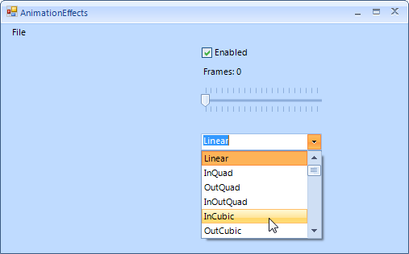

# Animation Effects


## 

Three properties control the animation behavior for expand and collapse effects on drop-down menus:

* The __DropDownAnimationEnabled__ property controls whether the expand and collapse will be animated at all. Set this property to __True__ to enable animation. 


* The __DropDownAnimationEasing__ property specifies the precise animation effect that will be applied. You can choose from a number of predefined effects including linear, exponential, elastic, and so on. 


* The __DropDownAnimationFrames__ property specifies the length of the animation. The higher the value of this property, the longer the animation will take. Experiment by setting this value higher so that the animation effects are easier to see.

The example below demonstrates toggling animation on and off, changing animation type and altering the animation speed. 



The controls used in the example are:

* __RadMenu__ to display some arbitrary menu items (see the [Menu Designer]() topic for more information on adding menu items at design time).

* __RadCheckBox__named "cbEnabled".

* __RadLabel__named "lblFrames".

* __RadTrackBar__named "tbFrames".

* __RadDropDownList__ named "ddlAnimation".  

To load the __RadDropDownList__with members of the __RadEasingType__ enumeration add the following code to a __Form Load__event handler. This code iterations the enumeration and adds both the string representation and the enumerated value itself. 

#_[C#]_

	


{{source=..\SamplesCS\Menus\Menu\AnimationEffects.cs region=easingTypes}} 
{{source=..\SamplesVB\Menus\Menu\AnimationEffects.vb region=easingTypes}} 

````C#
            foreach (RadEasingType ret in Enum.GetValues(typeof(RadEasingType)))
            {
                RadListDataItem item = new RadListDataItem();
                item.Text = ret.ToString("f");
                item.Value = ret;
                ddlAnimation.Items.Add(item);
            }
            ddlAnimation.SelectedIndex = 0;
````
````VB.NET
        For Each ret As RadEasingType In System.Enum.GetValues(GetType(RadEasingType))
            Dim item As New RadListDataItem()
            item.Text = ret.ToString("f")
            item.Value = ret
            ddlAnimation.Items.Add(item)
        Next ret
        ddlAnimation.SelectedIndex = 0
        '
````

{{endregion}} 


The example requires event handlers for: 

* __RadDropDownList SelectedIndexChanged__event.

* __RadCheckBox ToggleStateChanged__event.

* __RadTrackBar ValueChanged__event.

When the __RadDropDownList__ selection changes the __RadEasingType__ enumeration value is assigned to the __RadMenu____DropDownAnimationEasing__ property. The __RadCheckBox____Click__ event handler toggles the __DropDownAnimationEnabled__ property. The __RadTrackBar____ValueChanged__ event handler sets the __DropDownAnimationFrames__ property and displays the current value in the label. 

#_[C#]_

	


{{source=..\SamplesCS\Menus\Menu\AnimationEffects.cs region=eventHandlers}} 
{{source=..\SamplesVB\Menus\Menu\AnimationEffects.vb region=eventHandlers}} 

````C#
        void ddlAnimation_SelectedIndexChanged(object sender, Telerik.WinControls.UI.Data.PositionChangedEventArgs e)
        {
            RadListDataItem item = (sender as RadDropDownListElement).SelectedItem as RadListDataItem;
            radMenu1.DropDownAnimationEasing = (RadEasingType)item.Value;
        }

        void cbEnabled_ToggleStateChanged(object sender, StateChangedEventArgs args)
        {
            radMenu1.DropDownAnimationEnabled = (sender as RadCheckBox).IsChecked;
        }

        void tbFrames_ValueChanged(object sender, EventArgs e)
        {
            object trackBarValue = (sender as RadTrackBar).Value;
            lblFrames.Text = "Frames: " + trackBarValue.ToString();
            radMenu1.DropDownAnimationFrames = (int)trackBarValue;
        }
````
````VB.NET
    Private Sub ddlAnimation_SelectedIndexChanged(ByVal sender As Object, ByVal e As Telerik.WinControls.UI.Data.PositionChangedEventArgs)
        Dim item As RadListDataItem = TryCast((TryCast(sender, RadDropDownListElement)).SelectedItem, RadListDataItem)
        RadMenu1.DropDownAnimationEasing = CType(item.Value, RadEasingType)
    End Sub

    Private Sub cbEnabled_ToggleStateChanged(ByVal sender As Object, ByVal e As StateChangedEventArgs)
        RadMenu1.DropDownAnimationEnabled = (TryCast(sender, RadCheckBox)).IsChecked
    End Sub

    Private Sub tbFrames_ValueChanged(ByVal sender As Object, ByVal e As EventArgs)
        Dim trackBarValue As Object = (TryCast(sender, RadTrackBar)).Value
        lblFrames.Text = "Frames: " & trackBarValue.ToString()
        RadMenu1.DropDownAnimationFrames = CInt(Fix(trackBarValue))
    End Sub
    '
````

{{endregion}} 


