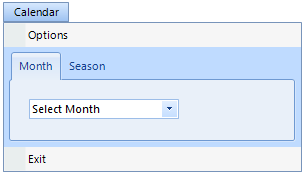

# Nesting Controls Tutorial


## 

This tutorial demonstrates adding a page view to a RadMenu. Each page will contain a populated drop down list.
          Clicking the drop down list items displays a message box with the current selection text.
        

1. Add a __RadMenu__ to the form. No other design time work needs to be done.
            

1. Add the necessary items definitions along with string array for the months and seasons.#_[C#] _

	


{{source=..\SamplesCS\Menus\Menu\NestingControlsTutorial.cs region=data}} 
{{source=..\SamplesVB\Menus\Menu\NestingControlsTutorial.vb region=data}} 

````C#
        private RadDropDownList seasonDropDownList;
        private RadDropDownList monthDropDownList;
        private RadPageView pageView;
        private string[] months = new string[]
        {
                    "January", "February", "March", "April", "May",
                    "June", "July", "August", "September", "October",
                    "November", "December", "January"
        };
        private string[] seasons = new string[] { "Spring", "Summer", "Fall", "Winter" };
````
````VB.NET
    Private seasonDropDownList As RadDropDownList
    Private monthDropDownList As RadDropDownList
    Private pageView As RadPageView

    Private months() As String = {"January", "February", "March", "April", "May", "June", "July", "August", "September", "October", "November", "December", "January"}
    Private seasons() As String = {"Spring", "Summer", "Fall", "Winter"}
````

{{endregion}} 


1. Create a private method that builds and returns a __RadDropDownList__. In addition you can display the selected item text
              by using the SelectedIndexChanged event.
            #_[C#] _

	


{{source=..\SamplesCS\Menus\Menu\NestingControlsTutorial.cs region=CreaateDDL}} 
{{source=..\SamplesVB\Menus\Menu\NestingControlsTutorial.vb region=CreaateDDL}} 

````C#
        private RadDropDownList CreateRadDropDownListElement(string text, string[] captions)
        {
            RadDropDownList ddl = new RadDropDownList();
            ddl.Location = new Point(15, 15);
            ddl.Size = new Size(150, 19);
            ddl.Margin = new Padding(25, 5, 5, 5);
            ddl.Text = text;
            foreach (string caption in captions)
            {
                ddl.Items.Add(new RadListDataItem(caption));
            }
            ddl.SelectedIndexChanged += ddl_SelectedIndexChanged;
            return ddl;
        }

        void ddl_SelectedIndexChanged(object sender, Telerik.WinControls.UI.Data.PositionChangedEventArgs e)
        {
            RadListDataItem item =
                (sender as RadDropDownList).SelectedItem;
            MessageBox.Show(item.Text);
        }
````
````VB.NET
    Private Function CreateRadDropDownListElement(ByVal text As String, ByVal captions() As String) As RadDropDownList
        Dim ddl As New RadDropDownList()
        ddl.Location = New Point(15, 15)
        ddl.Size = New Size(150, 19)
        ddl.Margin = New Padding(25, 5, 5, 5)
        ddl.Text = text
        For Each caption As String In captions
            ddl.Items.Add(New RadListDataItem(caption))
        Next caption
        AddHandler ddl.SelectedIndexChanged, AddressOf ddl_SelectedIndexChanged
        Return ddl
    End Function

    Private Sub ddl_SelectedIndexChanged(ByVal sender As Object, ByVal e As Telerik.WinControls.UI.Data.PositionChangedEventArgs)
        Dim item As RadListDataItem = (TryCast(sender, RadDropDownList)).SelectedItem
        MessageBox.Show(item.Text)
    End Sub
````

{{endregion}} 


1. Create a form __Load__ event handler. In addition you should add the event prevent the drop down from closing when one is working with the page view.
              The exit item can be used for closing the drop down in this case.
            #_[C#] _

	


{{source=..\SamplesCS\Menus\Menu\NestingControlsTutorial.cs region=main}} 
{{source=..\SamplesVB\Menus\Menu\NestingControlsTutorial.vb region=main}} 

````C#
        private void Form1_Load(object sender, EventArgs e)
        {
            monthDropDownList = CreateRadDropDownListElement("Select Month", months);
            seasonDropDownList = CreateRadDropDownListElement("Select Season", seasons);

            RadMenuItem rmiSettings = new RadMenuItem("Calendar");
            rmiSettings.DropDownClosing += rmiSettings_DropDownClosing;
            radMenu1.Items.Add(rmiSettings);
            rmiSettings.Items.Add(new RadMenuItem("Options"));
            RadMenuItem closeItem = new RadMenuItem("Exit");
            closeItem.Click += closeItem_Click;
            rmiSettings.Items.Add(closeItem);

            this.pageView = new RadPageView();
            this.pageView.Size = new System.Drawing.Size(300, 100);
            RadPageViewStripElement stripElement = this.pageView.ViewElement as RadPageViewStripElement;
            stripElement.ItemFitMode = StripViewItemFitMode.None;
            stripElement.StripButtons = StripViewButtons.None;

            RadPageViewPage montsPage = new RadPageViewPage("Month");
            RadPageViewPage seasonsPage = new RadPageViewPage("Season");

            montsPage.Controls.Add(monthDropDownList);
            seasonsPage.Controls.Add(seasonDropDownList);

            pageView.Pages.Add(montsPage);
            pageView.Pages.Add(seasonsPage);
            RadMenuHostItem hostItem = new RadMenuHostItem(pageView);
            hostItem.MinSize = new System.Drawing.Size(210, 50);

            rmiSettings.Items.Insert(1, hostItem);
        }

        void closeItem_Click(object sender, EventArgs e)
        {
            RadMenuItem item = (RadMenuItem)sender;
            RadMenuItem parent = item.HierarchyParent as RadMenuItem;
            parent.DropDown.ClosePopup(new PopupCloseInfo(RadPopupCloseReason.CloseCalled, this));
        }

        void rmiSettings_DropDownClosing(object sender, RadPopupClosingEventArgs args)
        {
            args.Cancel = args.CloseReason == RadPopupCloseReason.Mouse;
        }
````
````VB.NET
    Private Sub Form1_Load(ByVal sender As Object, ByVal e As EventArgs)
        monthDropDownList = CreateRadDropDownListElement("Select Month", months)
        seasonDropDownList = CreateRadDropDownListElement("Select Season", seasons)

        Dim rmiSettings As New RadMenuItem("Calendar")
        AddHandler rmiSettings.DropDownClosing, AddressOf rmiSettings_DropDownClosing
        radMenu1.Items.Add(rmiSettings)
        rmiSettings.Items.Add(New RadMenuItem("Options"))
        Dim closeItem As New RadMenuItem("Exit")
        AddHandler closeItem.Click, AddressOf closeItem_Click
        rmiSettings.Items.Add(closeItem)

        Me.pageView = New RadPageView()
        Me.pageView.Size = New System.Drawing.Size(300, 100)
        Dim stripElement As RadPageViewStripElement = TryCast(Me.pageView.ViewElement, RadPageViewStripElement)
        stripElement.ItemFitMode = StripViewItemFitMode.None
        stripElement.StripButtons = StripViewButtons.None

        Dim montsPage As New RadPageViewPage("Month")
        Dim seasonsPage As New RadPageViewPage("Season")

        montsPage.Controls.Add(monthDropDownList)
        seasonsPage.Controls.Add(seasonDropDownList)

        pageView.Pages.Add(montsPage)
        pageView.Pages.Add(seasonsPage)
        Dim hostItem As New RadMenuHostItem(pageView)
        hostItem.MinSize = New System.Drawing.Size(210, 50)

        rmiSettings.Items.Insert(1, hostItem)
    End Sub


    Private Sub closeItem_Click(ByVal sender As Object, ByVal e As EventArgs)
        Dim item As RadMenuItem = DirectCast(sender, RadMenuItem)
        Dim parent As RadMenuItem = TryCast(item.HierarchyParent, RadMenuItem)
        parent.DropDown.ClosePopup(New PopupCloseInfo(RadPopupCloseReason.CloseCalled, Me))
    End Sub

    Private Sub rmiSettings_DropDownClosing(ByVal sender As Object, ByVal args As RadPopupClosingEventArgs)
        args.Cancel = args.CloseReason = RadPopupCloseReason.Mouse
    End Sub
````

{{endregion}} 


This Load event handler performs the main work of the application. 

* A __RadDropDpwnList__ is created and populated with the months of the year.
                

* A second __RadDropDpwnList__ is created and populated with the names of the seasons.
                

* A main __RadMenuItem__ "Calendar" is created with two token menu items "Options" and "Exit".
                

* A __RadMenuHostItem__ is created to contain the page view.
                

* A __RadPageView__ is created. Two pages are added to the page view. Each one contains the corresponding drop down list. 
                  Then the page view is added to the __RadMenuHostItem__. In this example
                  the drop down lists are providing choices while the pages allows the tabs to be switched.
                

* The __RadMenuHostItem__ is inserted into the second position in the menu.
                

Press __F5__to run the application. Notice the behavior when clicking the tabs and when clicking the items
          in the combo boxes.
        
