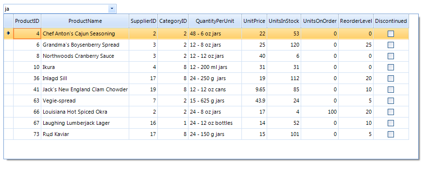

# Filtering


## Using simple FilterDescriptor

Filtering operation in __RadMultiColumnComboBox__ is controlled by the boolean __AutoFilter__ property. The data is filtered by the field specified as __DisplayMember__. In addtion you should set the filter expression (telling the control the rules it should use to filter the data) and add that expression to __MasterTemplate__: 

>note Please note that by default the FilterDescriptor.Value is an empty string and it should remain with this value.
>

{{source=..\SamplesCS\MultiColumnComboBox\MultiColumnComboBox1.cs region=filtering}} 
{{source=..\SamplesVB\MultiColumnComboBox\MultiColumnComboBox1.vb region=filtering}} 

````C#
            
this.radMultiColumnComboBox1.AutoFilter = true;
this.radMultiColumnComboBox1.DisplayMember = "ContactName";
FilterDescriptor filter = new FilterDescriptor();
filter.PropertyName = this.radMultiColumnComboBox1.DisplayMember;
filter.Operator = FilterOperator.Contains;
this.radMultiColumnComboBox1.EditorControl.MasterTemplate.FilterDescriptors.Add(filter);

````
````VB.NET
Me.RadMultiColumnComboBox1.AutoFilter = True
Me.RadMultiColumnComboBox1.DisplayMember = "ContactName"
Dim filter As New FilterDescriptor()
filter.PropertyName = Me.RadMultiColumnComboBox1.DisplayMember
filter.Operator = FilterOperator.Contains
Me.RadMultiColumnComboBox1.EditorControl.MasterTemplate.FilterDescriptors.Add(filter)

````

{{endregion}} 

The code above will result in the following multi-column combobox: <br>

## Using CompositeFilterDescriptor

You can filter data records by multiple values. For this purpose you have to use the __CompositeFilterDescriptor__ object. It contains a collection of filter descriptors objects and the logical operator for that filters.<br>

{{source=..\SamplesCS\MultiColumnComboBox\MultiColumnComboBox1.cs region=CompositeFilters}} 
{{source=..\SamplesVB\MultiColumnComboBox\MultiColumnComboBox1.vb region=CompositeFilters}} 

````C#
this.radMultiColumnComboBox1.AutoFilter = true;
CompositeFilterDescriptor compositeFilter = new CompositeFilterDescriptor();           
FilterDescriptor prodName = new FilterDescriptor("ProductName", FilterOperator.Contains, "");
FilterDescriptor prodQuantity = new FilterDescriptor("QuantityPerUnit", FilterOperator.Contains, "");
compositeFilter.FilterDescriptors.Add(prodName);
compositeFilter.FilterDescriptors.Add(prodQuantity);
compositeFilter.LogicalOperator = FilterLogicalOperator.Or;
this.radMultiColumnComboBox1.EditorControl.FilterDescriptors.Add(compositeFilter);

````
````VB.NET
Me.radMultiColumnComboBox1.AutoFilter = True
Dim compositeFilter As New CompositeFilterDescriptor()
Dim prodName As New FilterDescriptor("ProductName", FilterOperator.Contains, "")
Dim prodQuantity As New FilterDescriptor("QuantityPerUnit", FilterOperator.Contains, "")
compositeFilter.FilterDescriptors.Add(prodName)
compositeFilter.FilterDescriptors.Add(prodQuantity)
compositeFilter.LogicalOperator = FilterLogicalOperator.[Or]
Me.radMultiColumnComboBox1.EditorControl.FilterDescriptors.Add(compositeFilter)

````

{{endregion}} 

>note The composite filters allow you to create more complex filtering expressions. Note that this feature is supported for text columns only as the __RadMultiColumnComboBox__ has one common text input for the filtering operation and it is not possible to convert input data to different data formats automatically.
>

