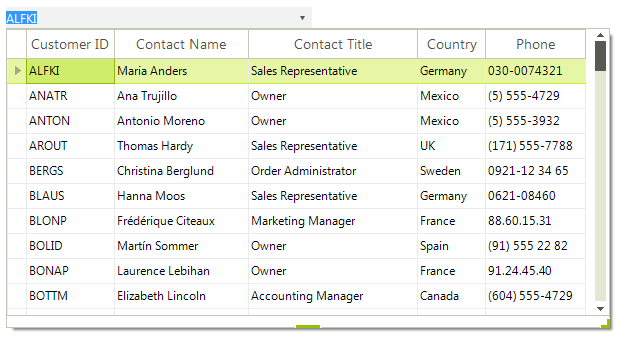

# MultiColumnComboBox

## 

The multi-column combobox is a special case of combobox control with RadGridView integrated in its drop-down. The control combines the functionality and features of RadDropDownList and RadGridView. 

The image below represents the structure of the multi-column combobox.

The drop-down element is an object of type __MultiColumnComboBoxElement__. Use this element to set the [drop-down style](), [animation]() and [sizing]() as you would do for the regular combobox.  

The __EditorControl__ property of the __MultiColumnComboBoxElement__ gives you a reference to the __RadGridView__ control. Using that reference you can obtain the RadGridView object and work as with normal RadGridView control. Refer to the [RadGridView documentation] () for additional information on RadGridView.

The current version has some limitations that you should consider:

* You cannot use the auto-complete mode of RadDropDownList

* The RadGridView control hosted in the drop-down does not allow editing operations

* The RadGridView control hosted in the drop-down does not support filtering, grouping and sorting operations.
