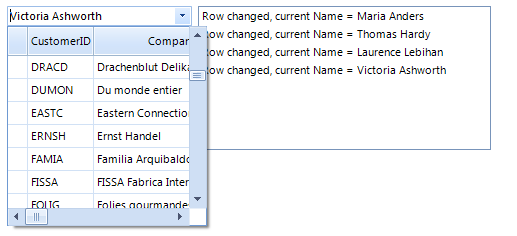

# SelectedIndexChanged


## 

__SelectedIndexChanged__ event fires when the index of the current list item changes. The index may change as a result of user selection with a mouse or keyboard navigation or programmatic assignment of the index. Note that with a data-bound combo box, __SelectedIndexChanged__ will be hit as the data is being bound to the control. When the data binding is done through the designer using the property window, the __SelectedIndex__ will change again as the form is unloaded.

{{source=..\SamplesCS\MultiColumnComboBox\MultiColumnComboBox1.cs region=selectedIndexChanged}} 
{{source=..\SamplesVB\MultiColumnComboBox\MultiColumnComboBox1.vb region=selectedIndexChanged}} 

````C#
    
void radMultiColumnComboBox1_SelectedIndexChanged(object sender, EventArgs e)
{
    string text;
    text = string.Format("Row changed, current Name = {0}", radMultiColumnComboBox1.EditorControl.Rows[radMultiColumnComboBox1.SelectedIndex].Cells["ContactName"].Value);
    radListControl1.Items.Add(text);
}

````
````VB.NET
Private Sub radMultiColumnComboBox1_SelectedIndexChanged(ByVal sender As Object, ByVal e As EventArgs)
    Dim text As String
    text = String.Format("Row changed, current Name = {0}", RadMultiColumnComboBox1.EditorControl.Rows(RadMultiColumnComboBox1.SelectedIndex).Cells("ContactName").Value)
    RadListControl1.Items.Add(text)
End Sub

````

{{endregion}} 


