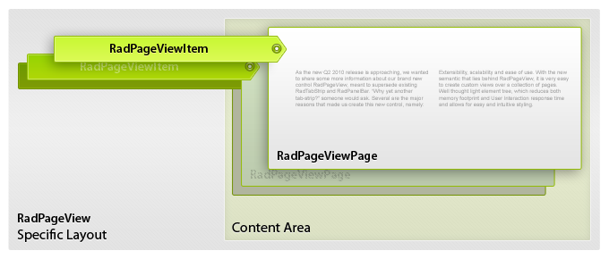

# Architecture

## Overview

RadPageView control is aiming high to provide a full replacement for the currently existing RadTabStrip and RadPanelBar controls by
        shipping the same functionality with a simpler approach and improved performance. This new control is based on a very flexible and
        extensible platform that is fully compatible with the Telerik Presentation Framework, and allows for implementing different layout
        scenarios as quick as never before.

## Architecture

The architecture of this control is pretty simple. It consists of pages which have associated items that can be used to show
        the corresponding page. A specific layout strategy arranges the pages and the items so that the end look-and-feel is achieved.
        The diagram below conceptually illustrates the RadPageView’s structure whereby the names of the diagram elements correspond to the actual Telerik types:
      

## View Modes

Currently, we ship three modes of this control which implement different layout strategies and thus achieve the functionality of the RadTabStrip and RadPanelBar controls all in one:
		• Strip Mode: equivalent to the RadTabStrip control.
		• Stack Mode: equivalent to the RadPanelBar’s ListBar mode.
		• Outlook Mode: equivalent to the RadPanelBar’s OutlookNavPane mode.

## Events

The RadPageView control exposes events common for all view modes like SelectedPageChanged, PageIndexChaged, PageIndexChanging,
        PagesClearing, PagesCleared etc. There are properties which get the currently selected page, the currently active view element (which represents the view mode)
        and the pages collection.
		

## Setting up RadPageView

To use this new control, you can simply drag-and-drop it onto your form in the Visual Studio designer and use its [Smart Tag]() to add pages. To switch between the different view-modes, you can set the ViewMode property in the Properties window of the control. To adjust properties of the specific view, you should find the __ViewElement__property in the property grid and expand its sub-properties where you can find settings specific to the currently active view. This is the general approach to set up the RadPageView control in the designer without considering the view mode.
