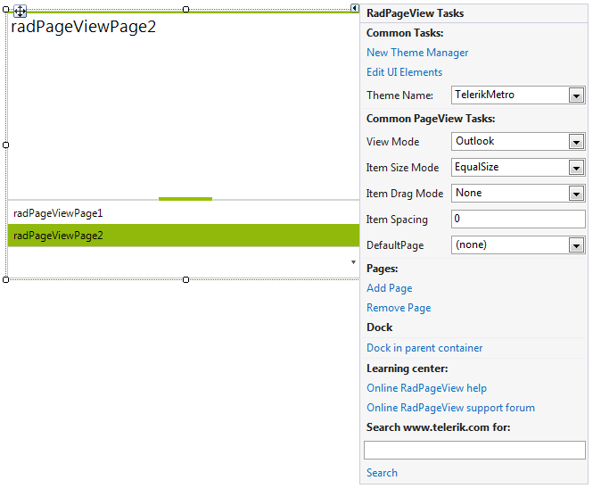

# Design-time

## Common properties

The Smart Tag for RadPageView lets you quickly access common tasks involved with building RadPageView elements and customizing its elements. There is a set of properties valid for each of the available view modes:

* __New Theme Manager__: Adds a new __RadThemeManagerhttp://www.telerik.com/help/winforms/vsb_thememanageradding.html__ component to the form.
            

* __Edit UI Elements__: Opens a dialog that displays the __Element Hierarchy Editorhttp://www.telerik.com/help/winforms/uieditoroverview.html__. This editor lets you browse all the elements in the control, including the RadTreeView itself, tree nodes and the UI elements
            that make up each node (e.g. expand and collapse elements and their associated ImagePrimitives objects).
          

* __Theme Name__: Select a theme name from the drop down list of themes available for that control. Selecting a theme allows
            you to change all aspects of the controls visual style at one time.
          

* __View Mode__: Sets the view mode of RadPageView. The supported modes are *Strip, Stack* and
            *Outlook*.
          

* __Item Size Mode__: Determines whether the items should have equal size. The supported modes are *EqualHeight,
            EqualWidth, EqualSize* and *Individual*.
          

* __Item Drag Mode__: Determines the drag mode of the items. The supported modes are *Preview* and
            *Immediate*.
          

* __Item Content Orientation__: Determines the orientation of the item content (image, text, and buttons' panel).
            The supported orientations are *Auto*, *Horizontal*, *Horizontal180*,
            *Vertical90* and *Vertical270*.
          

* __Item Spacing__: Determines the spacing between the items in pixels.
          

* __Add Page__: Clicking on this link will add a new page to RadPageView.Pages collection.
          

* __Remove Page__: Clicking on this will remove the currently selected page in RadPageView.
          

There are also view-specific properties as shown below:

## Strip view mode

* __Strip Alignment__: Determines the position of the tab items in RadPageView in relation to the content area.
            It can be *Top*, *Left*, *Bottom* or *Right*.
          

* __Item Alignment__: Determines the alignment of items within the strip layout.
          

* __Item Fit Mode__: Determines the fit mode of the items. The available modes are *None*,
            *Fill*, *Shrink* and *ShrinkAndFill*.
          

* __Strip Buttons__: Determines the style of the navigation buttons. The available styles are *None,
            Auto, LeftScroll, RightScroll, Scroll, VS2005Style, Close, ItemList, VS2008Style, All*.
          

## Stack view mode

* __Stack Position__: Determines the location of the items in relation to the content area.
          

* __Item Selection Mode__: Determines how the items in Stack view are selected and positioned.
          

## Outlook view mode

There are no Outlook view related properties in the Action Menu of RadPageView.

>caution In order to switch from one Action Menu to another, you should first close the menu by clicking on the Smart Tag and then reopen it again.
>

