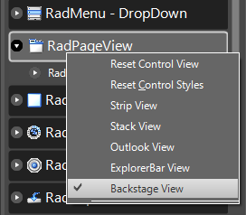
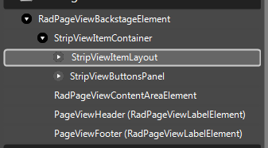
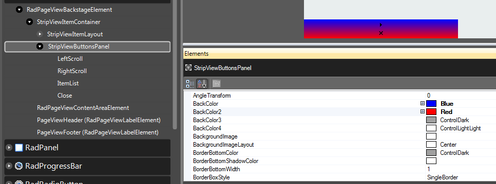
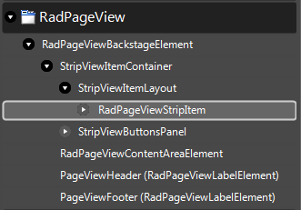
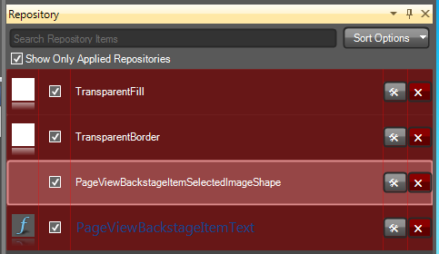
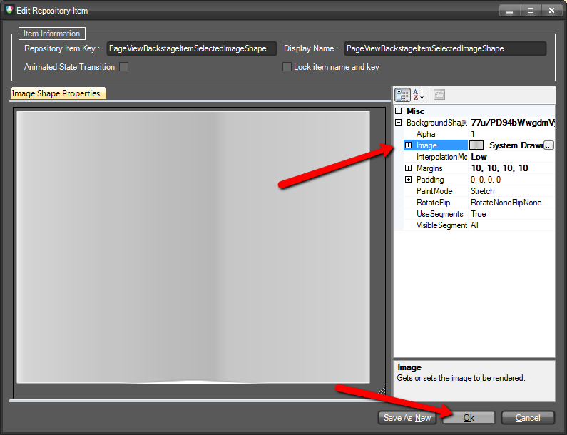
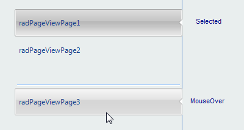
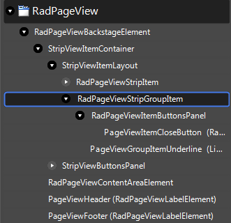

# Customizing Backstage View

The process of customizing the BackstageView mode of RadPageView includes several different stages:  

* [Customizing the content area](#customizing-the-content-area)

* [Customizing the items area](#customizing-the-items-(radpageviewpages)-area)

* [Customizing the ButtonsArea (if enabled)](#customizing-the-buttons-area)

* [Customizing the page items](#customizing-radpageviewitems)

* [Customizing group items](#customizing-radpageviewstripgroupitem)

All customizations are possible both through code and by creating/modifying a theme in
        [Visual Style Builder]()
        except the customization of the items (RadPageViewPage items or simply called tabs) since they use
        [ImageShape]()
        for their appearance.
      

>The items in Backstage view can be styled only through
            [Visual Style Builder](),
            since they use the
            [ImageShape]()
            functionality of our Telerik Presentation Framework in order to achieve their default view.
          

## Customizing the content area

Follows an example on how to customize the content area with Visual Style Builder using the ControlDefault theme as a base. 

1. Open the Visual Style Builder and select *File >> Export Built-in Themes…*

1. Then click *File >> Open Package* and load the ControlDefault theme.
            

1. After the theme is loaded, navigate to RadPageView in the Control Structure pane, right click it and select Backstage View
          

1. Expand RadPageViewBackstageElement and select RadPageViewContentAreaElement.

1. In the Elements Window, expand the RadPageViewBackstageElement and set its BackColor property to *191, 219, 255*

1. Save your theme, load it to your application and set the RadPageView theme to be the currently created theme as explained in
            [Using Custom Themes]() section.

Another way of customizing the content area is in code. The following code snippet demonstrates how to accsess the content area:

#### __[C#] Accessing the content area of Backstage View__

{{source=..\SamplesCS\PageView\BackstageView.cs region=contentArea}}
	            RadPageViewBackstageElement backStageElement = radPageView1.ViewElement as RadPageViewBackstageElement;
	            backStageElement.ContentArea.BackColor = Color.Yellow;
	{{endregion}}

#### __[VB.NET] Accessing the content area of Backstage View__

{{source=..\SamplesVB\PageView\BackstageView.vb region=contentArea}}
	        Dim backStageElement As RadPageViewBackstageElement = TryCast(RadPageView1.ViewElement, RadPageViewBackstageElement)
	        backStageElement.ContentArea.BackColor = Color.Yellow
	{{endregion}}

## Customizing the items (RadPageViewPages) area

The approach of customizing is the same, you just have to select the appropriate element from the Element Structure tree. In this case this is StripViewItemLayout

Use the following code snippet to access the element in code:

#### __[C#] Accessing the content area of Backstage View__

{{source=..\SamplesCS\PageView\BackstageView.cs region=itemsArea}}
	            RadPageViewBackstageElement backStageElement = radPageView1.ViewElement as RadPageViewBackstageElement;
	            StripViewItemLayout itemLayout = backStageElement.ItemContainer.ItemLayout as StripViewItemLayout;
	            itemLayout.BackColor = Color.Red;
	{{endregion}}

#### __[VB.NET] Accessing the content area of Backstage View__

{{source=..\SamplesVB\PageView\BackstageView.vb region=itemsArea}}
	        Dim backStageElement As RadPageViewBackstageElement = TryCast(RadPageView1.ViewElement, RadPageViewBackstageElement)
	        Dim itemLayout As StripViewItemLayout = TryCast(backStageElement.ItemContainer.ItemLayout, StripViewItemLayout)
	        itemLayout.BackColor = Color.Red
	{{endregion}}

## Customizing the buttons area

To access the element responsible for the buttons area, expand RadPageViewBackstageElement >> StripViewItemContainer and select StripViewButtonsPanel.
          Expanding the latter will give you the opportunity to customize the different buttons in the buttons panel.
        

Have in mind that StripViewButtonsPanel is not visible by default. After you select it, you can make it visible by first expanding the
          StripViewButtonsPanel and then setting the Visibility property to Visible. In addition, by default it does not have a fill, so you have
          to set the DrawFill property to true. Now you can customize its fill appearance.
        

The buttons panel can be accessed from the ItemsContaier of the Backstage element:

#### __[C#] Accessing the content area of Backstage View__

{{source=..\SamplesCS\PageView\BackstageView.cs region=buttonsArea}}
	            RadPageViewBackstageElement backStageElement = radPageView1.ViewElement as RadPageViewBackstageElement;
	            StripViewButtonsPanel buttonsPanel = backStageElement.ItemContainer.ButtonsPanel as StripViewButtonsPanel;
	            buttonsPanel.Visibility = ElementVisibility.Visible;
	            buttonsPanel.DrawFill = true;
	            buttonsPanel.BackColor = Color.Green;
	{{endregion}}

#### __[VB.NET] Accessing the content area of Backstage View__

{{source=..\SamplesVB\PageView\BackstageView.vb region=buttonsArea}}
	        Dim backStageElement As RadPageViewBackstageElement = TryCast(RadPageView1.ViewElement, RadPageViewBackstageElement)
	        Dim buttonsPanel As StripViewButtonsPanel = TryCast(backStageElement.ItemContainer.ButtonsPanel, StripViewButtonsPanel)
	        buttonsPanel.Visibility = ElementVisibility.Visible
	        buttonsPanel.DrawFill = True
	        buttonsPanel.BackColor = Color.Green
	{{endregion}}

## Customizing RadPageViewItems

As already mentioned, such a customization is only possible with
          [Visual Style Builder]().
        

By default, page items use
          [ImageShape]()
          for their appearance. This gives you the opportunity to create an image that will have the exact size of the page item
          (for your application) and just apply it through the theme, or you can use the functionality that our TPF offers with
          the so called ImageShape. In our scenario we have three images to cover the Selected, MouseOver and MouseDown states of the page item:
        
<table><tr><td>

Down</td><td>

Over</td><td>

Selected</td></tr></table>

We will use the [ImageShape]()
          functionality to stretch those images in order to fill the desired items size.
        

1. The element responsible for the items in Backstage View is called RadPageViewStripItem. Locate it in the Element Structure pane.
            (For the sake of this example ControlDefault theme is loaded in advance)

1. Choose the desired states in this case Selected, MouseOver and MouseDown

1. Edit the corresponding ImageShape repository items for each state.

1. Set the desired image and assign the desired properties in order to customize the image according to your requirement.
            For more information refer to the [ImageShape]() article.

1. Save and load your new theme into the application, as described in
            [Using Custom Themes]() article.

## Customizing RadPageViewStripGroupItem

RadPageViewStripGroup item is responsible for the group items in RadPageView. Every group item have an underline which is also customizable (PageViewGroupItemUnderline).

The following code snippet demonstrates how to access and customize the group items in code:

#### __[C#] Accessing the content area of Backstage View__

{{source=..\SamplesCS\PageView\BackstageView.cs region=groupItems}}
	            RadPageViewBackstageElement backStageElement = radPageView1.ViewElement as RadPageViewBackstageElement;
	            StripViewItemLayout itemLayout = backStageElement.ItemContainer.ItemLayout as StripViewItemLayout;
	            foreach (RadPageViewStripItem item in itemLayout.Children)
	            {
	                RadPageViewStripGroupItem groupItem = item as RadPageViewStripGroupItem;
	                if (groupItem != null)
	                {
	
	                    groupItem.BackColor = Color.Yellow;
	                    groupItem.NumberOfColors = 1;
	
	                    LightVisualElement underlineElement = ((LightVisualElement)groupItem.Children[1]);
	                    underlineElement.BorderBottomColor = Color.Blue;
	                    underlineElement.BorderTopColor = Color.Red;
	
	                }
	            }
	{{endregion}}

#### __[VB.NET] Accessing the content area of Backstage View__

{{source=..\SamplesVB\PageView\BackstageView.vb region=groupItems}}
	        Dim backStageElement As RadPageViewBackstageElement = TryCast(RadPageView1.ViewElement, RadPageViewBackstageElement)
	        Dim itemLayout As StripViewItemLayout = TryCast(backStageElement.ItemContainer.ItemLayout, StripViewItemLayout)
	        For Each item As RadPageViewStripItem In itemLayout.Children
	            Dim groupItem = TryCast(item, RadPageViewStripGroupItem)
	            If groupItem IsNot Nothing Then
	                groupItem.BackColor = Color.Yellow
	                groupItem.NumberOfColors = 1
	
	                Dim underlineElement = TryCast(groupItem.Children(1), LightVisualElement)
	                underlineElement.BorderBottomColor = Color.Blue
	                underlineElement.BorderTopColor = Color.Red
	            End If
	
	
	        Next
	{{endregion}}

