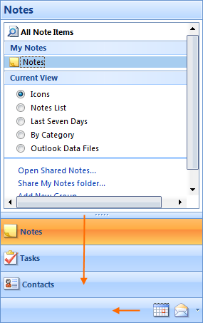
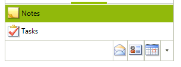

# Using The Overflow Grip

## Basics

The Overflow Grip can be used to increase/decrease the amount of currently visible items in the Outlook View to
        modify the amount available for the currently displayed content. The user can drag the Overflow Grip in the corresponding
        direction to adjust the amount of visible items in the stack as shown on the screenshots below. When the user drags the grip,
        items are added/removed from the overflow panel in the direction shown by the horizontal arrow.

## Programming the Overflow Grip

As well as from the UI, the overflow grip can be used programmatically. To do so, you should access the methods
        exposed by the RadPageViewOutlookElement class by casting the RadPageView’s ViewElement property to RadPageViewOutlookElement.
        Then, you should call the corresponding methods as the code snippet below demonstrates:

#### __[C#]__

{{source=..\SamplesCS\PageView\OutlookView.cs region=programmingGrip}}
	
	            RadPageViewOutlookElement outlookElement = this.radPageView1.ViewElement as RadPageViewOutlookElement;
	            //Drags the sizing grip one item down.
	            outlookElement.DragGripDown();
	            //Drags the sizing grip one item up.
	            outlookElement.DragGripUp();
	
	{{endregion}}

#### __[VB.NET]__

{{source=..\SamplesVB\PageView\OutlookView.vb region=programmingGrip}}
	
	        Dim outlookElement As RadPageViewOutlookElement = TryCast(Me.radPageView1.ViewElement, RadPageViewOutlookElement)
	        'Drags the sizing grip one item down.
	        outlookElement.DragGripDown()
	        'Drags the sizing grip one item up.
	        outlookElement.DragGripUp()
	
	{{endregion}}

You can also use the HideItems/ShowItems methods to specify how many items will be hidden/shown at once:

#### __[C#]__

{{source=..\SamplesCS\PageView\OutlookView.cs region=programmingItems}}
	
	            RadPageViewOutlookElement outlookElement = this.radPageView1.ViewElement as RadPageViewOutlookElement;
	            //Drags the sizing grip three items down.
	            outlookElement.HideItems(3);
	            //Drags the sizing grip two items up.
	            outlookElement.ShowItems(2);
	
	{{endregion}}

#### __[VB.NET]__

{{source=..\SamplesVB\PageView\OutlookView.vb region=programmingGrip}}
	
	        Dim outlookElement As RadPageViewOutlookElement = TryCast(Me.radPageView1.ViewElement, RadPageViewOutlookElement)
	        'Drags the sizing grip one item down.
	        outlookElement.DragGripDown()
	        'Drags the sizing grip one item up.
	        outlookElement.DragGripUp()
	
	{{endregion}}

When items are hidden by using the overflow grip, they appear as a strip of buttons on the overflow panel below the stack:

You can use these buttons to select and show the content of the corresponding item.

## Using the Overflow Grip’s Events

The RadPageViewOutlookElement exposes the following events to notify that the state of an item is changed by using the overflow grip:

* ItemCollapsed
          

* ItemShown
          

The ItemCollapsed event is fired for each item collapsed by dragging the overflow grip. On the contrary, the ItemShown event is
        fired each time an item is shown by dragging the overflow grip.

## Using the Overflow Panel’s Events

Items collapsed by either using the API or the UI are placed on the Overflow Panel. The RadPageViewOutlookElement exposes the ItemAssociatedButtonClicked event to notify that the user has clicked on an item from the Overflow Panel.

## The Overflow Grip and the Overflow Menu

The Overflow Menu exposes the “Show More Buttons” and “Show Fewer Buttons” actions which internally trigger the DragGripUp/DragGripDown
        logic to show or hide an item from the stack.
