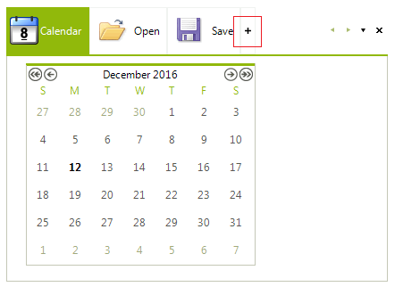
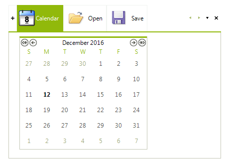
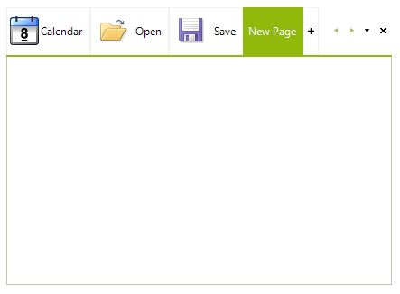

# New Item


RadPageView supports a special kind of page item that prompts the end-user to create a new page at runtime by clicking
        that item. Let's call the item "NewItem". When the NewItem is clicked, a special event is fired where the developer can decide
        what exactly should be done - in the context of RadPageView usually a new RadPageViewPage is being created.
       

## Enabling the NewItem

You can easily show the NewItem by setting the __NewItemVisibility__ property of the RadPageViewStripElement.
          This property is of the enum type StripViewNewItemVisibility and has the following possible values:
        

* __Hidden__ (default value): The NewItem is hidden.
              

* __Front__: The NewItem appears in front of the other page items in the items strip area.
             

* __End__: The NewItem appears at the end of the row of page items in the items strip area.
                            
                Here is how to set the NewItemVisibility property:
                #_[C#]_

	


{{source=..\SamplesCS\PageView\NewItem.cs region=settingNewItemVisibility}} 
{{source=..\SamplesVB\PageView\NewItem.vb region=settingNewItemVisibility}} 

````C#
            RadPageViewStripElement stripElement = this.radPageView1.ViewElement as RadPageViewStripElement;
            stripElement.NewItemVisibility = StripViewNewItemVisibility.End;
````
````VB.NET
        Dim stripElement As RadPageViewStripElement = TryCast(Me.RadPageView1.ViewElement, RadPageViewStripElement)
        stripElement.NewItemVisibility = StripViewNewItemVisibility.End
        '
````

{{endregion}} 


## Handling the clicked NewItem

When the NewItem is clicked by the end-user, RadPageView throws an event called __NewPageRequested__.
          There you can
          create a new RadPageViewPage instance and add it to RadPageView. In the following code snippet we create a new RadPageViewPage,
          add it to RadPageView, select the newly created page, and make sure that the page item is fully visible by calling the
          EnsureItemVisible method.
        #_[C#]_

	


{{source=..\SamplesCS\PageView\NewItem.cs region=newPageRequested}} 
{{source=..\SamplesVB\PageView\NewItem.vb region=newPageRequested}} 

````C#
        void radPageView1_NewPageRequested(object sender, EventArgs e)
        {
            RadPageView pageView = sender as RadPageView;
            RadPageViewStripElement stripElement = pageView.ViewElement as RadPageViewStripElement;

            RadPageViewPage page = new RadPageViewPage();
            page.Text = "New Page";
            pageView.Pages.Add(page);

            pageView.SelectedPage = page;
            pageView.ViewElement.EnsureItemVisible(stripElement.NewItem);
        }
````
````VB.NET
    Private Sub radPageView1_NewPageRequested(ByVal sender As Object, ByVal e As EventArgs)
        Dim pageView As RadPageView = TryCast(sender, RadPageView)
        Dim stripElement As RadPageViewStripElement = TryCast(pageView.ViewElement, RadPageViewStripElement)

        Dim page As New RadPageViewPage()
        page.Text = "New Page"
        pageView.Pages.Add(page)

        pageView.SelectedPage = page
        pageView.ViewElement.EnsureItemVisible(stripElement.NewItem)
    End Sub
    '
````

{{endregion}} 


The result is shown on the screenshot below:
