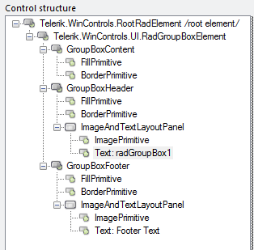

# TPF structure


>note This is an advanced section. You should read this section if you want to create a custom theme or want to get to know better the internal structure of RadGroupBox.
>


Like all Telerik *WinForms* controls *RadGroupBox* is build upon *Telerik Presentation Framework* (TPF). TPF consists of various elements (such as primitives and layouts) that are the building blocks of the controls. The *RadGroupBox* tree structure is given on the screenshot below: 

The most important nodes are *GroupBoxContent*, *GroupBoxHeader*, *GroupBoxFooter*, and *RadGroupBoxElement*. The last one also play the role of the layout node for the control which arranges its child nodes - content, header, and footer (all three extending the *GroupBoxVisualElement* class). The footer node if not collapsed (the default value is *collapsed*) is always arranged as a bar at the bottom of the control, while the content and the header are arranged above the area occupied by the footer. All *high level* arrangement properties such as *GroupBoxStyle*, *HeaderPosition*, *HeaderAlignment*, *etc* are defined as dependency properties.
      

*GroupBoxContent* node consists of a border and a fill. *GroupBoxHeader* and *GroupBoxFooter* have an *ImageAndTextLayoutPanel* as well so that a text and image can be placed and arranged. Please refer to *ImageAndTextLayoutPanel* about more information regarding image alignment, text alignment, image and text relation, etc.

Please refer to Architecture section for more information about the building blocks of the above tree and their corresponding properties.

## Code samples

>note The code samples below are just a demonstration of how you can set node properties programmatically. You will probably prefer to use the Visual Style Builder to create your themes using no code.
>

## Example 1

The code sample below access the *FillPrimitive* of the header, changes the first two gradient stop colors to red and yellow, and then the gradient style to linear. *GroupBoxElement* property of the control returns the *RadGroupBoxElement*, then the code access the *GroupBoxHeader* - Children[1] - finally the code access the *FillPrimitive* - Children[0] - which is cast to *FillPrimitive* so that you can use its properties like *GradientStyle*.

#### Change the GroupBox header color

{{source=..\SamplesCS\PanelsAndLabels\GroupBox\Advanced\TPFStructure.cs region=changeTheHeaderColor}} 
{{source=..\SamplesVB\PanelsAndLabels\GroupBox\Advanced\TPFStructure.vb region=changeTheHeaderColor}} 

````C#
            ((FillPrimitive)this.radGroupBox1.GroupBoxElement.Children[1].Children[0]).BackColor = Color.Red;
            ((FillPrimitive)this.radGroupBox1.GroupBoxElement.Children[1].Children[0]).BackColor2 = Color.Yellow;
            ((FillPrimitive)this.radGroupBox1.GroupBoxElement.Children[1].Children[0]).GradientStyle = Telerik.WinControls.GradientStyles.Linear;
````
````VB.NET
        DirectCast(Me.RadGroupBox1.GroupBoxElement.Children(1).Children(0), FillPrimitive).BackColor = Color.Red
        DirectCast(Me.RadGroupBox1.GroupBoxElement.Children(1).Children(0), FillPrimitive).BackColor2 = Color.Yellow
        DirectCast(Me.RadGroupBox1.GroupBoxElement.Children(1).Children(0), FillPrimitive).GradientStyle = Telerik.WinControls.GradientStyles.Linear
        '
````

{{endregion}} 

## Example 2

The code snippet below makes the *BorderPrimitive* of the Header invisible:

#### Change the GroupBox header border

{{source=..\SamplesCS\PanelsAndLabels\GroupBox\Advanced\TPFStructure.cs region=changeTheHeaderBorder}} 
{{source=..\SamplesVB\PanelsAndLabels\GroupBox\Advanced\TPFStructure.vb region=changeTheHeaderBorder}} 

````C#
            ((BorderPrimitive)this.radGroupBox1.GroupBoxElement.Children[1].Children[1]).Visibility = Telerik.WinControls.ElementVisibility.Hidden;
````
````VB.NET
        DirectCast(Me.RadGroupBox1.GroupBoxElement.Children(1).Children(1), BorderPrimitive).Visibility = Telerik.WinControls.ElementVisibility.Hidden
        '
````

{{endregion}}