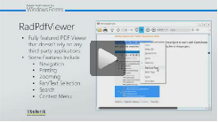
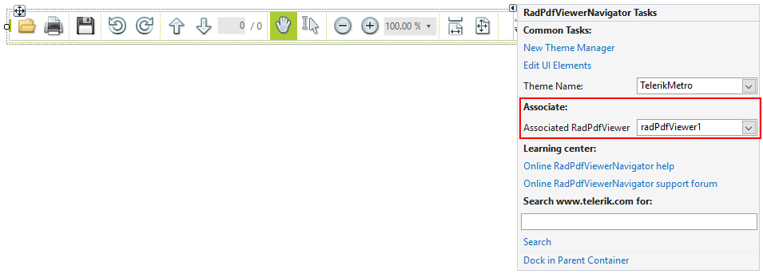

# Getting started

| RELATED VIDEOS |  |
| ------ | ------ |
|[Getting Started with the WinForms RadPdfViewer](http://tv.telerik.com/watch/radcontrols-for-winforms/getting-started-with-the-winforms-radpdfviewer)<br>__RadPdfViewer__ enables you to easily load and display PDF documents natively in your app without using any third-party tools except Telerik’s WinForms toolbox. Thanks to its built-in UI virtualization, RadPdfViewer delivers a performant solution in every scenario. This component will come as a nice addition to your Content Management Systems and Reporting applications, let’s see what __RadPdfViewer__ provides as a feature set.||

This article will help you quickly get started with __RadPdfViewer__. To start off, drag and drop a the control from the toolbox to your form. Set the __ViewerMode__ option to a desired value.

>caption Figure 1: Visual Studio Designer


There is also a property for the above setting which you can set in your code:

#### ViewerMode Property

{{source=..\SamplesCS\PdfViewer\PdfGettingStarted.cs region=Modes}} 
{{source=..\SamplesVB\PdfViewer\PdfGettingStarted.vb region=Modes}} 

````C#
this.radPdfViewer1.ViewerMode = FixedDocumentViewerMode.TextSelection;

````
````VB.NET
Me.RadPdfViewer1.ViewerMode = FixedDocumentViewerMode.TextSelection

````

{{endregion}}

Loading a PDF document is done via the __LoadDocument__ method. It accepts either a filename or an input stream as an argument.

#### LoadDocument Method

{{source=..\SamplesCS\PdfViewer\PdfGettingStarted.cs region=Loading}} 
{{source=..\SamplesVB\PdfViewer\PdfGettingStarted.vb region=Loading}} 

````C#
this.radPdfViewer1.LoadDocument(Application.StartupPath + "\\PdfViewer\\Sample.pdf");

````
````VB.NET
Me.RadPdfViewer1.LoadDocument(Application.StartupPath & "\PdfViewer\Sample.pdf")

````

{{endregion}}

The calls above will start to load the specified document asynchronously. When the loading finishes, the __DocumentLoaded__ event will fire:

#### DocumentLoaded Event

{{source=..\SamplesCS\PdfViewer\PdfGettingStarted.cs region=DocumentLoaded}} 
{{source=..\SamplesVB\PdfViewer\PdfGettingStarted.vb region=DocumentLoaded}} 

````C#
void radPdfViewer1_DocumentLoaded(object sender, EventArgs e)
{
    RadMessageBox.Show("The document was loaded.");
}

````
````VB.NET
Private Sub radPdfViewer1_DocumentLoaded(sender As Object, e As EventArgs)
    RadMessageBox.Show("The document was loaded.")
End Sub

````

{{endregion}}

Respectively, to unload a document, you can use the __UnloadDocument__ method 

#### UnloadDocument Method 

{{source=..\SamplesCS\PdfViewer\PdfGettingStarted.cs region=Unloading}} 
{{source=..\SamplesVB\PdfViewer\PdfGettingStarted.vb region=Unloading}} 

````C#
this.radPdfViewer1.UnloadDocument();

````
````VB.NET
Me.RadPdfViewer1.UnloadDocument()

````

{{endregion}}

To provide to the end-user an additional set of abilities for manipulating the document, you can use __RadPdfViewerNavigator__. To do this, drag it from the toolbox to your form and set its __AssociatedViewer__ from its __SmartTag__ menu. 

>caption Figure 2. RadPdfViewerNavigator


You can also set this in your code by using the __AssociatedPdfViewer__ property of the __PdfViewerNavigator__.

{{source=..\SamplesCS\PdfViewer\PdfGettingStarted.cs region=Navigator}} 
{{source=..\SamplesVB\PdfViewer\PdfGettingStarted.vb region=Navigator}} 

````C#
this.radPdfViewerNavigator1.AssociatedViewer = this.radPdfViewer1;

````
````VB.NET
Me.RadPdfViewerNavigator1.AssociatedViewer = Me.RadPdfViewer1

````

{{endregion}}

## Assembly References

If you add the __RadPdfViewer__ at run time you need to add references to the following assemblies:

* Telerik.WinControls.PdfViewer

* Telerik.WinControls

* Telerik.WinControls.UI

* TelerikCommon

* Telerik.Windows.Documents.Fixed

* Telerik.Windows.Documents.Core

# See Also

* [Logical Structure]()
* [Visual Structure]()