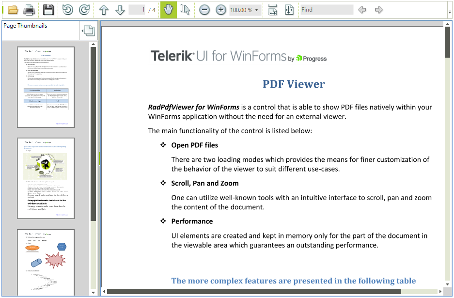

# PdfViewer

| RELATED VIDEOS |  |
| ------ | --- |
|[Getting Started with the WinForms RadPdfViewer](http://tv.telerik.com/watch/radcontrols-for-winforms/getting-started-with-the-winforms-radpdfviewer) __RadPdfViewer__ enables you to easily load and display PDF documents natively in your application without using any third-party tools except Telerik’s WinForms toolbox. Thanks to its built-in UI virtualization, RadPdfViewer delivers a efficient solution in every scenario. This component will come as a nice addition to your Content Management Systems and Reporting applications, let’s see what RadPdfViewer provides as a feature set.||

__RadPdfViewer__ is a control that can natively visualize PDF documents straight in your application. It comes with a predefined UI that is intuitive and provides the means for utilizing the features of the control. The control utilizes virtualization and supports load on-demand mode in order to guarantee good performance with larger documents. 

>caption Figure 1 RadPdfViewer

Here is a list of the supported features

* Open PDF document from file or stream
* Pan
* Zoom
* Selection
* Annotations
* Copy to clipboard
* Find
* Keyboard navigation
* Navigation toolbar
* Context menu
* Printing

## See Also

* [Structure]()
* [Design Time]()
* [Getting Started]()