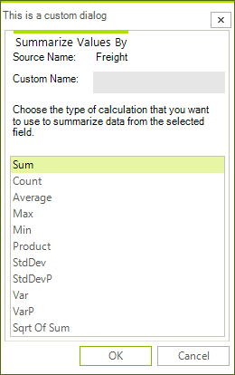

# Customizing the Dialogs

## 

To customize the dialogs in RadPivotGrid/RadPivotFieldList, you can either inherit from them to override/extend
          the base functionality or you can create an entirely custom dialogs by implementing the corresponding dialog interface.
        

#### __[C#] __

{{region MyAggregateOptionsDialog}}
	    class MyAggregateOptionsDialog : AggregateOptionsDialog
	    {
	        public override void LoadSettings(Telerik.Pivot.Core.PropertyAggregateDescriptionBase aggregateDescription)
	        {
	            base.LoadSettings(aggregateDescription);
	            this.Text = "This is a custom dialog";
	        }
	    }
	{{endregion}}

#### __[VB.NET] __

{{region MyAggregateOptionsDialog}}
	Class MyAggregateOptionsDialog
	    Inherits AggregateOptionsDialog
	    Public Overrides Sub LoadSettings(aggregateDescription As Telerik.Pivot.Core.PropertyAggregateDescriptionBase)
	        MyBase.LoadSettings(aggregateDescription)
	        Me.Text = "This is a custom dialog"
	    End Sub
	End Class
	#End Region
	
	#Region "MyDialogsFactory"
	Class MyDialogsFactory
	    Inherits PivotGridDialogsFactory
	    Public Overrides Function CreateAggregateOptionsDialog() As IAggregateOptionsDialog
	        Return New MyAggregateOptionsDialog()
	    End Function
	End Class
	#End Region

When RadPivotGrid and RadPivotFieldList need a dialog, they use the __PivotGridDialogsFactory__ to
          create an instance of a dialog. To replace the default dialogs with your custom ones, you need to implement a
          custom factory as show below.
        

#### __[C#] __

{{region MyDialogsFactory}}
	    class MyDialogsFactory : PivotGridDialogsFactory
	    {
	        public override IAggregateOptionsDialog CreateAggregateOptionsDialog()
	        {
	            return new MyAggregateOptionsDialog();
	        }
	    }
	{{endregion}}

#### __[VB.NET] __

{{region MyDialogsFactory}}
	Class MyDialogsFactory
	    Inherits PivotGridDialogsFactory
	    Public Overrides Function CreateAggregateOptionsDialog() As IAggregateOptionsDialog
	        Return New MyAggregateOptionsDialog()
	    End Function
	End Class
	#End Region

Then, you need to assign it to RadPivotGrid and RadPivotFieldList:

#### __[C#] __

{{region SetFactories}}
	            this.radPivotGrid1.DialogsFactory = new MyDialogsFactory();
	            this.radPivotFieldList1.DialogsFactory = new MyDialogsFactory();
	{{endregion}}

#### __[VB.NET] __

{{region SetFactories}}
	        Me.radPivotGrid1.DialogsFactory = New MyDialogsFactory()
	        Me.radPivotFieldList1.DialogsFactory = New MyDialogsFactory()
	        '#End Region
	    End Sub
	
	    Private Sub PivotGridDialogs_Load(sender As Object, e As EventArgs) Handles Me.Load
	        ' TODO: This line of code loads data into the 'nwindDataSet.Orders' table. You can move, or remove it, as needed.
	        Me.ordersTableAdapter.Fill(Me.nwindDataSet.Orders)
	    End Sub
	End Class
	
	#Region "MyAggregateOptionsDialog"
	Class MyAggregateOptionsDialog
	    Inherits AggregateOptionsDialog
	    Public Overrides Sub LoadSettings(aggregateDescription As Telerik.Pivot.Core.PropertyAggregateDescriptionBase)
	        MyBase.LoadSettings(aggregateDescription)
	        Me.Text = "This is a custom dialog"
	    End Sub
	End Class
	#End Region
	
	#Region "MyDialogsFactory"
	Class MyDialogsFactory
	    Inherits PivotGridDialogsFactory
	    Public Overrides Function CreateAggregateOptionsDialog() As IAggregateOptionsDialog
	        Return New MyAggregateOptionsDialog()
	    End Function
	End Class
	#End Region

