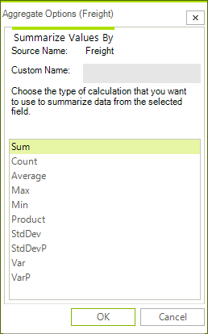
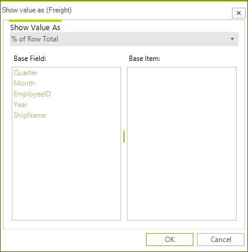
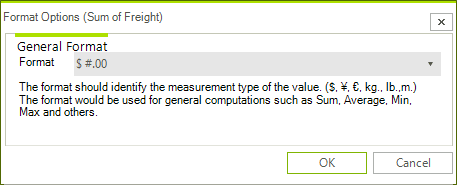

# Dialogs

There are several different dialogs which allow the end user to modify various settings in RadPivotGrid. The dialogs can be opened from the menus in RadPivotGrid or RadPivotFieldList. Each dialog implements a specific interface which will allow you to replace the default dialogs with custom implemented ones.

## AggregateOptionsDialog

The __AggregateOptionsDialog__ allows the end-user to change the aggregate function of an aggregate description as well as set a custom name for it. This dialog is opened from the __Aggregates__ list in RadPivotFieldList. The __AggregateOptionsDialog__ implements the __IAggregateOptionsDialog__ interface.  

## CalculationOptionsDialog

The __CalculationOptionsDialog__ allows the end-user to change the way that values are calculated. There are various calculation options like *% Of, Running Totals, Rank, Index, etc*. This dialog is opened from the __Aggregates__ list in RadPivotFieldList. The __CalculationOptionsDialog__ implements the __ICalculationOptionsDialog__ interface. 

## NumberFormatOptionsDialog

The __NumberFormatOptionsDialog__ allows the end-user set a format string for the calculated values. There are several predefined strings in the drop-down and any custom string can be entered in the editor as well. This dialog is opened from the __Aggregates__ list in RadPivotFieldList. The __NumberFormatOptionsDialog__ implements the __INumberFormatOptionsDialog__ interface.  

## SortOptionsDialog

The __SortOptionsDialog__ allows the end-user to select order in which the groups generated by a given group descriptor are sorted. They can be sorted alphabetically by their names or ascending/descending by the values of the aggregates for the groups. This dialog can be opened either from the RadPivotFieldList or from the drop-down menu of the group descriptors in RadPivotGrid. The __SortOptionsDialog__ implements the __ISortOptionsDialog__ interface. 

## LabelFilterOptionsDialog

The __LabelFilterOptionsDialog__ allows the end-user to select the filter function applied to the labels of the groups when using __Group Filtering__ or the fields of the items when using __Report Filtering__. The __LabelFilterOptionsDialog__ implements the __ILabelFilterOptionsDialog__ interface. 

## ValueFilterOptionsDialog

The __ValueFilterOptionsDialog__ allows the end-user to select the filter function applied to the values of the groups when using values filters. The __ValueFilterOptionsDialog__ implements the __IValueFilterOptionsDialog__ interface. 

## Top10FilterOptionsDialog

The __Top10FilterOptionsDialog__ allows the end-user to set the Top10 filter applied to the values of the groups when using value filters. The __Top10FilterOptionsDialog__ implements the __ITop10FilterOptionsDialog__ interface. 
