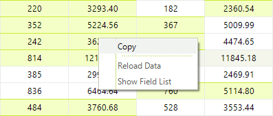
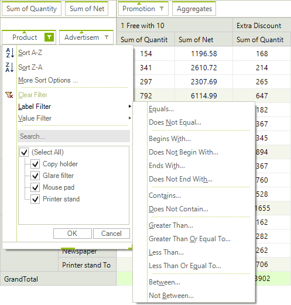

# End-user functionalities

* __Expand/Collapse__ – using the expander button which appears in the header cells, the end-user can expand or collapse each group which will allow to easily see the summarized data for the sub groups of the collapsed group. 

* __Resize & Best Fit__ – by dragging the edges of certain cells the user can modify the width of the columns and the height of the rows in RadPivotGrid. This way the view can be adjusted to display any larger content if needed. Additionally, by double-clicking the edges of the resizable cells the user can best-fit the corresponding column so that it occupies the least possible width in which all values fit. Best fit is also available in the context menu.

* __Sorting__ – the user can change the sort direction of a group by clicking the corresponding group descriptor element. The small arrow inside such element indicates the current sort direction  

* __Context menu__ – the context menu in RadPivotGrid allows the user to execute various tasks depending on the element over which the menu was opened.  

* __Selection and Copying__ – In RadPivotGrid you can select multiple cells using the mouse in a combination with the Shift/Control keys. Additionally, you can copy the selected data and paste in other text or spreadsheet editors.  

* __Drag & drop__ – with the built-in drag&drop functionality of RadPivotGrid the end-user can easily change the way data is aggregated. This can be done by dragging a field descriptor element to another descriptor area or changing the descriptors order within the same area.  

* __Filtering__ – using the filtering popup the user can select which records to include or exclude from the report. There are two types of filtering: __Report filtering__ which allows you to filter the data source before the report is generated and __Group filtering__ which allows you to filter the generated groups by their label or value.  
