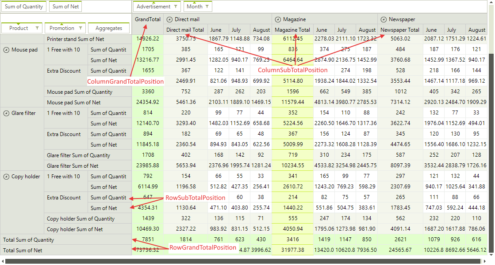

# Layout Settings

## 

RadPivotGrid supports two types of layouts - __Tabular__ and __Compact__. 
          The Tabular layout displays each field in a separate rectangle - for row descriptors in a separate column, 
          and for columns descriptors in a separate row. The Compact layout nests the field descriptors in one common 
          rectangle to save up space which can be useful in the cases where a large number of fields is being used.
        

You can control the layout type of the column and row headers via the following properties:

#### __[C#] __

{{source=..\SamplesCS\PivotGrid\PivotGridLayoutSettings.cs region=LayoutType}}
	            this.radPivotGrid1.ColumnHeadersLayout = Telerik.WinControls.UI.PivotLayout.Tabular;
	            this.radPivotGrid1.RowHeadersLayout = Telerik.WinControls.UI.PivotLayout.Compact;
	{{endregion}}

#### __[VB.NET] __

{{source=..\SamplesVB\PivotGrid\PivotGridLayoutSettings.vb region=LayoutType}}
	        Me.RadPivotGrid1.ColumnHeadersLayout = Telerik.WinControls.UI.PivotLayout.Tabular
	        Me.RadPivotGrid1.RowHeadersLayout = Telerik.WinControls.UI.PivotLayout.Compact
	{{endregion}}

You can also control where SubTotals and GrandTotals are displayed:

#### __[C#] __

{{source=..\SamplesCS\PivotGrid\PivotGridLayoutSettings.cs region=Totals}}
	            this.radPivotGrid1.ColumnGrandTotalsPosition = Telerik.WinControls.UI.TotalsPos.First;
	            this.radPivotGrid1.RowGrandTotalsPosition = Telerik.WinControls.UI.TotalsPos.Last;
	            this.radPivotGrid1.ColumnsSubTotalsPosition = Telerik.WinControls.UI.TotalsPos.First;
	            this.radPivotGrid1.RowsSubTotalsPosition = Telerik.WinControls.UI.TotalsPos.Last;
	{{endregion}}

#### __[VB.NET] __

{{source=..\SamplesVB\PivotGrid\PivotGridLayoutSettings.vb region=Totals}}
	        Me.RadPivotGrid1.ColumnGrandTotalsPosition = Telerik.WinControls.UI.TotalsPos.First
	        Me.RadPivotGrid1.RowGrandTotalsPosition = Telerik.WinControls.UI.TotalsPos.Last
	        Me.RadPivotGrid1.ColumnsSubTotalsPosition = Telerik.WinControls.UI.TotalsPos.First
	        Me.RadPivotGrid1.RowsSubTotalsPosition = Telerik.WinControls.UI.TotalsPos.Last
	{{endregion}}

When you have added more than one aggregate description, there are special header cells for each aggregate. To control whether these cells  are displayed in the column headers area or in the row headers area, and also set the level of the aggregate descriptions in the group tree, you can use the following properties:

#### __[C#] __

{{source=..\SamplesCS\PivotGrid\PivotGridLayoutSettings.cs region=Aggregates}}
	            this.radPivotGrid1.AggregatesPosition = Telerik.Pivot.Core.PivotAxis.Columns;
	            this.radPivotGrid1.AggregatesLevel = 1;
	{{endregion}}

#### __[VB.NET] __

{{source=..\SamplesVB\PivotGrid\PivotGridLayoutSettings.vb region=Aggregates}}
	        Me.RadPivotGrid1.AggregatesPosition = Telerik.Pivot.Core.PivotAxis.Columns
	        Me.RadPivotGrid1.AggregatesLevel = 1
	{{endregion}}

