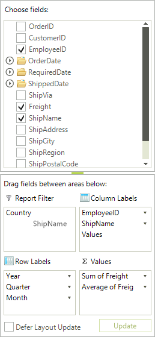
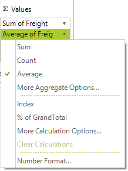
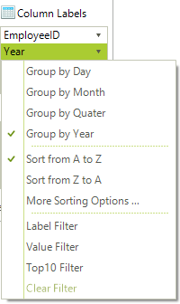

# RadPivotFieldList

__RadPivotFieldList__ is a control which provides functionality similar to the PivotTable Field List panel in MS Excel. Using RadPivotFieldList the end user can change the way of representing aggregated data in RadPivotGrid by modifying the column/row group descriptions, the aggregate descriptions or the report filters. The end users can do this by dragging fields across the four list boxes in RadPivotFieldList or by reordering the items in a single list. 

## Associating with RadPivotGrid

__RadPivotFieldList__ is a standalone control that can be associated with RadPivotGrid. To do this, you should set its __AssociatedPivotGrid__ property. This setting is also available in the smart tag of RadPivotFieldList so you can easily choose between the available RadPivotGrids on your form.

__RadPivotFieldList__ also provides you the option to defer the update of RadPivotGrid’s layout until you have pressed the __Update__  button or to update the layout immediately after you change the contents of its lists. This feature can be controlled by the checkbox at the bottom of the control, or via the __DeferUpdates__ property.

## Value options

By using the drop-down menu of the items in the __Value__s list, you can modify settings related to the aggregate descriptors. For example, you can choose between the available aggregate functions (Sum, Count, Average, etc.) or you can modify the way that the values are calculated and displayed (% of total, % of another field, index, rank, etc…). Additionally, you can change the number format of the calculated values.  

## Label Options

By using the drop-down menu of the items in the __Row/Column Labels__ lists, you can modify settings related to the group descriptors. For example, you can edit the sorting options and apply a label filter, a value filter, or the so called  Top10 filter. Additionally, you can manage settings that are specific to the type of the field. You can change the date interval used for grouping by a DateTime field or change the step used for grouping a numeric field.  
