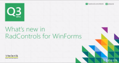
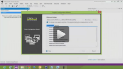
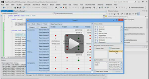
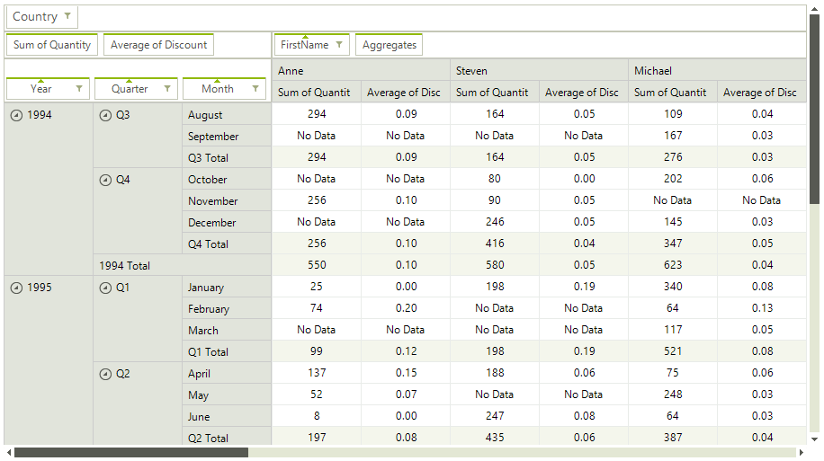

# PivotGrid

<table><th><tr><td>

RELATED VIDEOS</td><td></td></tr></th><tr><td>

[What is new in Q3 2012 Telerik UI for WinForms](http://tv.telerik.com/watch/radcontrols-for-winforms/what-is-new-in-q3-2012-radcontrols-for-winforms)

This webinar examines the new features found in Telerik UI for WinForms. Included in the Q3 2012 release for WinForms is RadPivotGrid (Beta), Coded UI Testing Support, touch, legend and financial charts for RadChartView, Visual Studio 2012 compliance and much much more. Get started with RadPivotGrid for WinForms now! (05:12 - 15:11)
            </td><td></td></tr><tr><td>

[Getting Started with RadPivotGrid for WinForms](http://tv.telerik.com/watch/radcontrols-for-winforms/getting-started-with-radpivotgrid-for-winforms)

Telerik PivotGrid for Windows Forms is a control that empowers your applications with similar functionality to the PivotTables in MS Excel. It takes large chunks of data and summarizes it in a human readable way with the help of aggregates and field descriptors.
            </td><td></td></tr><tr><td>

[Visualizing KPIs with RadPivotGrid for WinForms](http://tv.telerik.com/watch/radcontrols-for-winforms/visualizing-kpis-with-radpivotgrid-for-winforms)

RadPivotGrid for WinForms gives you the ability to visualize and monitor your measured KPI data directly from your OLAP Cube.
              This video shows you how to define an interface so users can define their own visualization, then dives deeper in demonstrating
              how to initialize the state of your RadPivotGrid in code.
            </td><td></td></tr></table>

RadPivotGrid for WinForms is a control which provides functionality similar to the functionality of PivotTables in MS Excel. It takes large chunks of data and summarizes it in a human readable way by the help of aggregates and field descriptors. The end-user can easily get an aggregated view of the data that would best suit their needs by dragging and dropping the items of the field descriptors and the aggregates. RadPivotGrid can also sort the data and show subtotals and grandtotals at the end or at the beginning of the summarized data. It supports the UI virtualization available in RadGridView, so it can easily handle large datasets bringing to you top performance and low memory footprint even in such scenarios. As a control based on the Telerik Presentation Framework, RadPivotGrid also supports themes that you can quickly personalize with the help of Visual Style Builder.
      

## 

Here is a list of the supported features:  

* Grouping data by row and column descriptors

* Aggregating data by aggregate descriptors

* Sorting group values

* Report filters

* Drag and drop of descriptors and aggregates

* Field chooser dialog

* Row/Column SubTotals and GrandTotals positions

* Row/Column Headers layouts – Tabular and Compact

* EmptyValueString, ErrorValueString, FormatString

* Design Time support for data binding

* UI virtualization

* Column/row resizing

* Tooltips

* Context menus

* Best Fit

* Copy data to clipboard

* Cell selection

* Formatting cells

* Themes

* Support for multiple data sources: 

* Support for XMLA access to OLAP Cube.
                

* Support for ADOMD access to OLAP Cube.
                

* Support for local sources that implement the IEnumerable interface.
                
