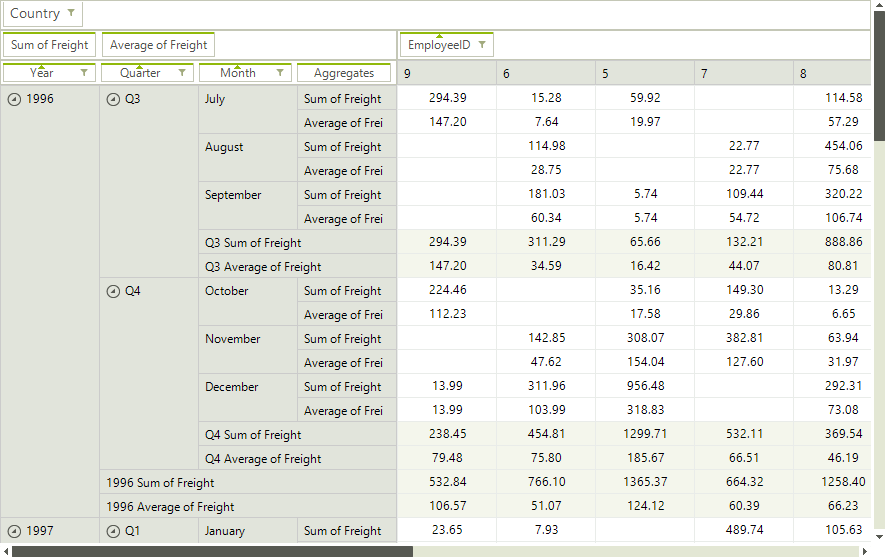

# Using the DataSource property

Similarly to other WinForms data controls, RadPivotGrid can be populated with data by setting its DataSource and DataMember properties. However, you also need to add the appropriate descriptions in order to define the structure of the data that is going to be displayed. More information about the different types of descriptions can be found in the [Using LocalDataSourceProvider article]()

{{source=..\SamplesCS\PivotGrid\PopulatingWithData\PivotGridUsingTheDataSourceProperty.cs region=FillWithData}} 
{{source=..\SamplesVB\PivotGrid\PopulatingWithData\PivotGridUsingTheDataSourceProperty.vb region=FillWithData}} 

````C#
this.radPivotGrid1.RowGroupDescriptions.Add(new DateTimeGroupDescription() { PropertyName = "OrderDate", Step = DateTimeStep.Year, GroupComparer = new GroupNameComparer() });
this.radPivotGrid1.RowGroupDescriptions.Add(new DateTimeGroupDescription() { PropertyName = "OrderDate", Step = DateTimeStep.Quarter, GroupComparer = new GroupNameComparer() });
this.radPivotGrid1.RowGroupDescriptions.Add(new DateTimeGroupDescription() { PropertyName = "OrderDate", Step = DateTimeStep.Month, GroupComparer = new GroupNameComparer() });
this.radPivotGrid1.ColumnGroupDescriptions.Add(new PropertyGroupDescription() { PropertyName = "EmployeeID", GroupComparer = new GrandTotalComparer() });
this.radPivotGrid1.AggregateDescriptions.Add(new PropertyAggregateDescription() { PropertyName = "Freight", AggregateFunction = AggregateFunctions.Sum });
this.radPivotGrid1.AggregateDescriptions.Add(new PropertyAggregateDescription() { PropertyName = "Freight", AggregateFunction = AggregateFunctions.Average });
this.radPivotGrid1.FilterDescriptions.Add(new PropertyFilterDescription() { PropertyName = "ShipCountry", CustomName = "Country" });
NwindDataSet dataset = new NwindDataSet();
SamplesCS.DataSources.NwindDataSetTableAdapters.OrdersTableAdapter adapter = new SamplesCS.DataSources.NwindDataSetTableAdapters.OrdersTableAdapter();
adapter.Fill(dataset.Orders);
this.radPivotGrid1.DataSource = dataset;
this.radPivotGrid1.DataMember = "Orders";

````
````VB.NET
Me.RadPivotGrid1.RowGroupDescriptions.Add(New DateTimeGroupDescription() With { _
 .PropertyName = "OrderDate", _
 .[Step] = DateTimeStep.Year, _
 .GroupComparer = New GroupNameComparer() _
})
Me.RadPivotGrid1.RowGroupDescriptions.Add(New DateTimeGroupDescription() With { _
 .PropertyName = "OrderDate", _
 .[Step] = DateTimeStep.Quarter, _
 .GroupComparer = New GroupNameComparer() _
})
Me.RadPivotGrid1.RowGroupDescriptions.Add(New DateTimeGroupDescription() With { _
 .PropertyName = "OrderDate", _
 .[Step] = DateTimeStep.Month, _
 .GroupComparer = New GroupNameComparer() _
})
Me.RadPivotGrid1.ColumnGroupDescriptions.Add(New PropertyGroupDescription() With { _
 .PropertyName = "EmployeeID", _
 .GroupComparer = New GrandTotalComparer() _
})
Me.RadPivotGrid1.AggregateDescriptions.Add(New PropertyAggregateDescription() With { _
 .PropertyName = "Freight", _
 .AggregateFunction = AggregateFunctions.Sum _
})
Me.RadPivotGrid1.AggregateDescriptions.Add(New PropertyAggregateDescription() With { _
 .PropertyName = "Freight", _
 .AggregateFunction = AggregateFunctions.Average _
})
Me.RadPivotGrid1.FilterDescriptions.Add(New PropertyFilterDescription() With { _
 .PropertyName = "ShipCountry", _
 .CustomName = "Country" _
})
Dim dataset As New NwindDataSet()
Dim adapter As New NwindDataSetTableAdapters.OrdersTableAdapter()
adapter.Fill(dataset.Orders)
Me.RadPivotGrid1.DataSource = dataset
Me.RadPivotGrid1.DataMember = "Orders"

````

{{endregion}} 

>note When you set the DataSource and DataMember properties, RadPivotGrid will automatically prepare a LocalDataSourceProvider and use it internally.
>


